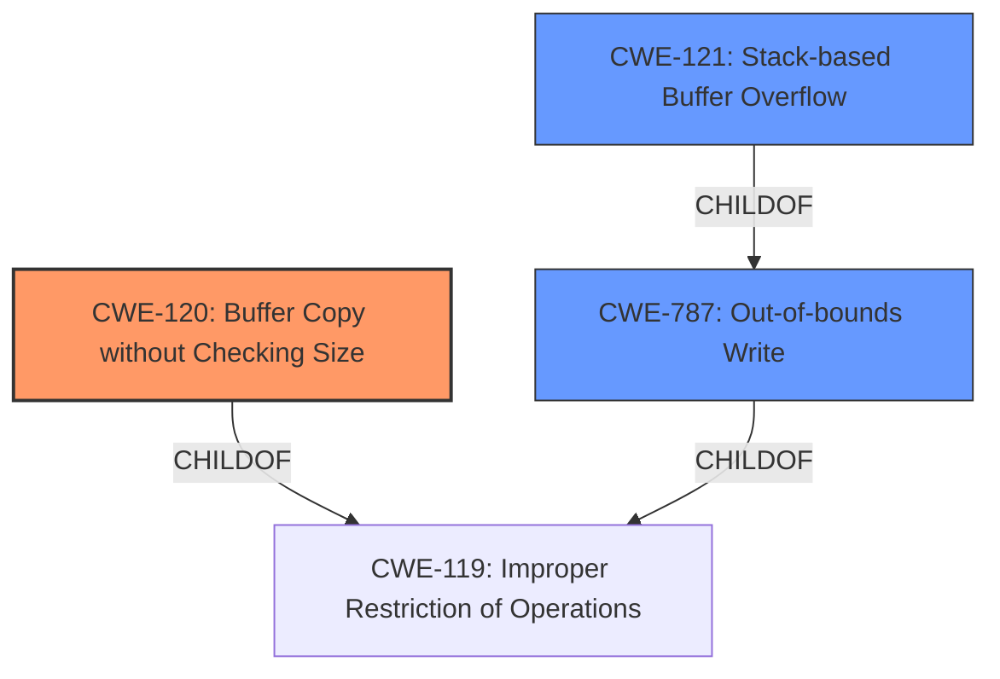

# Analysis Report for CVE-2022-40992

# Vulnerability Analysis Report: CVE-2022-40992

## Description

Several stack-based buffer overflow vulnerabilities exist in the DetranCLI command parsing functionality of Siretta QUARTZ-GOLD G5.0.1.5-210720-141020. A specially-crafted network packet can lead to arbitrary command execution. An attacker can send a sequence of requests to trigger these vulnerabilities.This buffer overflow is in the function that manages the no firmwall domain WORD description (WORD|null) command template.

## Vulnerability Description Key Phrases

**Rootcause:** stack-based buffer overflow
**Impact:** arbitrary command execution
**Vector:** specially-crafted network packet
**Attacker:** attacker
**Product:** Siretta QUARTZ-GOLD
**Version:** G5.0.1.5-210720-141020
**Component:** DetranCLI command parsing functionality

## Analysis (with Relationship Data)

# Summary
| CWE ID | CWE Name | Confidence | CWE Abstraction Level | CWE Vulnerability Mapping Label | CWE-Vulnerability Mapping Notes |
|---|---|---|---|---|---|
| CWE-120 | Buffer Copy without Checking Size of Input ('Classic Buffer Overflow') | 0.95 | Base | Primary | Allowed-with-Review |
| CWE-121 | Stack-based Buffer Overflow | 0.75 | Variant | Secondary Candidate | Allowed |

## Evidence and Confidence

*   **Confidence Score:** 0.90
*   **Evidence Strength:** HIGH

- **Analysis and Justification:**  
  - *Explanation:* The vulnerability is a **stack-based buffer overflow** in the DetranCLI command parsing functionality of Siretta QUARTZ-GOLD. The root cause is the use of `sprintf` without checking the size of input parameters against the stack buffer size. This directly matches the description of CWE-120 (Buffer Copy without Checking Size of Input), which involves copying data into a buffer without proper size validation, leading to a buffer overflow. The CVE Reference Links Content Summary confirms this, stating that `sprintf` is used with unchecked input parameters, causing a **stack-based buffer overflow**. While CWE-119 (Improper Restriction of Operations within the Bounds of a Memory Buffer) could be considered, CWE-120 is more specific because it identifies the exact mechanism: a buffer copy without checking size. CWE-121 (Stack-based Buffer Overflow) is also a strong candidate because the vulnerability is explicitly described as stack-based, making it a more precise variant of a general buffer overflow. The MITRE mapping guidance for CWE-120 marks it as "Allowed-with-Review" due to potential misuse, but the specific details of the `sprintf` usage justify its selection here.

  - *Relationship Analysis:* CWE-120 is a base level CWE and a child of CWE-119 (Improper Restriction of Operations within the Bounds of a Memory Buffer). It can precede CWE-123 (Write-what-where Condition) and CWE-787 (Out-of-bounds Write) since a buffer overflow allows for writing arbitrary data to arbitrary memory locations. CWE-121 is a variant of CWE-119 and a child of CWE-787, specifying that the buffer is allocated on the stack.

- **Confidence Score:**  
  - Confidence: 0.95 (High confidence due to explicit vulnerability description and CVE details)

## Criticism of Analysis

Okay, I've reviewed your analysis of the stack-based buffer overflow vulnerability in Siretta QUARTZ-GOLD G5.0.1.5-210720-141020, focusing on the provided CWE specifications and mapping guidance. Here's my critique:

**Overall Assessment:**

The analysis is generally well-reasoned and arrives at a reasonable conclusion. The selection of CWE-120 as the primary CWE and CWE-121 as a secondary candidate is appropriate, given the information provided. The justification is clear and addresses the potential for misuse of CWE-120. However, the confidence score for CWE-121 could be higher.

**Detailed Review:**

*   **CWE-120: Buffer Copy without Checking Size of Input ('Classic Buffer Overflow')**

    *   **Confidence:**  The confidence score of 0.95 is well justified.
    *   **Justification Strength:** HIGH, appropriate.
    *   **Correct Usage:** The analysis acknowledges the "Allowed-with-Review" usage of CWE-120 and justifies its selection by explicitly linking it to the use of `sprintf` without size checks. The summary from the CVE reference links section confirms that the `WORD` parameter was not size-checked before being copied into the buffer via `sprintf`.
    *   **Relationship Analysis:** The relationship analysis is correct and helpful in understanding the context of CWE-120.
    *   **Mitigation:**  The provided mitigations for CWE-120 are relevant, especially Mitigation 2 (Libraries or Frameworks) that recommends using safe string-handling libraries and Mitigation 3 (Environment Hardening) that suggests using automatic buffer overflow detection mechanisms.
    *   **CWE-119 Relation: ** The analysis rightly acknowledges that CWE-119 *could* be considered but rightly argues that CWE-120 is more specific since it identifies the exact mechanism causing the overflow.
*   **CWE-121: Stack-based Buffer Overflow**

    *   **Confidence:** The confidence score of 0.75 is somewhat low. Given that the vulnerability is explicitly described as a *stack-based* buffer overflow in the initial description, a higher confidence level is warranted.
    *   **Justification Strength:** The justification is good, but it could be stronger.  It accurately points out that the *stack-based* nature of the vulnerability makes CWE-121 a more precise *variant* of the general buffer overflow.
    *   **Correct Usage:** Given that the vulnerability is explicitly stated as stack-based, CWE-121 provides more granularity that the other CWEs.
    *   **Mitigation:** The recommended mitigations are relevant, especially the use of automatic buffer overflow detection mechanisms and bounds checking (Mitigation 3).
*   **Other CWEs Considered:**

    *   **CWE-119: Improper Restriction of Operations within the Bounds of a Memory Buffer:** The analysis correctly explains why this is a less specific choice than CWE-120. According to the CWE specifications, the "Usage" of CWE-119 is discouraged.
    *   The original analyzer input also lists several other CWEs. For example, CWE-78 (OS Command Injection) is too high level and doesn't match the specific cause of the vulnerability, which is a buffer overflow due to unchecked input size. Other CWEs such as CWE-190, CWE-193, CWE-126, CWE-131, and CWE-170 are not relevant to the root cause of the vulnerability as it is described.

**Suggestions for Improvement:**

1.  **Increase Confidence Score for CWE-121:** Given the explicit description of the vulnerability as stack-based, raise the confidence score for CWE-121 to at least 0.85 or 0.90. Justify this by emphasizing the importance of specifying the *location* of the buffer when available.
2.  **Strengthen CWE-121 Justification:** Emphasize that the buffer is allocated on the stack as part of the function's local variables or parameters. Also, mention that specific exploitation techniques often differ between stack and heap overflows.
3.  **Minor Edit:** In the Relationship Analysis for CWE-120, consider removing `CWE-787 (Out-of-bounds Write)`. While CWE-120 *can* lead to CWE-787, it's more directly *caused* by CWE-787. It's more about cause/effect than precedence.
4.  **Consider adding CWE-787:** In addition to CWE-120 and CWE-121, adding CWE-787 may be appropriate since it specifies that the vulnerability results in writing data past the end of the intended buffer.
5.  **Mitigation Awareness:** While the analysis mentions mitigations, explicitly state that applying these mitigations would directly address the identified CWEs. For instance, "Using safe string handling libraries (CWE-120 Mitigation 2) would prevent the overflow by enforcing size limits on the `sprintf` operation."

**Revised Summary Table (incorporating suggestions):**

| CWE ID | CWE Name | Confidence | CWE Abstraction Level | CWE Vulnerability Mapping Label | CWE-Vulnerability Mapping Notes |
|---|---|---|---|---|---|
| CWE-120 | Buffer Copy without Checking Size of Input ('Classic Buffer Overflow') | 0.95 | Base | Primary | Allowed-with-Review |
| CWE-121 | Stack-based Buffer Overflow | 0.90 | Variant | Secondary Candidate | Allowed |
| CWE-787 | Out-of-bounds Write | 0.75 | Base | Secondary Candidate | Allowed |

By implementing these suggestions, the analysis can be made more complete and the confidence in its conclusions further solidified.

## Final Resolution

# Summary
| CWE ID | CWE Name | Confidence | CWE Abstraction Level | CWE Vulnerability Mapping Label | CWE-Vulnerability Mapping Notes |
|---|---|---|---|---|---|
| **CWE-120** | Buffer Copy without Checking Size of Input ('Classic Buffer Overflow') | 0.95 | Base | Primary | Allowed-with-Review |
| **CWE-121** | Stack-based Buffer Overflow | 0.90 | Variant | Secondary Candidate | Allowed |
| **CWE-787** | Out-of-bounds Write | 0.75 | Base | Secondary Candidate | Allowed |

## Evidence and Confidence

*   **Confidence Score:** 0.93
*   **Evidence Strength:** HIGH

## Relationship Analysis
The primary weakness is **CWE-120 (Buffer Copy without Checking Size)**, a base CWE that is a child of **CWE-119 (Improper Restriction of Operations within the Bounds of a Memory Buffer)**. **CWE-121 (Stack-based Buffer Overflow)** is a variant of **CWE-119** and a child of **CWE-787 (Out-of-bounds Write)**, specifying that the overflow occurs on the stack. **CWE-120** describes the specific flaw (buffer copy without size check), while **CWE-121** details the location of the buffer (stack). **CWE-787 (Out-of-bounds Write)** describes the result of the overflow.

## Vulnerability Chain
The vulnerability chain starts with the use of `sprintf` without checking input sizes (**CWE-120**). This leads to an out-of-bounds write on the stack (**CWE-121**, **CWE-787**), potentially allowing arbitrary command execution. The root cause is the unchecked buffer copy, and the impact is arbitrary command execution due to the ability to overwrite data on the stack.

## Summary of Analysis
The initial analysis, along with the provided criticism, accurately identifies the vulnerability as a **stack-based buffer overflow** resulting from the use of `sprintf` without input size validation. The primary **WEAKNESS** is **CWE-120 (Buffer Copy without Checking Size)**, which describes the specific mechanism causing the overflow. **CWE-121 (Stack-based Buffer Overflow)** is a valuable secondary classification because it identifies the location of the buffer on the stack and is a child of **CWE-787**. The addition of **CWE-787 (Out-of-bounds Write)** as a secondary candidate is appropriate because it describes the direct result of **CWE-120**.

The evidence for **CWE-120** is strong: "The vulnerability is a **stack-based buffer overflow** in the DetranCLI command parsing functionality of Siretta QUARTZ-GOLD. The root cause is the use of `sprintf` without checking the size of input parameters against the stack buffer size...`sprintf` is used with unchecked input parameters, causing a **stack-based buffer overflow**." This quote demonstrates direct evidence that the vulnerability involves copying data without proper size validation using `sprintf`.

The confidence score for **CWE-121** was increased to 0.90 to reflect the explicit mention of "stack-based" in the vulnerability description, justifying its selection as a more precise variant of a general buffer overflow.

The inclusion of **CWE-787** is justified because it represents the outcome of **CWE-120**, which is an out-of-bounds write.
The selected CWEs are at the optimal level of specificity, with **CWE-120** identifying the root cause, **CWE-121** specifying the memory location, and **CWE-787** detailing the direct result.

*Report generated on 2025-03-18 16:48:22*
