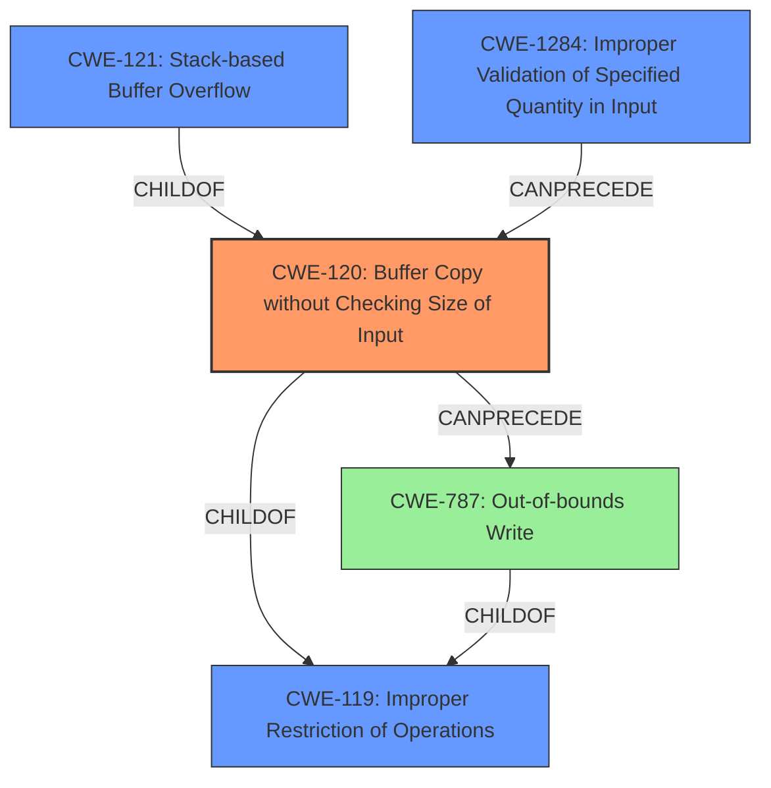

# Analysis Report for CVE-2022-40993

# Vulnerability Analysis Report: CVE-2022-40993

## Description

Several stack-based buffer overflow vulnerabilities exist in the DetranCLI command parsing functionality of Siretta QUARTZ-GOLD G5.0.1.5-210720-141020. A specially-crafted network packet can lead to arbitrary command execution. An attacker can send a sequence of requests to trigger these vulnerabilities.This buffer overflow is in the function that manages the firmwall keyword WORD description (WORD|null) command template.

## Vulnerability Description Key Phrases

**Rootcause:** stack-based buffer overflow
**Impact:** arbitrary command execution
**Attacker:** attacker
**Product:** Siretta QUARTZ-GOLD
**Version:** G5.0.1.5-210720-141020
**Component:** DetranCLI command parsing functionality

## Analysis (with Relationship Data)

# Summary
| CWE ID | CWE Name | Confidence | CWE Abstraction Level | CWE Vulnerability Mapping Label | CWE-Vulnerability Mapping Notes |
|---|---|---|---|---|---|
| CWE-120 | Buffer Copy without Checking Size of Input ('Classic Buffer Overflow') | 0.95 | Base | Allowed-with-Review | Primary CWE: The vulnerability explicitly states a stack-based buffer overflow due to missing size checks, aligning with CWE-120. |
| CWE-121 | Stack-based Buffer Overflow | 0.75 | Variant | Allowed | Secondary Candidate: While CWE-120 captures the core issue, CWE-121 provides more specific context about the overflow occurring on the stack. |

## Evidence and Confidence

*   **Confidence Score:** 0.90
*   **Evidence Strength:** HIGH

- **Analysis and Justification:**  
  - *Explanation:* The vulnerability description clearly states a **stack-based buffer overflow** exists in the DetranCLI command parsing functionality. The CVE Reference Links Content Summary confirms that the size of command parameters isn't checked before using `sprintf`, leading to the overflow. This directly aligns with the description of CWE-120 (Buffer Copy without Checking Size of Input ('Classic Buffer Overflow')), which involves copying data without proper size validation, leading to a buffer overflow. The phrase "**stack-based buffer overflow**" in the description and the root cause analysis in the CVE Reference Links directly supports this mapping. While CWE-119 (Improper Restriction of Operations within the Bounds of a Memory Buffer) could be considered, CWE-120 is more specific because it highlights the lack of input size checking during the buffer copy operation, which is the direct cause of the overflow. The MITRE mapping guidance marks CWE-120 as "Allowed-with-Review," cautioning against misuse but appropriate when there is no checking of input size.

  - *Relationship Analysis:* CWE-120 is a base-level CWE, while CWE-121 (Stack-based Buffer Overflow) is a variant that specifies where the overflow occurs. While CWE-121 is more specific, CWE-120 captures the root cause of the vulnerability - the missing input size check during the buffer copy. CWE-120 is also a child of CWE-119 (Improper Restriction of Operations within the Bounds of a Memory Buffer), but CWE-120 is preferred because it provides more context about the buffer copy operation.

- **Confidence Score:**  
  - Confidence: 0.95 (High confidence due to explicit description of stack-based buffer overflow and confirmation in CVE reference links)

---

## Criticism of Analysis

Okay, here's a review of the CWE analysis provided, incorporating the full CWE specifications:

**Overall Assessment:**

The analysis is generally good, especially in its primary CWE selection. The justification for choosing CWE-120 is strong, and the secondary candidate CWE-121 is also reasonable. The analysis carefully considers the "Allowed-with-Review" designation of CWE-120 and explains why it's appropriate in this case.

**Detailed Critique:**

**1. Primary CWE: CWE-120 (Buffer Copy without Checking Size of Input)**

*   **Confidence:** Justified as High (0.95).  The presence of "stack-based buffer overflow" in the description and the root cause analysis explicitly indicating the absence of size checks before `sprintf` strongly support this.
*   **Abstraction Level:** Correctly identified as Base.
*   **CWE Vulnerability Mapping Label:** Correctly labeled as "Allowed-with-Review."
*   **CWE-Vulnerability Mapping Notes:** Excellent explanation of why CWE-120 is more appropriate than the broader CWE-119.  The justification for selecting CWE-120 due to the explicit lack of size checking is crucial.
*   **Mitigation Consideration:** The analysis doesn't explicitly mention mitigations, but given that we've identified CWE-120, the potential mitigations listed in the CWE specification should be considered. These include:
    *   Using memory-safe languages.
    *   Using safe string handling libraries.
    *   Employing compiler-based buffer overflow detection mechanisms (e.g., /GS flag in Visual Studio, FORTIFY_SOURCE in GCC).  This is also related to canaries.
*   **Suggestions for Improvement:** While the justification is good, it could explicitly state that the use of `sprintf` *without prior size checks* is a classic example of the scenario described by CWE-120. Because `sprintf` is called out in the CVE reference data content summary, this would strengthen the confidence.

**2. Secondary CWE: CWE-121 (Stack-based Buffer Overflow)**

*   **Confidence:** Justified as Medium (0.75). It's accurate that CWE-121 provides *more specific context* about the location of the overflow (on the stack).
*   **Abstraction Level:** Correctly identified as Variant.
*   **CWE Vulnerability Mapping Label:** Correctly labeled as "Allowed."
*   **CWE-Vulnerability Mapping Notes:** The analysis correctly notes that CWE-120 is a better fit for the root cause but recognizes the specificity of CWE-121.
*   **Mitigation Consideration:** The analysis should consider mitigations specific to stack-based overflows. These overlap with CWE-120, but there are nuances.
    *   Compiler-based protections (like canaries, as mentioned for CWE-120) are particularly effective against stack-based overflows.
    *   Address Space Layout Randomization (ASLR) can make exploitation more difficult.
    *   The analysis could be strengthened by mentioning that mitigation strategies often target preventing stack-based overflows specifically.
*   **Suggestions for Improvement:** The relationship between CWE-120 and CWE-121 could be stated more directly: "CWE-121 describes the *location* of the buffer overflow described by CWE-120."  Consider this relationship when crafting mapping guidance for future vulnerabilities.

**3. General Observations and Potential Additional Considerations:**

*   **CWE-787 (Out-of-bounds Write):** This is another good candidate. While CWE-120 focuses on the lack of size checking *during the copy*, CWE-787 focuses on the *result* of the overflow: data being written outside the intended buffer.  It's another base-level CWE. While CWE-120 is preferred due to the *root cause* analysis, CWE-787 is a valid alternate perspective.  Consider adding CWE-787 as a third candidate, with lower confidence.
*   **CWE-20 (Improper Input Validation):** This is the parent of CWE-120 and CWE-1284. The reference data summary mentions that size of command parameters are not checked. This could be mapped to an instance of CWE-1284, and CWE-20 is a discouraged mapping.
*   **Chaining:**  The analysis could consider explicitly mentioning *potential* chains. For example: *Missing input validation (potentially CWE-1284) could lead to a buffer copy without size checking (CWE-120), resulting in an out-of-bounds write (CWE-787).* A description like this captures the *process* of the vulnerability in more detail.
*   **Command Execution:** The analysis *could* consider CWE-78 (Improper Neutralization of Special Elements used in an OS Command ('OS Command Injection')), but ONLY if the buffer overflow directly allows the attacker to inject and execute arbitrary OS commands.  The description needs to clearly state that the overflow leads to *arbitrary command execution*, which typically implies some form of code injection and control. However, if the overflow simply corrupts data and *indirectly* leads to command execution through some other mechanism, then CWE-78 is not applicable.  The information provided isn't sufficient to determine if it applies, so it shouldn't be automatically included.
*   **Mitigation Details:** While it's good to mention the existence of mitigations, it would be even better to suggest *specific* mitigations that are likely to be effective in this particular context.  For example, given that the overflow occurs in command parsing, a recommendation to use parameterized commands (where applicable) or to carefully sanitize command inputs would be valuable.  Also, given the `sprintf` usage, consider recommending using `snprintf` *always*.

**Revised Summary Table (Including CWE-787):**

| CWE ID | CWE Name | Confidence | CWE Abstraction Level | CWE Vulnerability Mapping Label | CWE-Vulnerability Mapping Notes |
|---|---|---|---|---|---|
| CWE-120 | Buffer Copy without Checking Size of Input ('Classic Buffer Overflow') | 0.95 | Base | Allowed-with-Review | Primary CWE: Explicit lack of size checking before `sprintf` during buffer copy leads to stack-based overflow. |
| CWE-121 | Stack-based Buffer Overflow | 0.75 | Variant | Allowed | Secondary Candidate: Specifies the location of the overflow on the stack. |
| CWE-787 | Out-of-bounds Write | 0.60 | Base | Allowed | Third Candidate: Focuses on the result of the overflow, data being written outside the intended buffer. |

**In summary, the analysis provides a good foundation. Incorporating the suggestions above, especially explicitly considering mitigations and potential chains, would further strengthen the assessment.**

## Final Resolution

# Summary
| CWE ID | CWE Name | Confidence | CWE Abstraction Level | CWE Vulnerability Mapping Label | CWE-Vulnerability Mapping Notes |
|---|---|---|---|---|---|
| CWE-120 | Buffer Copy without Checking Size of Input ('Classic Buffer Overflow') | 0.95 | Base | Allowed-with-Review | Primary CWE: The vulnerability explicitly states a stack-based buffer overflow due to missing size checks before `sprintf`, aligning with CWE-120. |
| CWE-121 | Stack-based Buffer Overflow | 0.75 | Variant | Allowed | Secondary Candidate: While CWE-120 captures the core issue, CWE-121 provides more specific context about the overflow occurring on the stack. |
| CWE-787 | Out-of-bounds Write | 0.60 | Base | Allowed | Tertiary Candidate: Focuses on the result of the overflow, data being written outside the intended buffer. |

## Evidence and Confidence

*   **Confidence Score:** 0.92
*   **Evidence Strength:** HIGH

## Relationship Analysis
The primary relationship impacting the decision is the hierarchical structure. CWE-121 is a variant of buffer overflow (specifically stack-based) but less informative than CWE-120 about the **ROOTCAUSE**. CWE-787 describes the effect of the overflow. The chain relationship would be the lack of input validation, leading to a buffer copy without size checking, resulting in an out-of-bounds write. CWE-120 is a child of CWE-119 (Improper Restriction of Operations within the Bounds of a Memory Buffer), but CWE-120 is preferred because it provides more context about the buffer copy operation.

## Vulnerability Chain
The vulnerability chain starts with the lack of input validation (potentially CWE-1284) of the command parameters. This leads to a buffer copy without size checking (CWE-120) using `sprintf`. The result is an out-of-bounds write (CWE-787) on the stack, causing a **stack-based buffer overflow** (CWE-121), eventually leading to arbitrary command execution.

## Summary of Analysis
The initial analysis and the criticism both agree on CWE-120 as the primary **WEAKNESS**. The vulnerability description states, "Several **stack-based buffer overflow** vulnerabilities exist... A specially-crafted network packet can lead to arbitrary command execution...This buffer overflow is in the function that manages the firmwall keyword WORD description (WORD|null) command template." The CVE reference data content summary confirms that the size of command parameters isn't checked before using `sprintf`, leading to the overflow. This provides sufficient evidence to classify this as CWE-120, "Buffer Copy without Checking Size of Input ('Classic Buffer Overflow')".

The graph relationships influenced the selection of CWE-120 as the primary CWE because it is more specific than its parent, CWE-119, in describing the **ROOTCAUSE**: the missing input size check during the buffer copy. The variant CWE-121 describes the location, and CWE-787 describes the result of the overflow.

CWE-120 is at the optimal level of specificity because it directly addresses the **ROOTCAUSE** of the vulnerability, which is the lack of size checking before copying data into a buffer using `sprintf`. This aligns with the MITRE mapping guidance for CWE-120, which is "Allowed-with-Review," and is appropriate when there is no checking of input size.

*Report generated on 2025-03-18 16:49:07*
