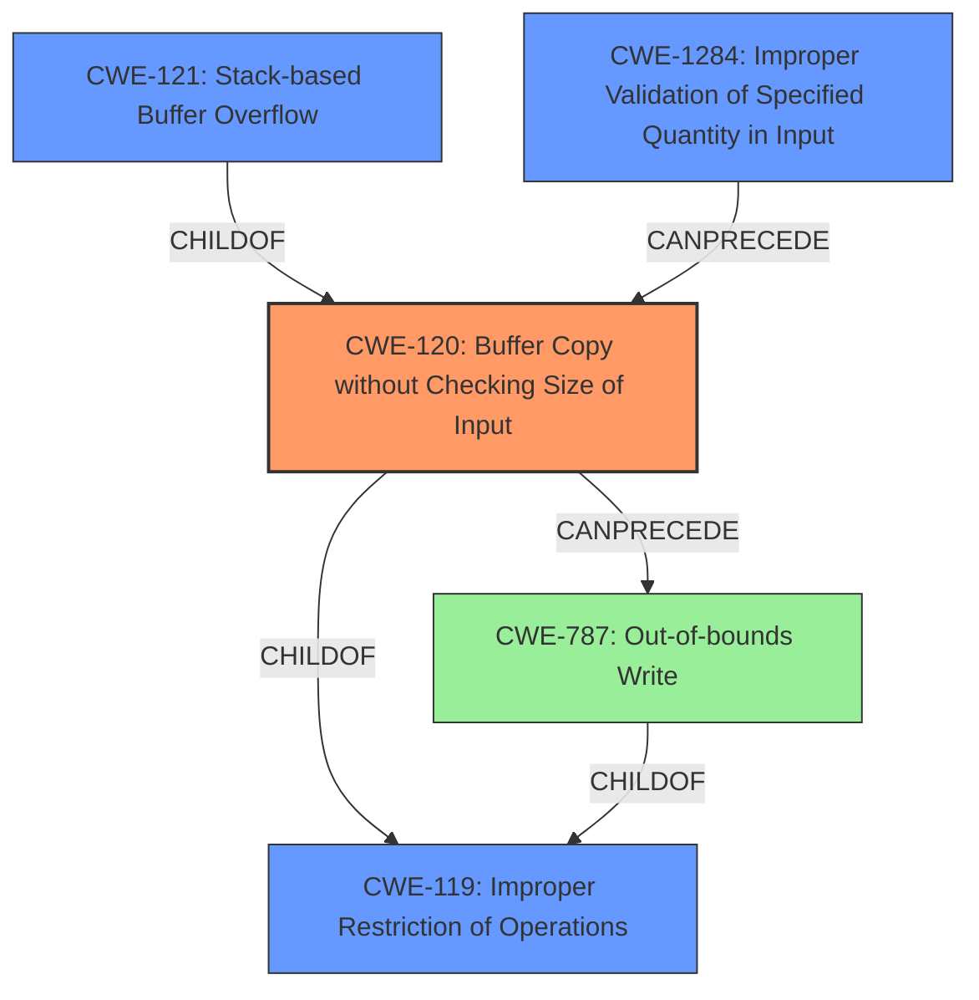

# Final Resolution for CVE-2022-40993

# Summary
| CWE ID | CWE Name | Confidence | CWE Abstraction Level | CWE Vulnerability Mapping Label | CWE-Vulnerability Mapping Notes |
|---|---|---|---|---|---|
| CWE-120 | Buffer Copy without Checking Size of Input ('Classic Buffer Overflow') | 0.95 | Base | Allowed-with-Review | Primary CWE: The vulnerability explicitly states a stack-based buffer overflow due to missing size checks before `sprintf`, aligning with CWE-120. |
| CWE-121 | Stack-based Buffer Overflow | 0.75 | Variant | Allowed | Secondary Candidate: While CWE-120 captures the core issue, CWE-121 provides more specific context about the overflow occurring on the stack. |
| CWE-787 | Out-of-bounds Write | 0.60 | Base | Allowed | Tertiary Candidate: Focuses on the result of the overflow, data being written outside the intended buffer. |

## Evidence and Confidence

*   **Confidence Score:** 0.92
*   **Evidence Strength:** HIGH

## Relationship Analysis
The primary relationship impacting the decision is the hierarchical structure. CWE-121 is a variant of buffer overflow (specifically stack-based) but less informative than CWE-120 about the **ROOTCAUSE**. CWE-787 describes the effect of the overflow. The chain relationship would be the lack of input validation, leading to a buffer copy without size checking, resulting in an out-of-bounds write. CWE-120 is a child of CWE-119 (Improper Restriction of Operations within the Bounds of a Memory Buffer), but CWE-120 is preferred because it provides more context about the buffer copy operation.

## Vulnerability Chain
The vulnerability chain starts with the lack of input validation (potentially CWE-1284) of the command parameters. This leads to a buffer copy without size checking (CWE-120) using `sprintf`. The result is an out-of-bounds write (CWE-787) on the stack, causing a **stack-based buffer overflow** (CWE-121), eventually leading to arbitrary command execution.

## Summary of Analysis
The initial analysis and the criticism both agree on CWE-120 as the primary **WEAKNESS**. The vulnerability description states, "Several **stack-based buffer overflow** vulnerabilities exist... A specially-crafted network packet can lead to arbitrary command execution...This buffer overflow is in the function that manages the firmwall keyword WORD description (WORD|null) command template." The CVE reference data content summary confirms that the size of command parameters isn't checked before using `sprintf`, leading to the overflow. This provides sufficient evidence to classify this as CWE-120, "Buffer Copy without Checking Size of Input ('Classic Buffer Overflow')".

The graph relationships influenced the selection of CWE-120 as the primary CWE because it is more specific than its parent, CWE-119, in describing the **ROOTCAUSE**: the missing input size check during the buffer copy. The variant CWE-121 describes the location, and CWE-787 describes the result of the overflow.

CWE-120 is at the optimal level of specificity because it directly addresses the **ROOTCAUSE** of the vulnerability, which is the lack of size checking before copying data into a buffer using `sprintf`. This aligns with the MITRE mapping guidance for CWE-120, which is "Allowed-with-Review," and is appropriate when there is no checking of input size.