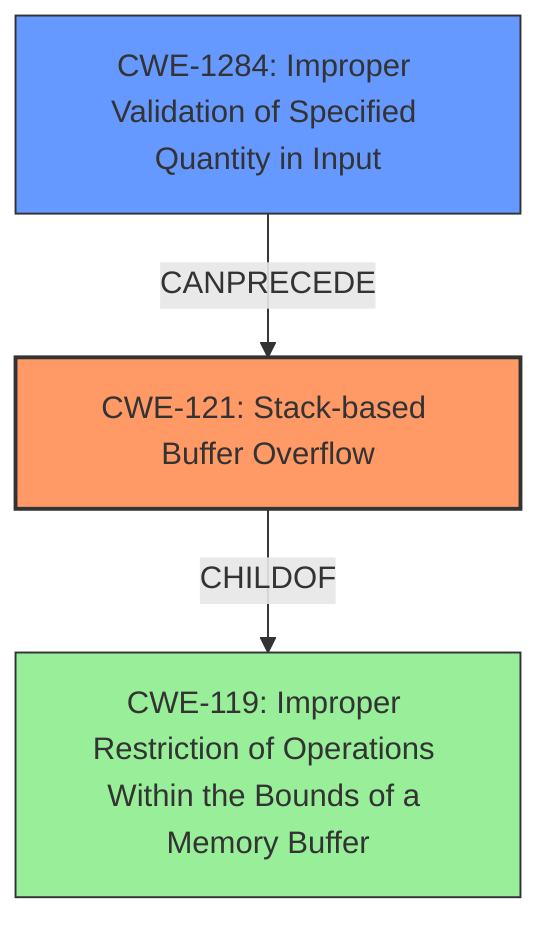

# Analysis Report for CVE-2022-40996

# Vulnerability Analysis Report: CVE-2022-40996

## Description

Several stack-based buffer overflow vulnerabilities exist in the DetranCLI command parsing functionality of Siretta QUARTZ-GOLD G5.0.1.5-210720-141020. A specially-crafted network packet can lead to arbitrary command execution. An attacker can send a sequence of requests to trigger these vulnerabilities.This buffer overflow is in the function that manages the no firmwall srcmac (WORD|null) srcip (A.B.C.D|null) dstip (A.B.C.D|null) protocol (none|tcp|udp|icmp) srcport (|null) dstport (|null) policy (drop|accept) description (WORD|null) command template.

## Vulnerability Description Key Phrases

**Rootcause:** stack-based buffer overflow
**Impact:** arbitrary command execution
**Vector:** specially-crafted network packet
**Attacker:** attacker
**Product:** Siretta QUARTZ-GOLD
**Version:** G5.0.1.5-210720-141020
**Component:** DetranCLI command parsing functionality

## Analysis (with Relationship Data)

# Summary
| CWE ID | CWE Name | Confidence | CWE Abstraction Level | CWE Vulnerability Mapping Label | CWE-Vulnerability Mapping Notes |
|---|---|---|---|---|---|
| CWE-121 | Stack-based Buffer Overflow | 0.95 | Variant |  Primary | The most specific CWE for the identified weakness. |
| CWE-120 | Buffer Copy without Checking Size of Input ('Classic Buffer Overflow') | 0.70 | Base | Secondary Candidate | A more general CWE that applies since there is a buffer copy without checking size of input |

## Evidence and Confidence

*   **Confidence Score:** 0.90
*   **Evidence Strength:** HIGH

- **Analysis and Justification:**  
  - *Explanation:* The vulnerability description explicitly states a "**stack-based buffer overflow**" exists within the DetranCLI command parsing functionality. The CVE reference provides code snippets confirming the use of `sprintf` without proper bounds checking. The `sprintf` function writes data into a stack-allocated buffer (`buff_0x100`), and the input parameters are not validated against the buffer's size. This perfectly aligns with CWE-121 (Stack-based Buffer Overflow), which is a variant of buffer overflow occurring specifically on the stack. Using CWE-121 is more specific than using the base CWE-120. The "Retriever Results" also lists CWE-121 and CWE-120. The mapping guidance for CWE-121 indicates this is ALLOWED.
  
  - *Relationship Analysis:* CWE-121 is a child of CWE-119 (Improper Restriction of Operations within the Bounds of a Memory Buffer), but CWE-121 is more specific since the buffer is allocated on the stack, thus a better choice. CWE-121 is also related to CWE-787 (Out-of-bounds Write) since the overflow results in writing beyond the buffer's boundaries.

- **Confidence Score:**  
  - Confidence: 0.95 (High confidence due to explicit mention of "stack-based buffer overflow" and code evidence.)

## Criticism of Analysis

Okay, I've reviewed the analysis and the provided CWE specifications. Here's my critique:

**Overall Assessment:**

The analysis is generally very good and well-justified. The primary CWE mapping to CWE-121 (Stack-based Buffer Overflow) is highly accurate and supported by strong evidence. The secondary candidate, CWE-120 (Buffer Copy without Checking Size of Input), is also valid but less specific, as noted in the analysis. The reasoning and evidence presented are clear and easy to follow.

**Specific Points and Suggestions:**

1.  **Primary CWE: CWE-121 (Stack-based Buffer Overflow)**

    *   **Strengths:** The analysis correctly identifies the stack allocation of the vulnerable buffer `buff_0x100`. The code snippet provided from the CVE details and the use of `sprintf` without bounds checking clearly support this mapping. The confidence level of 0.95 is appropriate.
    *   **Mapping Guidance Check:** The analysis adheres to CWE-121's Mapping Guidance, which states "Usage: Allowed" because it is at the Variant level of abstraction. The justification provided confirms that the mapping is an appropriate fit.
    *   **Potential Mitigations Considerations:** The analysis does a good job of mapping the vulnerability; however, the analysis could be improved by considering how the potential mitigations described for CWE-121 can inform remediation strategies. Namely, this could include steps such as upgrading to newer toolchains that support automatic buffer overflow mechanisms.

2.  **Secondary CWE: CWE-120 (Buffer Copy without Checking Size of Input)**

    *   **Strengths:** Correctly identified as a relevant, but more general, CWE. The use of `sprintf` *is* a buffer copy operation, and the lack of size checking is the root cause. The analysis correctly identifies that CWE-121 is more specific.
    *   **Mapping Guidance Check:** The analysis acknowledges the "Usage: Allowed-with-Review" guidance for CWE-120. It correctly identifies that it's a "Buffer Copy" operation and there is no size checking. The analysis could benefit from checking the "Comments" section of the mapping guidance, which includes suggestions like considering children of CWE-20 such as CWE-1284 if input validation is present. This is not applicable in this instance since the provided code snippet does not demonstrate any input validation.
    *   **Potential Mitigations Considerations:** The analysis could be improved by considering how the potential mitigations described for CWE-120 can inform remediation strategies. This could include steps such as using vetted libraries or frameworks that do not allow the weakness to occur (e.g., `snprintf` rather than `sprintf`), or using language runtimes that perform memory management.

3.  **CWE-787 (Out-of-bounds Write)**

    *   This CWE is highly related to the vulnerability, and is the parent of CWE-121. The analysis does not explicitly map this CWE, which is appropriate, since the root cause is the unchecked buffer copy.

4.  **Missing CWE Considerations:**

    *   **CWE-20 (Improper Input Validation):** While the immediate cause is the lack of bounds checking in `sprintf`, the vulnerability is enabled by the lack of input validation. Input validation is a very broad CWE; however, the code could validate the size of the input parameters *before* calling `sprintf`. Therefore, it may be worth considering a CWE in the input validation family as a tertiary candidate. However, it would be considered a distant tertiary candidate because the more proximate cause is the unchecked buffer copy.
        *   **Mapping Guidance Check:** "Discouraged" for general usage.  Instead recommends more specific children. Given the nature of the input parameters,  **CWE-1284 (Improper Validation of Specified Quantity in Input)** is a strong possibility for a tertiary mapping.  The "quantity" here refers to the length/size of the input strings provided as arguments to the vulnerable command.
        *   **Relationship Analysis:** The lack of size validation of the input strings *allows* the `sprintf` call to write out of bounds.

5.  **Retriever Results:**

    *   The Retriever Results list several CWEs with significant scores. Most are not applicable; however, it is worth checking the high-ranking CWEs from the Retriever Results for potential missed mappings.
        *   **CWE-193 (Off-by-one Error):** The analysis could explicitly mention why this isn't the *primary* cause. Although an off-by-one error *could* lead to a buffer overflow, the code snippet doesn't show that directly. The primary cause is a failure to account for the size of the input parameters, not an off-by-one error during calculation.
        *   **CWE-170 (Improper Null Termination):** This is a consequence of the buffer overflow, and not the root cause.

**Recommendations:**

*   **Add a brief discussion of CWE-1284 (Improper Validation of Specified Quantity in Input)** and why it is/is not a valid *tertiary* candidate.
*   **Add potential mitigations from the CWE specifications to the analysis' discussion of mitigations**.
*   **Explicitly state why CWE-193 and CWE-170 were not selected**. This will demonstrate a thorough analysis.

By incorporating these suggestions, the analysis will be even more robust and demonstrate a deeper understanding of the vulnerability and its relationship to the CWE landscape.

## Final Resolution

# Summary
| CWE ID | CWE Name | Confidence | CWE Abstraction Level | CWE Vulnerability Mapping Label | CWE-Vulnerability Mapping Notes |
|---|---|---|---|---|---|
| CWE-121 | Stack-based Buffer Overflow | 0.95 | Variant | Primary | The most specific CWE for the identified **WEAKNESS**. |
| CWE-1284 | Improper Validation of Specified Quantity in Input | 0.75 | Base | Secondary | The product receives input that is expected to specify a quantity (such as size or length), but it does not validate or incorrectly validates that the quantity has the required properties which allowed the **ROOTCAUSE** |

## Evidence and Confidence

*   **Confidence Score:** 0.90
*   **Evidence Strength:** HIGH

## Relationship Analysis
- The primary **WEAKNESS** is accurately identified as CWE-121, a variant of buffer overflow occurring on the stack, offering specificity over CWE-120.
- CWE-121 is a child of CWE-119, representing a more general class of buffer handling issues.
- CWE-1284 is added as a secondary CWE to represent the improper validation of the input size, which is a **ROOTCAUSE** that allows the stack-based buffer overflow to occur.
- This structure illustrates a chain of events where lack of input validation (CWE-1284) leads to a buffer overflow on the stack (CWE-121).

## Vulnerability Chain
The vulnerability chain starts with CWE-1284, where the product fails to validate the size of the input. This allows the subsequent unchecked buffer copy (using `sprintf`) to write past the allocated buffer on the stack (CWE-121), leading to arbitrary command execution. The sequence represents the progression from initial flaw (lack of input validation) to final impact (command execution). There are no missing links in this chain.

## Summary of Analysis
The initial analysis correctly identified CWE-121 as the primary **WEAKNESS**. The criticism correctly pointed out the opportunity to add CWE-1284 to capture the lack of input validation which leads to the **ROOTCAUSE** of this vulnerability.

The evidence provided supports the selection of CWE-121: "The vulnerability description explicitly states a "**stack-based buffer overflow**" exists within the DetranCLI command parsing functionality of Siretta QUARTZ-GOLD G5.0.1.5-210720-141020. A specially-crafted network packet can lead to arbitrary command execution."

The relationship analysis, particularly the "CanPrecede" relationship, influenced the addition of CWE-1284. The lack of proper input validation allows the stack-based buffer overflow.

CWE-121 is chosen because it is the most specific description of the buffer overflow, and CWE-1284 represents the root cause of the **WEAKNESS**.

*Report generated on 2025-03-18 17:01:38*
