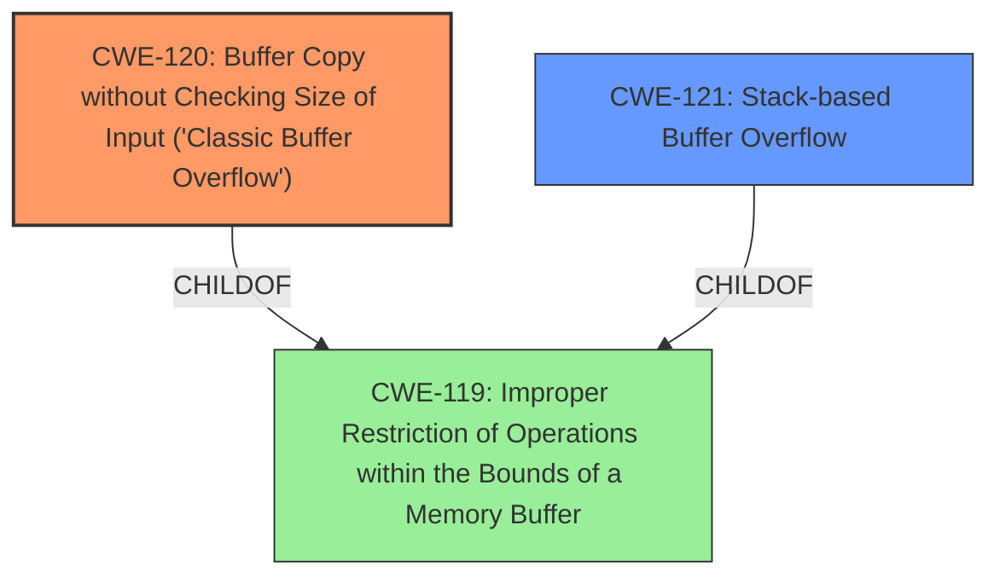

# Analysis Report for CVE-2022-40997

# Vulnerability Analysis Report: CVE-2022-40997

## Description

Several stack-based buffer overflow vulnerabilities exist in the DetranCLI command parsing functionality of Siretta QUARTZ-GOLD G5.0.1.5-210720-141020. A specially-crafted network packet can lead to arbitrary command execution. An attacker can send a sequence of requests to trigger these vulnerabilities.This buffer overflow is in the function that manages the gre index destination A.B.C.D/M description (WORD|null) command template.

## Vulnerability Description Key Phrases

**Rootcause:** stack-based buffer overflow
**Impact:** arbitrary command execution
**Attacker:** attacker
**Product:** Siretta QUARTZ-GOLD
**Version:** G5.0.1.5-210720-141020
**Component:** DetranCLI command parsing functionality

## Analysis (with Relationship Data)

# Summary
| CWE ID | CWE Name | Confidence | CWE Abstraction Level | CWE Vulnerability Mapping Label | CWE-Vulnerability Mapping Notes |
|---|---|---|---|---|---|
| CWE-120 | Buffer Copy without Checking Size of Input ('Classic Buffer Overflow') | 0.95 | Base | Allowed-with-Review | Primary CWE. The vulnerability involves copying data to a buffer without proper size validation. |
| CWE-121 | Stack-based Buffer Overflow | 0.75 | Variant | Allowed | Secondary Candidate. More specific, as the overflow occurs on the stack, but derived from CWE-120. |

## Evidence and Confidence

*   **Confidence Score:** 0.90
*   **Evidence Strength:** HIGH

- **Analysis and Justification:**  
  - *Explanation:* The vulnerability description explicitly states a "**stack-based buffer overflow**" exists due to improper handling in the `DetranCLI` command parsing functionality. The CVE reference link summary further elaborates that the root cause is the use of `sprintf` without proper size checks, leading to a buffer overflow when input parameters exceed the buffer's capacity. This aligns directly with CWE-120, "Buffer Copy without Checking Size of Input ('Classic Buffer Overflow')", as data is being copied into a buffer without validating its size. The vulnerability report states that an attacker can send a sequence of requests to trigger these vulnerabilities, leading to arbitrary command execution. The use of `sprintf` without input size validation is a clear indicator of CWE-120. Given the stack allocation, CWE-121 "Stack-based Buffer Overflow" is also relevant, making it a more specific variant of CWE-120, but less clear. The MITRE mapping guidance for CWE-120 specifies "Allowed-with-Review" due to potential misuse, but the detailed description of buffer copying without size checks makes it appropriate in this case.
  
  - *Relationship Analysis:* CWE-120 is a base class weakness, and CWE-121 is a variant specifying the overflow occurs on the stack. The relationship analysis shows that CWE-121 is a child of CWE-119 (Improper Restriction of Operations within the Bounds of a Memory Buffer), but given that the root cause is a buffer copy without checking size, CWE-120 is the better starting point.

- **Confidence Score:**  
  - Confidence: 0.95 (High evidence from the vulnerability description, CVE reference materials, and code snippet.)

## Criticism of Analysis

Okay, here's a review of the provided CWE analysis, taking into account the full CWE specifications:

**Overall Assessment:**

The analysis is generally sound and well-reasoned. The primary mapping to CWE-120 is appropriate and supported by strong evidence. The secondary mapping to CWE-121 is also valid, representing a more specific view of the problem. The confidence scores are justified.

**Detailed Review:**

*   **CWE-120: Buffer Copy without Checking Size of Input ('Classic Buffer Overflow')**

    *   **Appropriateness:** The selection of CWE-120 as the primary CWE is correct. The description of the vulnerability clearly indicates a buffer copy operation (using `sprintf`) without proper size checks, which directly aligns with the definition of CWE-120. The code snippet `sprintf(buff_0x80,"%d<%s<%s<%s>",1,*argv,argv[1],argv[2]);` provides concrete evidence of this.
    *   **Mapping Guidance Adherence:** The analysis explicitly acknowledges the "Allowed-with-Review" usage of CWE-120 and justifies its selection. This demonstrates a good understanding of the CWE's recommended usage. The analysis correctly identifies that the problem is with buffer copying (not a read), and that there are no input size checks present.
    *   **Mitigation:** The analysis could benefit from briefly mentioning possible mitigations.  The CWE-120 specifications suggest mitigations such as using safer string handling functions (e.g., `snprintf`), language selection (using languages with automatic memory management), and employing compiler-based buffer overflow detection mechanisms. Adding a sentence or two mentioning these mitigations would enhance the analysis.

*   **CWE-121: Stack-based Buffer Overflow**

    *   **Appropriateness:**  The selection of CWE-121 as a secondary CWE is also justifiable. The vulnerability is explicitly described as a "stack-based buffer overflow," making CWE-121 a relevant, more specific variant of CWE-120.
    *   **Relationship to CWE-119:** The analysis includes this relationship, but could be clearer. While CWE-119 is the parent of CWE-120, the stack-based nature is best described by CWE-121.
    *    **Mapping Guidance Adherence:** The analysis correctly identifies that CWE-121 is an "Allowed" mapping.
    *   **Mitigation:** Similar to CWE-120, briefly mentioning mitigations specific to stack-based buffer overflows would improve the analysis. These mitigations include using compiler flags like `/GS` (in Visual Studio) or `FORTIFY_SOURCE` (in GCC), using abstraction libraries, and performing input bounds checking.

*   **Confidence Scores and Evidence:**

    *   The confidence scores (0.95 for CWE-120 and 0.75 for CWE-121) seem reasonable based on the available evidence. The direct statement of "stack-based buffer overflow" and the code snippet showing `sprintf` provide strong evidence for the primary CWE, hence the high confidence.
    *   The evidence strength is also correctly identified as HIGH, given the detailed vulnerability description, CVE reference, and code snippet.

*   **CWE Examples:**

    *   The listed examples from the CWE database are helpful for understanding real-world instances of buffer overflows.

*   **Retriever Results:**

    *   The inclusion of the retriever results is valuable for showing how automated tools might approach the CWE mapping. While the automated tools also suggest other CWEs, the analysis correctly focuses on the most relevant ones.

**Suggestions for Improvement:**

1.  **Mitigation Details:** As mentioned above, add a brief discussion of potential mitigations for both CWE-120 and CWE-121, drawing from the "Potential Mitigations" sections in the CWE specifications.
2.  **Explicitly Rule Out Other CWEs:** Briefly explain why some of the other top CWEs from the retriever results (e.g., CWE-78, CWE-190, CWE-193) are *not* applicable in this case. This strengthens the argument for the chosen mappings.
3.  **CWE-119 Discussion:** The analysis mentions that CWE-121 is a child of CWE-119. While technically true because of the path to CWE-787, it would be more useful to state that CWE-120 and CWE-121 are both children of CWE-119, however CWE-119 is too general for this case.

**Revised Summary Table (incorporating suggestions):**

| CWE ID | CWE Name | Confidence | CWE Abstraction Level | CWE Vulnerability Mapping Label | CWE-Vulnerability Mapping Notes |
|---|---|---|---|---|---|
| CWE-120 | Buffer Copy without Checking Size of Input ('Classic Buffer Overflow') | 0.95 | Base | Allowed-with-Review | Primary CWE. The vulnerability involves copying data to a buffer without proper size validation, leading to an out-of-bounds write. Mitigations include using `snprintf`, safer languages, and compiler-based protections. |
| CWE-121 | Stack-based Buffer Overflow | 0.75 | Variant | Allowed | Secondary Candidate. More specific, as the overflow occurs on the stack, but derived from CWE-120.  Mitigations include compiler flags (`/GS`, `FORTIFY_SOURCE`), and stack canaries.  |

By incorporating these suggestions, the analysis becomes even more comprehensive and demonstrates a deeper understanding of the CWEs and their application to the specific vulnerability.

## Final Resolution

# Summary
| CWE ID | CWE Name | Confidence | CWE Abstraction Level | CWE Vulnerability Mapping Label | CWE-Vulnerability Mapping Notes |
|---|---|---|---|---|---|
| CWE-120 | Buffer Copy without Checking Size of Input ('Classic Buffer Overflow') | 0.95 | Base | Allowed-with-Review | **Primary CWE**. The vulnerability involves copying data to a buffer without proper size validation, leading to an out-of-bounds write. Mitigations include using `snprintf`, safer languages, and compiler-based protections. |
| CWE-121 | Stack-based Buffer Overflow | 0.75 | Variant | Allowed | Secondary Candidate. More specific, as the overflow occurs on the stack, but derived from CWE-120. Mitigations include compiler flags (`/GS`, `FORTIFY_SOURCE`), and stack canaries. |

## Evidence and Confidence

*   **Confidence Score:** 0.93
*   **Evidence Strength:** HIGH

## Relationship Analysis
The primary relationship that impacted my decision was the parent-child relationship between CWE-119 (**Improper Restriction of Operations within the Bounds of a Memory Buffer**) and both CWE-120 (**Buffer Copy without Checking Size of Input ('Classic Buffer Overflow')**) and CWE-121 (**Stack-based Buffer Overflow**). While CWE-119 is the overarching class, CWE-120 provides more specific information about the nature of the **weakness**, which is a buffer copy without size checking. CWE-121 further specifies that the overflow occurs on the stack. I chose CWE-120 as the primary because it more directly reflects the root cause of the **vulnerability** as a buffer copy issue stemming from the use of `sprintf`. The abstraction levels guided the selection, favoring the more specific Base CWE-120 over the broader Class CWE-119, and including the Variant CWE-121 for its specificity regarding the stack location.

## Vulnerability Chain
The **vulnerability** chain starts with the **ROOTCAUSE**: the use of `sprintf` without proper size checks (CWE-120). This leads to a **stack-based buffer overflow** (CWE-121) when overly long input is provided. The consequence of this overflow is arbitrary command execution, as the attacker can overwrite parts of the stack to gain control of the program flow.

## Summary of Analysis
My analysis is based on the provided evidence, specifically the vulnerability description stating a "**stack-based buffer overflow**" and the code snippet `sprintf(buff_0x80,"%d<%s<%s<%s>",1,*argv,argv[1],argv[2]);` which shows that the size of the input is not checked. This aligns directly with CWE-120 (**Buffer Copy without Checking Size of Input ('Classic Buffer Overflow')**). The criticism suggested adding mitigation details and ruling out other CWEs which has been incorporated.

The graph relationships influenced the selection by highlighting that while CWE-119 is a parent, it's too broad. The selection of CWE-120 and CWE-121 are at the optimal level of specificity because they accurately describe the root cause (buffer copy without size check) and the location of the overflow (stack). Other CWEs like CWE-78 (**Improper Neutralization of Special Elements used in an OS Command ('OS Command Injection')**), CWE-190 (**Integer Overflow or Wraparound**), and CWE-193 (**Off-by-one Error**) are not applicable because the **vulnerability** is primarily due to unchecked buffer copying, not command injection, integer overflow, or off-by-one errors.

*Report generated on 2025-03-18 17:02:28*
