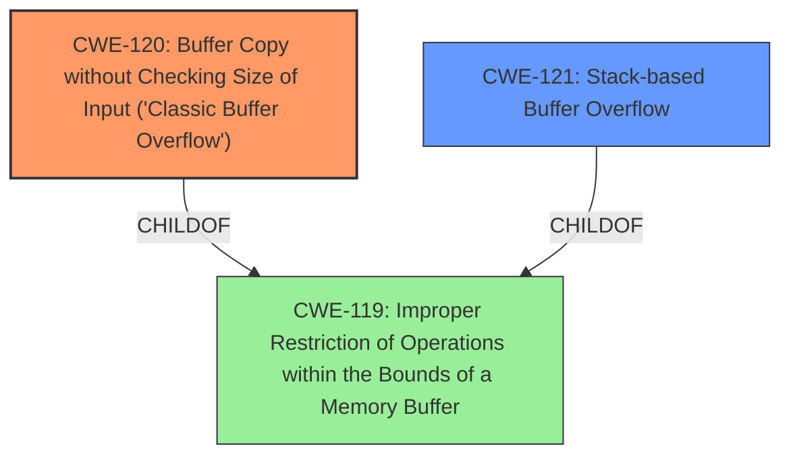

# Final Resolution for CVE-2022-40997

# Summary
| CWE ID | CWE Name | Confidence | CWE Abstraction Level | CWE Vulnerability Mapping Label | CWE-Vulnerability Mapping Notes |
|---|---|---|---|---|---|
| CWE-120 | Buffer Copy without Checking Size of Input ('Classic Buffer Overflow') | 0.95 | Base | Allowed-with-Review | **Primary CWE**. The vulnerability involves copying data to a buffer without proper size validation, leading to an out-of-bounds write. Mitigations include using `snprintf`, safer languages, and compiler-based protections. |
| CWE-121 | Stack-based Buffer Overflow | 0.75 | Variant | Allowed | Secondary Candidate. More specific, as the overflow occurs on the stack, but derived from CWE-120. Mitigations include compiler flags (`/GS`, `FORTIFY_SOURCE`), and stack canaries. |

## Evidence and Confidence

*   **Confidence Score:** 0.93
*   **Evidence Strength:** HIGH

## Relationship Analysis
The primary relationship that impacted my decision was the parent-child relationship between CWE-119 (**Improper Restriction of Operations within the Bounds of a Memory Buffer**) and both CWE-120 (**Buffer Copy without Checking Size of Input ('Classic Buffer Overflow')**) and CWE-121 (**Stack-based Buffer Overflow**). While CWE-119 is the overarching class, CWE-120 provides more specific information about the nature of the **weakness**, which is a buffer copy without size checking. CWE-121 further specifies that the overflow occurs on the stack. I chose CWE-120 as the primary because it more directly reflects the root cause of the **vulnerability** as a buffer copy issue stemming from the use of `sprintf`. The abstraction levels guided the selection, favoring the more specific Base CWE-120 over the broader Class CWE-119, and including the Variant CWE-121 for its specificity regarding the stack location.

## Vulnerability Chain
The **vulnerability** chain starts with the **ROOTCAUSE**: the use of `sprintf` without proper size checks (CWE-120). This leads to a **stack-based buffer overflow** (CWE-121) when overly long input is provided. The consequence of this overflow is arbitrary command execution, as the attacker can overwrite parts of the stack to gain control of the program flow.

## Summary of Analysis
My analysis is based on the provided evidence, specifically the vulnerability description stating a "**stack-based buffer overflow**" and the code snippet `sprintf(buff_0x80,"%d<%s<%s<%s>",1,*argv,argv[1],argv[2]);` which shows that the size of the input is not checked. This aligns directly with CWE-120 (**Buffer Copy without Checking Size of Input ('Classic Buffer Overflow')**). The criticism suggested adding mitigation details and ruling out other CWEs which has been incorporated.

The graph relationships influenced the selection by highlighting that while CWE-119 is a parent, it's too broad. The selection of CWE-120 and CWE-121 are at the optimal level of specificity because they accurately describe the root cause (buffer copy without size check) and the location of the overflow (stack). Other CWEs like CWE-78 (**Improper Neutralization of Special Elements used in an OS Command ('OS Command Injection')**), CWE-190 (**Integer Overflow or Wraparound**), and CWE-193 (**Off-by-one Error**) are not applicable because the **vulnerability** is primarily due to unchecked buffer copying, not command injection, integer overflow, or off-by-one errors.