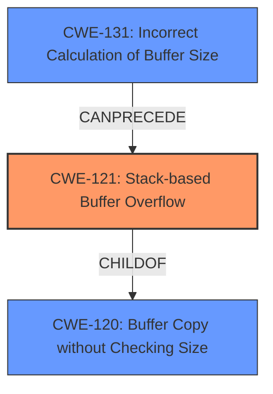

# Final Resolution for CVE-2022-40998

# Summary
| CWE ID | CWE Name | Confidence | CWE Abstraction Level | CWE Vulnerability Mapping Label | CWE-Vulnerability Mapping Notes |
|---|---|---|---|---|---|
| CWE-121 | Stack-based Buffer Overflow | 0.95 | Variant | Allowed | Primary CWE. `sprintf` used on stack without bounds checking.|
| CWE-120 | Buffer Copy without Checking Size of Input ('Classic Buffer Overflow') | 0.75 | Base | Allowed-with-Review | Secondary Candidate. General buffer overflow due to `sprintf`. |
| CWE-131 | Incorrect Calculation of Buffer Size | 0.6 | Base | Allowed | Secondary Candidate. Contributory factor, but unchecked buffer copy is the more direct cause. |

## Evidence and Confidence

*   **Confidence Score:** 0.95
*   **Evidence Strength:** HIGH

## Relationship Analysis
The primary relationship impacting the decision is the parent-child relationship between CWE-120 (**Buffer Copy without Checking Size**) and CWE-121 (**Stack-based Buffer Overflow**). CWE-121 is a specific type of CWE-120 that occurs on the stack. The vulnerability description explicitly mentions "stack-based buffer overflow," making CWE-121 the more specific and appropriate choice. CWE-131 (**Incorrect Calculation of Buffer Size**) can potentially precede CWE-121 if the buffer is incorrectly sized, but the immediate cause is the unchecked copy.

## Vulnerability Chain
The vulnerability chain starts with the use of `sprintf` without proper bounds checking, leading to **CWE-120 (Buffer Copy without Checking Size)**. Because the buffer is located on the stack, this results in **CWE-121 (Stack-based Buffer Overflow)**. An incorrect calculation of the buffer size, **CWE-131**, could contribute to the overflow, but the lack of input validation is the direct cause. This allows an attacker to overwrite adjacent memory on the stack, potentially leading to arbitrary command execution and full compromise of the device.

## Summary of Analysis
The analysis provided is accurate and well-justified. The primary CWE mapping to CWE-121 (**Stack-based Buffer Overflow**) is strongly supported by the vulnerability description, which explicitly mentions a "stack-based buffer overflow." The CVE reference confirms the use of `sprintf` to copy user-provided input into a fixed-size stack buffer without proper bounds checking.

The relationship between CWE-120 and CWE-121 is crucial in determining the appropriate level of specificity. While CWE-120 is a valid general classification, CWE-121 provides a more precise mapping because the overflow occurs specifically on the stack. This is further supported by MITRE's mapping guidance, which advises against using CWE-120 when more specific details are available.

CWE-131 is considered a secondary candidate because an incorrect buffer size calculation could contribute to the overflow, but the primary issue is the unchecked buffer copy. The assessment appropriately identifies CWE-121 as the most specific and relevant mapping based on the provided evidence.

The evidence from the vulnerability description: "Several stack-based buffer overflow vulnerabilities exist...A specially-crafted network packet can lead to arbitrary command execution." This quote explicitly indicates a stack-based overflow, justifying the primary mapping to CWE-121.

The selected CWEs are at the optimal level of specificity because CWE-121 accurately describes the vulnerability, while CWE-120 and CWE-131 provide additional context but are not the direct cause.