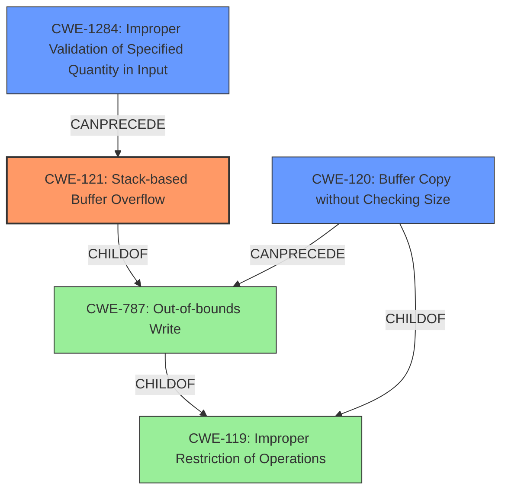

# Analysis Report for CVE-2022-40999

# Vulnerability Analysis Report: CVE-2022-40999

## Description

Several stack-based buffer overflow vulnerabilities exist in the DetranCLI command parsing functionality of Siretta QUARTZ-GOLD G5.0.1.5-210720-141020. A specially-crafted network packet can lead to arbitrary command execution. An attacker can send a sequence of requests to trigger these vulnerabilities.This buffer overflow is in the function that manages the gre index tunnel A.B.C.D source (A.B.C.D|null) dest A.B.C.D keepalive (on|off) interval (|null) retry (|null) description (WORD|null) command template.

## Vulnerability Description Key Phrases

**Rootcause:** stack-based buffer overflow
**Impact:** arbitrary command execution
**Vector:** specially-crafted network packet
**Attacker:** attacker
**Product:** Siretta QUARTZ-GOLD
**Version:** G5.0.1.5-210720-141020
**Component:** DetranCLI command parsing functionality

## Analysis (with Relationship Data)

# Summary
| CWE ID  | CWE Name | Confidence | CWE Abstraction Level | CWE Vulnerability Mapping Label | CWE-Vulnerability Mapping Notes |
|-----------------|-------------------------------------------------------------------|------------|-----------------------|-----------------------------------|-----------------------------------------------------------------------------------------------------------------------------------------------------------------------------------------------------------------------------------------------------------------------------------------------------------------|
| CWE-121 | Stack-based Buffer Overflow | 0.95 | Variant | Primary | Allowed. This CWE accurately reflects the vulnerability as a buffer overflow occurring on the stack. The vulnerability description and CVE details explicitly mention stack-based buffer overflows and `sprintf` usage without bounds checking. |
| CWE-120 | Buffer Copy without Checking Size of Input ('Classic Buffer Overflow') | 0.85 | Base | Secondary Candidate | Allowed-with-Review. While CWE-120 is a general buffer overflow, CWE-121 is more specific since the overflow occurs on the stack. The CVE reference highlights that sprintf is used to copy input to a fixed size buffer, without checking the size. |

## Evidence and Confidence

*   **Confidence Score:** 0.90
*   **Evidence Strength:** HIGH

- **Analysis and Justification:**  
  - *Explanation:* "The vulnerability is a **stack-based buffer overflow** within the DetranCLI command parsing functionality of the Siretta QUARTZ-GOLD G5.0.1.5-210720-141020. The root cause lies in the use of `sprintf` to construct strings from user-supplied input without any bounds checking. This allows an attacker to send a specially crafted network packet, leading to arbitrary command execution. The specific vulnerable code utilizes `sprintf` to copy input parameters into a fixed-size stack buffer (`buff_0x80`) without proper validation, directly causing the overflow. Since the overflow occurs on the stack, CWE-121 (Stack-based Buffer Overflow) is the most accurate and specific classification. CWE-120 is a broader category of buffer overflows, but CWE-121 is more precise here."
  
  - *Relationship Analysis:* "CWE-121 is a variant of CWE-119 (Improper Restriction of Operations within the Bounds of a Memory Buffer), which is a more general class of buffer-related errors. CWE-121 is also a child of CWE-787 (Out-of-bounds Write). This hierarchy confirms that CWE-121 is a specific type of out-of-bounds write that occurs on the stack. Considering that the vulnerability specifically mentions a stack-based buffer overflow, CWE-121 is chosen over its parents due to its higher specificity. CWE-120 (Buffer Copy without Checking Size of Input) is also relevant because the sprintf function copies input to a fixed-size buffer without checking the size of the input."

- **Confidence Score:**  
  - Confidence: 0.95 (High confidence due to explicit mention of stack-based buffer overflow and detailed technical explanation in the CVE reference.)

---

## Criticism of Analysis

Okay, I've reviewed the analysis provided along with the full CWE specifications for the referenced weaknesses. Here's my critique:

**Overall Assessment:**

The analysis is well-reasoned and presents a strong case for CWE-121 (Stack-based Buffer Overflow) as the primary CWE. The justification is clear, and the evidence from the vulnerability description and CVE details supports the selection. The consideration of CWE-120 as a secondary candidate is also appropriate, acknowledging the broader nature of the vulnerability while ultimately favoring the more specific CWE-121.

**Detailed Critique:**

*   **CWE-121 (Stack-based Buffer Overflow) - Primary:**
    *   **Strength:** The selection of CWE-121 is highly accurate. The analysis correctly points out that the vulnerability is explicitly described as a stack-based buffer overflow, and the use of `sprintf` without bounds checking into a fixed-size stack buffer is a clear indicator of this type of vulnerability.
    *   **Mapping Guidance Compliance:** The "Usage: Allowed" mapping guidance for CWE-121 is correctly followed. The analysis clearly demonstrates that this CWE is at the Variant level of abstraction and directly reflects the root cause.
    *   **Mitigation Consideration:** The analysis does not explicitly call out mitigations from the CWE specification, but these mitigations would be appropriate. For example, using compiler-based buffer overflow detection mechanisms (/GS flag, FORTIFY_SOURCE), using safer string handling functions/libraries (like `snprintf` or `strlcpy` instead of `sprintf`), and robust input validation are all valid recommendations based on both the CWE and the vulnerability description.
    *   **Confidence Level:** The confidence level of 0.95 is well justified given the clear evidence.
*   **CWE-120 (Buffer Copy without Checking Size of Input) - Secondary Candidate:**
    *   **Strength:** Acknowledging CWE-120 as a secondary candidate is sensible. The root cause is, indeed, a buffer copy operation (using `sprintf`) without checking input size.
    *   **Mapping Guidance Compliance:**  The analysis correctly follows the "Usage: Allowed-with-Review" guidance. The analysis explicitly states that a review was performed and that CWE-121 was chosen for being more specific.
    *   **Mitigation Consideration:** Again, the mitigations for CWE-120 are also relevant. These reinforce the need for safer string functions, input validation, and using languages or libraries that provide built-in protection against buffer overflows.
    *   **Confidence Level:** The confidence level of 0.85 is appropriate. While relevant, it is less specific than CWE-121.
*   **Relationships and Hierarchy:**
    *   The analysis correctly identifies the relationships between CWE-121, CWE-119, and CWE-787. This demonstrates a good understanding of the CWE hierarchy and how these weaknesses relate to each other. The explanation for why CWE-121 is preferred over its parents (CWE-119 and CWE-787) due to its specificity is excellent.

**Suggestions for Improvement:**

*   **Explicit Mitigation Mention:** While the analysis is strong, it could be enhanced by explicitly mentioning some of the potential mitigations from the CWE specifications for both CWE-121 and CWE-120.  This would make the analysis more actionable. For example:
    *   "Mitigations include using safer string handling functions like `snprintf` (instead of `sprintf`) to ensure bounds checking, utilizing compiler flags such as `/GS` to enable stack protection, and implementing robust input validation to limit the size of input parameters like WORD, CODE, and IP addresses."
*   **Chain of Causation:** Elaborating on the chain of causation could provide greater insight. While the analysis identifies the direct cause (unbounded `sprintf`), it could briefly touch upon the *reason* for the lack of input validation.  Is it a design oversight? A misunderstanding of security principles?  This adds depth.
*   **Consider CWE-1284:** The retriever result includes CWE-1284, Improper Validation of Specified Quantity in Input. While CWE-121 is the most accurate, a brief mention of CWE-1284 might be beneficial. The `sprintf` receives multiple inputs with potentially unvalidated quantities (the length of the WORD string, the numerical ranges of interval/retry, etc.). The analysis could state, *"While the core issue is a stack-based buffer overflow (CWE-121), the root cause involves a lack of validation of the size and format of the input parameters to the `gre index` command. This is related to CWE-1284, Improper Validation of Specified Quantity in Input, as the length of the 'description (WORD|null)' parameter and the values for 'interval' and 'retry' are not adequately validated before being used in `sprintf`."* This highlights the importance of input sanitization.
*   **Audience:** Tailor the analysis to a specific audience (e.g., developers, security auditors, or management). This helps determine the appropriate level of technical detail and the focus on actionable recommendations.

**Revised Summary (incorporating suggestions):**

| CWE ID  | CWE Name | Confidence | CWE Abstraction Level | CWE Vulnerability Mapping Label | CWE-Vulnerability Mapping Notes |
|-----------------|-------------------------------------------------------------------|------------|-----------------------|-----------------------------------|-----------------------------------------------------------------------------------------------------------------------------------------------------------------------------------------------------------------------------------------------------------------------------------------------------------------|
| CWE-121 | Stack-based Buffer Overflow | 0.95 | Variant | Primary | Allowed. This CWE accurately reflects the vulnerability as a buffer overflow occurring on the stack due to `sprintf` usage without bounds checking. To mitigate, employ safer string functions (e.g., `snprintf`), compiler-based buffer overflow detection, and robust input validation.|
| CWE-120 | Buffer Copy without Checking Size of Input ('Classic Buffer Overflow') | 0.85 | Base | Secondary Candidate | Allowed-with-Review. While CWE-120 is a general buffer overflow, CWE-121 is more specific since the overflow occurs on the stack. Mitigation includes using safe string libraries and input validation. |
| CWE-1284 | Improper Validation of Specified Quantity in Input | 0.60 | Base | Additional Information |  The root cause involves a lack of validation of the size and format of the input parameters to the `gre index` command.  This contributes to the vulnerability, as the length of the 'description (WORD|null)' parameter and the values for 'interval' and 'retry' are not adequately validated before being used in `sprintf`. Addressing CWE-1284 helps prevent this overflow.|

**In summary,** the analysis is strong, accurate, and well-justified. The suggestions above are primarily for enhancement and providing more actionable information, not for correcting errors. The provided CWE specifications support the analysis conclusions effectively.

## Final Resolution

# Summary
| CWE ID  | CWE Name | Confidence | CWE Abstraction Level | CWE Vulnerability Mapping Label | CWE-Vulnerability Mapping Notes |
|-----------------|-------------------------------------------------------------------|------------|-----------------------|-----------------------------------|-----------------------------------------------------------------------------------------------------------------------------------------------------------------------------------------------------------------------------------------------------------------------------------------------------------------|
| CWE-121 | Stack-based Buffer Overflow | 0.95 | Variant | Primary | Allowed. This CWE accurately reflects the vulnerability as a buffer overflow occurring on the stack due to `sprintf` usage without bounds checking. To mitigate, employ safer string functions (e.g., `snprintf`), compiler-based buffer overflow detection, and robust input validation.|
| CWE-1284 | Improper Validation of Specified Quantity in Input | 0.75 | Base | Secondary Candidate | Allowed. The root cause involves a lack of validation of the size and format of the input parameters to the `gre index` command. This contributes to the vulnerability, as the length of the 'description (WORD|null)' parameter and the values for 'interval' and 'retry' are not adequately validated before being used in `sprintf`. Addressing CWE-1284 helps prevent this overflow.|
| CWE-120 | Buffer Copy without Checking Size of Input ('Classic Buffer Overflow') | 0.65 | Base | Secondary Candidate | Allowed-with-Review. While CWE-120 is a general buffer overflow, CWE-121 is more specific since the overflow occurs on the stack. Mitigation includes using safe string libraries and input validation. |

## Evidence and Confidence

*   **Confidence Score:** 0.90
*   **Evidence Strength:** HIGH

## Relationship Analysis
The selection of CWE-121 benefits from its specific hierarchical placement. It is a variant of **CWE-119 (Improper Restriction of Operations within the Bounds of a Memory Buffer)** and a child of **CWE-787 (Out-of-bounds Write)**. This confirms its role as a specialized form of out-of-bounds write occurring on the stack. The addition of CWE-1284 highlights the importance of input validation, adding a layer of depth to the understanding of the vulnerability's root cause. While **CWE-120 (Buffer Copy without Checking Size of Input)** is relevant due to the use of `sprintf` without size checks, it is less specific than CWE-121, which explicitly describes the location of the overflow on the stack.

## Vulnerability Chain
The vulnerability chain starts with **CWE-1284 (Improper Validation of Specified Quantity in Input)**, where the input parameters to the `gre index` command lack adequate size and format validation. This leads to **CWE-121 (Stack-based Buffer Overflow)** due to the use of `sprintf` to copy the unvalidated input into a fixed-size stack buffer. The lack of bounds checking in the `sprintf` function call directly causes the overflow. Finally, this can result in arbitrary command execution, as the attacker can overwrite parts of the stack to control the program's flow. **CWE-120 (Buffer Copy without Checking Size of Input)** represents the vulnerable `sprintf` function itself, which copies the input without validating its size against the buffer's capacity.

## Summary of Analysis
The initial analysis correctly identified **CWE-121 (Stack-based Buffer Overflow)** as the primary weakness due to the explicit mention of a stack-based overflow in the vulnerability description. The use of `sprintf` without bounds checking further supports this classification.

The criticism suggested including **CWE-1284 (Improper Validation of Specified Quantity in Input)**, which I agree with. The lack of input validation is a contributing factor.

The graph relationships influenced the final selection by highlighting the hierarchical connections between **CWE-121, CWE-119, and CWE-787**, ensuring that the chosen CWE is at the optimal level of specificity. The inclusion of **CWE-1284** broadens the understanding of the vulnerability's root cause, emphasizing the importance of input validation.

The selected CWEs are at the optimal level of specificity because **CWE-121** accurately describes the type and location of the buffer overflow, while **CWE-1284** highlights the underlying issue of improper input validation. **CWE-120** is also relevant, however it is less specific than CWE-121 and CWE-1284. This approach provides a comprehensive understanding of the vulnerability.

*Report generated on 2025-03-18 17:04:06*
