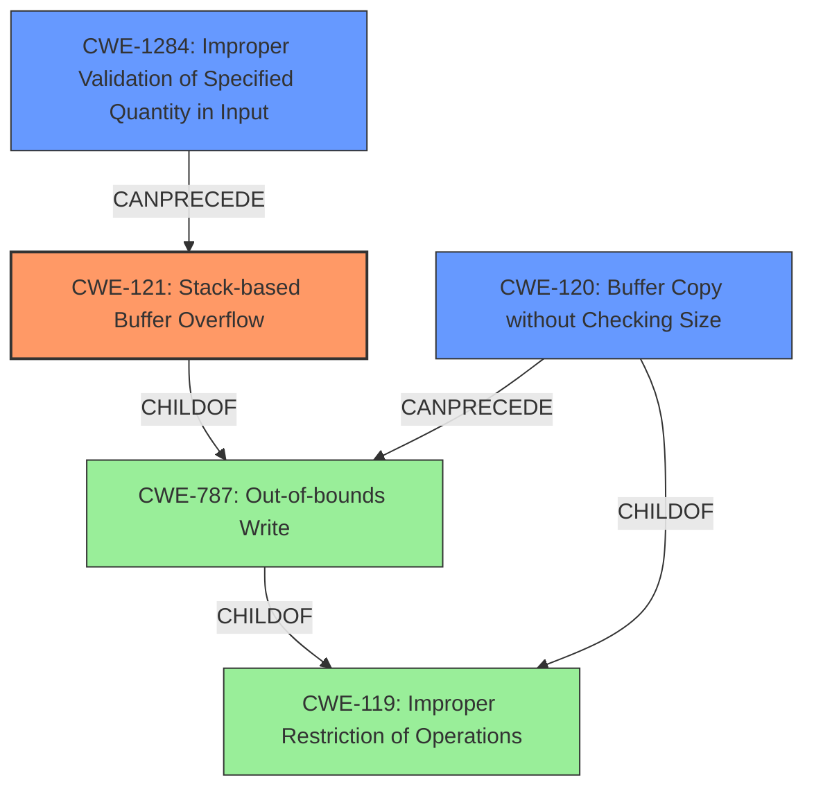

# Final Resolution for CVE-2022-40999

# Summary
| CWE ID  | CWE Name | Confidence | CWE Abstraction Level | CWE Vulnerability Mapping Label | CWE-Vulnerability Mapping Notes |
|-----------------|-------------------------------------------------------------------|------------|-----------------------|-----------------------------------|-----------------------------------------------------------------------------------------------------------------------------------------------------------------------------------------------------------------------------------------------------------------------------------------------------------------|
| CWE-121 | Stack-based Buffer Overflow | 0.95 | Variant | Primary | Allowed. This CWE accurately reflects the vulnerability as a buffer overflow occurring on the stack due to `sprintf` usage without bounds checking. To mitigate, employ safer string functions (e.g., `snprintf`), compiler-based buffer overflow detection, and robust input validation.|
| CWE-1284 | Improper Validation of Specified Quantity in Input | 0.75 | Base | Secondary Candidate | Allowed. The root cause involves a lack of validation of the size and format of the input parameters to the `gre index` command. This contributes to the vulnerability, as the length of the 'description (WORD|null)' parameter and the values for 'interval' and 'retry' are not adequately validated before being used in `sprintf`. Addressing CWE-1284 helps prevent this overflow.|
| CWE-120 | Buffer Copy without Checking Size of Input ('Classic Buffer Overflow') | 0.65 | Base | Secondary Candidate | Allowed-with-Review. While CWE-120 is a general buffer overflow, CWE-121 is more specific since the overflow occurs on the stack. Mitigation includes using safe string libraries and input validation. |

## Evidence and Confidence

*   **Confidence Score:** 0.90
*   **Evidence Strength:** HIGH

## Relationship Analysis
The selection of CWE-121 benefits from its specific hierarchical placement. It is a variant of **CWE-119 (Improper Restriction of Operations within the Bounds of a Memory Buffer)** and a child of **CWE-787 (Out-of-bounds Write)**. This confirms its role as a specialized form of out-of-bounds write occurring on the stack. The addition of CWE-1284 highlights the importance of input validation, adding a layer of depth to the understanding of the vulnerability's root cause. While **CWE-120 (Buffer Copy without Checking Size of Input)** is relevant due to the use of `sprintf` without size checks, it is less specific than CWE-121, which explicitly describes the location of the overflow on the stack.

## Vulnerability Chain
The vulnerability chain starts with **CWE-1284 (Improper Validation of Specified Quantity in Input)**, where the input parameters to the `gre index` command lack adequate size and format validation. This leads to **CWE-121 (Stack-based Buffer Overflow)** due to the use of `sprintf` to copy the unvalidated input into a fixed-size stack buffer. The lack of bounds checking in the `sprintf` function call directly causes the overflow. Finally, this can result in arbitrary command execution, as the attacker can overwrite parts of the stack to control the program's flow. **CWE-120 (Buffer Copy without Checking Size of Input)** represents the vulnerable `sprintf` function itself, which copies the input without validating its size against the buffer's capacity.

## Summary of Analysis
The initial analysis correctly identified **CWE-121 (Stack-based Buffer Overflow)** as the primary weakness due to the explicit mention of a stack-based overflow in the vulnerability description. The use of `sprintf` without bounds checking further supports this classification.

The criticism suggested including **CWE-1284 (Improper Validation of Specified Quantity in Input)**, which I agree with. The lack of input validation is a contributing factor.

The graph relationships influenced the final selection by highlighting the hierarchical connections between **CWE-121, CWE-119, and CWE-787**, ensuring that the chosen CWE is at the optimal level of specificity. The inclusion of **CWE-1284** broadens the understanding of the vulnerability's root cause, emphasizing the importance of input validation.

The selected CWEs are at the optimal level of specificity because **CWE-121** accurately describes the type and location of the buffer overflow, while **CWE-1284** highlights the underlying issue of improper input validation. **CWE-120** is also relevant, however it is less specific than CWE-121 and CWE-1284. This approach provides a comprehensive understanding of the vulnerability.