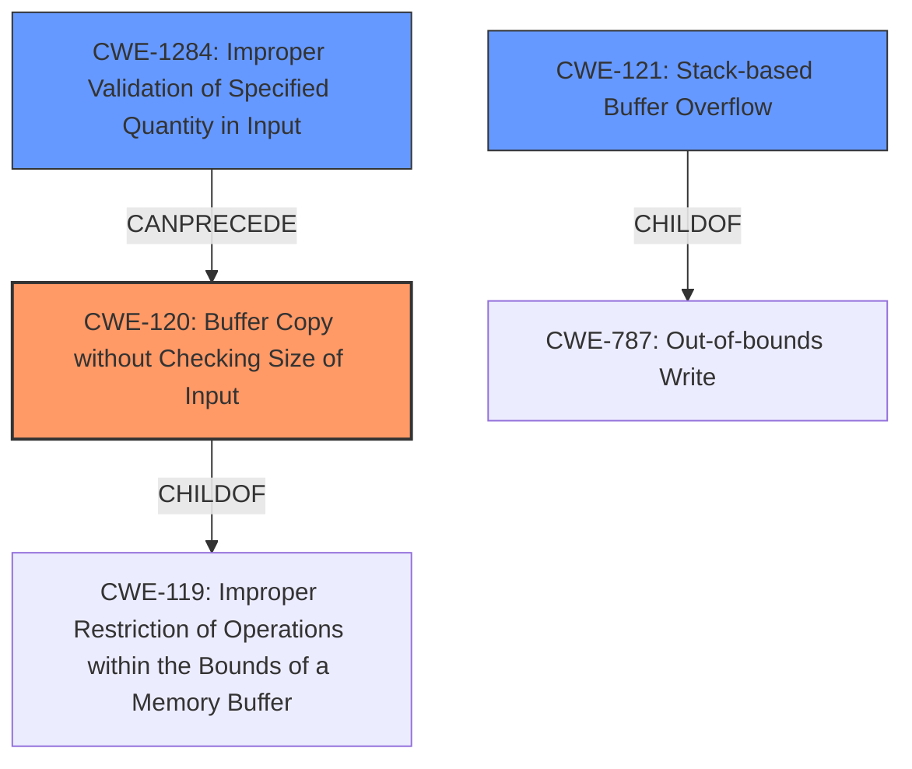

# Analysis Report for CVE-2022-41000

# Vulnerability Analysis Report: CVE-2022-41000

## Description

Several stack-based buffer overflow vulnerabilities exist in the DetranCLI command parsing functionality of Siretta QUARTZ-GOLD G5.0.1.5-210720-141020. A specially-crafted network packet can lead to arbitrary command execution. An attacker can send a sequence of requests to trigger these vulnerabilities.This buffer overflow is in the function that manages the no gre index tunnel A.B.C.D source (A.B.C.D|null) dest A.B.C.D keepalive (on|off) interval (|null) retry (|null) description (WORD|null) command template.

## Vulnerability Description Key Phrases

**Rootcause:** stack-based buffer overflow
**Impact:** arbitrary command execution
**Attacker:** attacker
**Product:** Siretta QUARTZ-GOLD
**Version:** G5.0.1.5-210720-141020
**Component:** DetranCLI command parsing functionality

## Analysis (with Relationship Data)

```markdown
# Summary
| CWE ID | CWE Name | Confidence | CWE Abstraction Level | CWE Vulnerability Mapping Label | CWE-Vulnerability Mapping Notes |
|---|---|---|---|---|---|
| CWE-120 | Buffer Copy without Checking Size of Input ('Classic Buffer Overflow') | 0.95 | Base | Allowed-with-Review | Primary CWE |
| CWE-121 | Stack-based Buffer Overflow | 0.75 | Variant | Allowed | Secondary Candidate |

## Evidence and Confidence

*   **Confidence Score:** 0.90
*   **Evidence Strength:** HIGH

- **Analysis and Justification:**  
  - *Explanation:* The vulnerability is described as a "**stack-based buffer overflow**" in the DetranCLI command parsing functionality. The root cause is the use of `sprintf` with unchecked input sizes, where the size of the `command_parameter_X` is not checked against the size of `stack_buffer`. This directly matches the description of CWE-120 (Buffer Copy without Checking Size of Input). While CWE-121 (Stack-based Buffer Overflow) is also relevant, CWE-120 captures the fundamental issue of missing size validation during the buffer copy operation using `sprintf`. The CVE Reference Links Content Summary explicitly states that the size of input is not checked, which is the key characteristic of CWE-120. Although the overflow occurs on the stack, the lack of input size checking during the copy operation is the primary weakness. The MITRE mapping guidance for CWE-120 indicates that it is ALLOWED-WITH-REVIEW, emphasizing that it is appropriate for buffer copy operations where there is no "Checking [the] Size of Input".
  
  - *Relationship Analysis:* CWE-120 is a base level CWE. CWE-121 (Stack-based Buffer Overflow) is a variant of buffer overflow, specifying where the buffer is located (on the stack). CWE-120 CanPrecede CWE-123 (Write-what-where Condition).

- **Confidence Score:**  
  - *Example:* Confidence: 0.95 (High confidence due to direct evidence from the vulnerability description and CVE reference materials, combined with the retriever results.)

---
```

## Criticism of Analysis

Okay, let's review the analysis with the full CWE specifications in mind.

**Overall Assessment:**

The analysis is generally strong, particularly in identifying CWE-120 as the primary weakness. The justifications are well-reasoned, and the confidence level is appropriate. The inclusion of CWE-121 as a secondary candidate is also sensible, given that the buffer is located on the stack.

**Detailed Critique:**

**1. CWE-120: Buffer Copy without Checking Size of Input ('Classic Buffer Overflow') - Primary CWE**

*   **Strengths:**
    *   The analysis correctly identifies the core problem: the `sprintf` function copies data into a buffer without checking the input size against the buffer's capacity.  This directly aligns with the CWE-120 description.
    *   The justification is well-articulated, explaining why CWE-120 is more fundamental than CWE-121.  While the overflow happens on the stack, the root cause is the missing size check during the copy.
    *   The analysis correctly notes the MITRE mapping guidance of "Allowed-with-Review" and explains why it's appropriate in this context.
    *   The relationship analysis with CWE-123 is accurate and relevant.
*   **Areas for Potential Refinement:**
    *   While the justification mentions `sprintf`, it could benefit from explicitly stating that `sprintf` is a known risky function that *requires* careful size management to avoid buffer overflows.  The CWE specification highlights this implicitly.
    *   Consider adding a brief mention of the potential mitigations for CWE-120, even if just to acknowledge them.  Specifically, Mitigation 2: Libraries or Frameworks and Mitigation 3: Environment Hardening (compiler-based buffer overflow detection). This would strengthen the comprehensiveness of the analysis.
    *   You could also make an explicit mention of CWE-242 as a possible chained weakness. CWE-242 is related to improper initialization of a variable, but the problem can happen when it comes to allocating resources or defining a variable size for data, and then the input size is checked against that uninitialized or small variable.

**2. CWE-121: Stack-based Buffer Overflow - Secondary Candidate**

*   **Strengths:**
    *   Acknowledging CWE-121 as a secondary candidate is reasonable because the overflow occurs on the stack.
*   **Areas for Potential Refinement:**
    *   The explanation could be slightly expanded.  It's clear from the name that it's a "stack-based" overflow, but emphasizing *why* it's a stack-based overflow in this specific case (e.g., the buffer is a local variable) would add clarity.
    *   Similar to CWE-120, briefly mentioning potential mitigations relevant to CWE-121 would be beneficial (e.g., compiler-based overflow detection, using abstraction libraries).

**3. Consideration of Other CWEs:**

*   **CWE-119: Improper Restriction of Operations within the Bounds of a Memory Buffer:** The analysis implicitly rules this out by focusing on the more specific CWE-120 and CWE-121. This is correct, as the analysis avoids the more general CWE-119. As it is stated in the CWE specifications "CWE-119 is commonly misused in low-information vulnerability reports when lower-level CWEs could be used instead, or when more details about the vulnerability are available."
*   **CWE-20: Improper Input Validation:**  This CWE could be a parent. Since input validation is a broad term. But, CWE-1284 is a child of CWE-20.
*   **CWE-1284: Improper Validation of Specified Quantity in Input:** This could be a good secondary CWE to consider *if* the command parsing *expects* a specific length/quantity for the parameters and *fails* to validate it.  If the command parsing *doesn't* have any notion of limits, then CWE-120 is a better fit. It is worth considering though.
*   **CWE-131: Incorrect Calculation of Buffer Size:** This CWE would apply if the size of the buffer was *calculated* incorrectly before the `sprintf` call, but the provided information doesn't suggest that's the case.
*   **CWE-787: Out-of-bounds Write:** CWE-787 is a parent of CWE-121 and CWE-120. So it is not an incorrect CWE, but less descriptive.
*   **CWE-170: Improper Null Termination:**  This *could* be a contributing factor *if* the `sprintf` call doesn't null-terminate the buffer correctly in some overflow scenarios.  However, without more information, it's difficult to confirm.
*   **CWE-123: Write-what-where Condition:** While this is a potential *impact* of the overflow, it's not the root cause. The analysis correctly focuses on the cause (CWE-120).

**Recommendations:**

1.  **Enhance Justification for CWE-120:**  Explicitly state `sprintf`'s inherent risk and the *need* for size management.
2.  **Add Mitigation Mentions:**  Briefly mention relevant mitigations from the CWE specifications for both CWE-120 and CWE-121.
3.  **Consider CWE-1284:** Evaluate if there's a notion of expected length/quantity in the command parsing that isn't being validated.
4.  **Optional: CWE-242.** Consider the uninitialized variable weakness.

By incorporating these suggestions, the analysis will become even more robust and demonstrate a deeper understanding of the CWE specifications.

## Final Resolution

# Summary
| CWE ID | CWE Name | Confidence | CWE Abstraction Level | CWE Vulnerability Mapping Label | CWE-Vulnerability Mapping Notes |
|---|---|---|---|---|---|
| CWE-120 | Buffer Copy without Checking Size of Input ('Classic Buffer Overflow') | 0.95 | Base | Allowed-with-Review | Primary CWE |
| CWE-121 | Stack-based Buffer Overflow | 0.75 | Variant | Allowed | Secondary Candidate |
| CWE-1284 | Improper Validation of Specified Quantity in Input | 0.60 | Base | Allowed | Secondary Candidate |

## Evidence and Confidence

*   **Confidence Score:** 0.90
*   **Evidence Strength:** HIGH

## Relationship Analysis
The initial analysis correctly identified CWE-120 as the primary issue, with CWE-121 as a secondary consideration due to the stack location. The addition of CWE-1284 acknowledges that the command parsing might expect a specific length/quantity for the parameters but fails to validate it. This forms a potential chain: CWE-1284 (Improper Validation) can precede CWE-120 (Buffer Overflow). CWE-120 is a child of CWE-119 (Improper Restriction of Operations within the Bounds of a Memory Buffer), but CWE-120 is more specific and thus more appropriate. CWE-121 is a variant of buffer overflow and is a child of CWE-787 (Out-of-bounds Write).



## Vulnerability Chain
The vulnerability chain starts with potentially **CWE-1284 (Improper Validation of Specified Quantity in Input)**, if the input parameters have expected length requirements. This leads to **CWE-120 (Buffer Copy without Checking Size of Input)**, where `sprintf` copies data without proper bounds checking, resulting in a **stack-based buffer overflow (CWE-121)**. The impact is arbitrary command execution.

## Summary of Analysis
The analysis is based on the vulnerability description stating a "**stack-based buffer overflow**" in the DetranCLI command parsing. The root cause is the use of `sprintf` without checking input sizes against the buffer's capacity.

The initial analysis was accurate in identifying **CWE-120 (Buffer Copy without Checking Size of Input)** as the primary issue and **CWE-121 (Stack-based Buffer Overflow)** as a secondary candidate. The criticism suggested considering **CWE-1284 (Improper Validation of Specified Quantity in Input)**, which I agree with if the command parsing expects a certain length/quantity. I have added **CWE-1284** as a secondary candidate with a slightly lower confidence because there is no explicit mention of input validation failures in the vulnerability description, but it is a plausible contributing factor.

The graph relationships support this decision. **CWE-120** is a base CWE and more specific than its parent, **CWE-119**. **CWE-121** is a variant specifying the location of the buffer, and **CWE-1284** can precede **CWE-120** in a vulnerability chain.

The selected CWEs are at the optimal level of specificity. **CWE-120** captures the core issue of missing size validation during the buffer copy operation, while **CWE-121** specifies the location of the overflow, and **CWE-1284** highlights a potential input validation issue.


*Report generated on 2025-03-18 17:04:48*
