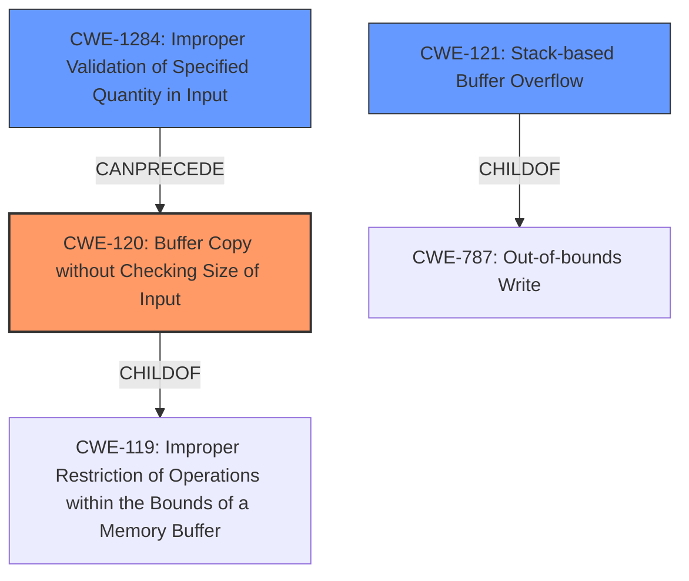

# Final Resolution for CVE-2022-41000

# Summary
| CWE ID | CWE Name | Confidence | CWE Abstraction Level | CWE Vulnerability Mapping Label | CWE-Vulnerability Mapping Notes |
|---|---|---|---|---|---|
| CWE-120 | Buffer Copy without Checking Size of Input ('Classic Buffer Overflow') | 0.95 | Base | Allowed-with-Review | Primary CWE |
| CWE-121 | Stack-based Buffer Overflow | 0.75 | Variant | Allowed | Secondary Candidate |
| CWE-1284 | Improper Validation of Specified Quantity in Input | 0.60 | Base | Allowed | Secondary Candidate |

## Evidence and Confidence

*   **Confidence Score:** 0.90
*   **Evidence Strength:** HIGH

## Relationship Analysis
The initial analysis correctly identified CWE-120 as the primary issue, with CWE-121 as a secondary consideration due to the stack location. The addition of CWE-1284 acknowledges that the command parsing might expect a specific length/quantity for the parameters but fails to validate it. This forms a potential chain: CWE-1284 (Improper Validation) can precede CWE-120 (Buffer Overflow). CWE-120 is a child of CWE-119 (Improper Restriction of Operations within the Bounds of a Memory Buffer), but CWE-120 is more specific and thus more appropriate. CWE-121 is a variant of buffer overflow and is a child of CWE-787 (Out-of-bounds Write).

## Vulnerability Chain
The vulnerability chain starts with potentially **CWE-1284 (Improper Validation of Specified Quantity in Input)**, if the input parameters have expected length requirements. This leads to **CWE-120 (Buffer Copy without Checking Size of Input)**, where `sprintf` copies data without proper bounds checking, resulting in a **stack-based buffer overflow (CWE-121)**. The impact is arbitrary command execution.

## Summary of Analysis
The analysis is based on the vulnerability description stating a "**stack-based buffer overflow**" in the DetranCLI command parsing. The root cause is the use of `sprintf` without checking input sizes against the buffer's capacity.

The initial analysis was accurate in identifying **CWE-120 (Buffer Copy without Checking Size of Input)** as the primary issue and **CWE-121 (Stack-based Buffer Overflow)** as a secondary candidate. The criticism suggested considering **CWE-1284 (Improper Validation of Specified Quantity in Input)**, which I agree with if the command parsing expects a certain length/quantity. I have added **CWE-1284** as a secondary candidate with a slightly lower confidence because there is no explicit mention of input validation failures in the vulnerability description, but it is a plausible contributing factor.

The graph relationships support this decision. **CWE-120** is a base CWE and more specific than its parent, **CWE-119**. **CWE-121** is a variant specifying the location of the buffer, and **CWE-1284** can precede **CWE-120** in a vulnerability chain.

The selected CWEs are at the optimal level of specificity. **CWE-120** captures the core issue of missing size validation during the buffer copy operation, while **CWE-121** specifies the location of the overflow, and **CWE-1284** highlights a potential input validation issue.