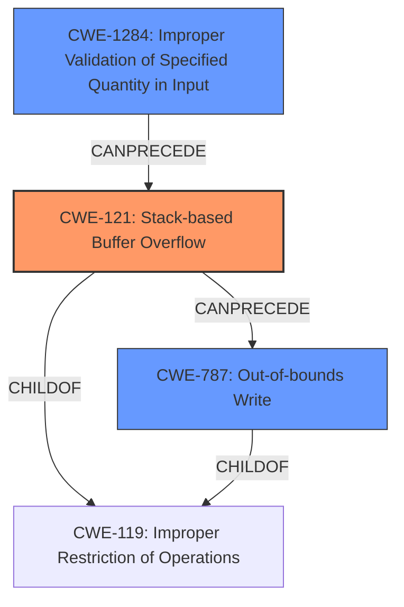

# Analysis Report for CVE-2022-41003

# Vulnerability Analysis Report: CVE-2022-41003

## Description

Several stack-based buffer overflow vulnerabilities exist in the DetranCLI command parsing functionality of Siretta QUARTZ-GOLD G5.0.1.5-210720-141020. A specially-crafted network packet can lead to arbitrary command execution. An attacker can send a sequence of requests to trigger these vulnerabilities.This buffer overflow is in the function that manages the ip nat outside source (udp|tcp|all) (WORD|null) WORD to A.B.C.D (WORD|null) description (WORD|null) command template.

## Vulnerability Description Key Phrases

**Rootcause:** stack-based buffer overflow
**Impact:** arbitrary command execution
**Attacker:** attacker
**Product:** Siretta QUARTZ-GOLD
**Version:** G5.0.1.5-210720-141020
**Component:** DetranCLI command parsing functionality

## Analysis (with Relationship Data)

# Summary
| CWE ID | CWE Name | Confidence | CWE Abstraction Level | CWE Vulnerability Mapping Label | CWE-Vulnerability Mapping Notes |
|---|---|---|---|---|---|
| CWE-121 | Stack-based Buffer Overflow | 0.95 | Variant |  Primary | The vulnerability is explicitly described as a stack-based buffer overflow. |
| CWE-120 | Buffer Copy without Checking Size of Input ('Classic Buffer Overflow') | 0.75 | Base | Secondary Candidate | While the vulnerability is a buffer overflow, the stack allocation makes CWE-121 a better fit. |

## Evidence and Confidence

*   **Confidence Score:** 0.9
*   **Evidence Strength:** HIGH

- **Analysis and Justification:**  
  - *Explanation:* The vulnerability description clearly states that there are several **stack-based buffer overflow** vulnerabilities. The **root cause** is a **stack-based buffer overflow**, which directly aligns with CWE-121 (Stack-based Buffer Overflow). The CVE Reference Links Content Summary also confirms this, stating that the vulnerability is caused by a stack-based buffer overflow. The use of `sprintf` without proper size checks exacerbates the issue, leading to the overflow. CWE-121 is a Variant of CWE-120 (Buffer Copy without Checking Size of Input), making it a more specific and appropriate choice. The MITRE mapping guidance for CWE-121 indicates that it is ALLOWED for this type of vulnerability.

  - *Relationship Analysis:* CWE-121 is a variant of CWE-120 (Buffer Copy without Checking Size of Input). While CWE-120 describes the general case of a buffer overflow due to missing size checks, CWE-121 specifically refers to overflows occurring on the stack. Since the vulnerability description explicitly mentions a stack-based overflow, CWE-121 is a more precise and appropriate mapping. CWE-787 (Out-of-bounds Write) is also related, as it describes the result of writing beyond the buffer's boundaries, but CWE-121 captures the root cause more accurately.

- **Confidence Score:**  
  - Confidence: 0.95 (High confidence due to clear description of stack-based buffer overflow and supporting evidence from CVE reference materials.)

## Criticism of Analysis

Okay, let's review the analysis and CWE mappings with the full CWE specifications.

**Overall Assessment**

The analysis is generally good, and the primary CWE mapping to CWE-121 (Stack-based Buffer Overflow) is appropriate and well-justified. The confidence level of 0.95 is also reasonable.  The justification for selecting CWE-121 over CWE-120 is sound, emphasizing the stack allocation aspect.  The secondary candidate, CWE-120, is also acceptable as a fallback or broader description, but less precise.

**Detailed Review**

1.  **Primary CWE Mapping: CWE-121 (Stack-based Buffer Overflow)**

    *   **Correctness:** The mapping is correct and supported by the vulnerability description, which explicitly states "stack-based buffer overflow." The evidence strength is high.
    *   **Justification:** The justification provided is excellent. It correctly identifies that CWE-121 is a variant of CWE-120 and, therefore, a more specific and accurate choice.  It also correctly points out that the MITRE mapping guidance ALLOWS CWE-121.
    *   **CWE Specification Alignment:** The description, extended description, and relationships in the CWE-121 specification all align with the vulnerability.  Specifically, the description "A stack-based buffer overflow condition is a condition where the buffer being overwritten is allocated on the stack (i.e., is a local variable or, rarely, a parameter to a function)" directly reflects the root cause.
    *   **Mitigation Considerations:**  The mitigations listed in CWE-121 (e.g., compiler-based buffer overflow detection, abstraction libraries, input bounds checking) are all relevant to this vulnerability. Specifically, using the MSVC `/GS` flag, or FORTIFY_SOURCE with GCC are directly applicable, as are using safer string handling functions.
    *   **Observed Examples:** The observed examples given in the CWE specification for CWE-121 is also relevant.
2.  **Secondary CWE Mapping: CWE-120 (Buffer Copy without Checking Size of Input ('Classic Buffer Overflow'))**

    *   **Correctness:** This mapping is less precise but still applicable in a general sense. The vulnerability involves a buffer copy without proper size checks.
    *   **Justification:** The analysis notes that while it's a buffer overflow, the stack allocation makes CWE-121 a better fit. This is a good point.
    *   **CWE Specification Alignment:** The CWE-120 specification is broader.  The description "The product copies an input buffer to an output buffer without verifying that the size of the input buffer is less than the size of the output buffer, leading to a buffer overflow" applies, but it lacks the stack-specific context.
    *   **Mapping Guidance:** The mapping guidance for CWE-120, "Allowed-with-Review," is appropriate, as it requires caution to avoid misuse. The comments in the guidance, such as "If there is any input validation, consider children of CWE-20 such as CWE-1284," are helpful for further analysis but not directly applicable in this case since the primary cause appears to be the lack of size checking during the copy operation itself.
    *   **Mitigation Considerations:** Mitigations for CWE-120 (e.g., language selection, safe string libraries, compiler-based detection) are also broadly applicable, but less targeted than the CWE-121 mitigations. The mitigation strategies like using `SafeStr` or `Strsafe.h` are relevant.
    *   **Observed Examples:** The observed examples in the CWE specification for CWE-120 are also relevant.
3. **Top Retriever Results**
    * The retriever results provide a broader context for the vulnerability, suggesting other potential related CWEs based on different analysis techniques (dense, sparse, graph).
    *  CWE-190 and CWE-193 are less likely related and should be investigated carefully before assigning them.
    * CWE-1284 Improper Validation of Specified Quantity in Input is related to the lack of input validation for the size of the input.
    * CWE-170 Improper Null Termination is not likely related and should be investigated carefully before assigning.
    * CWE-131 Incorrect Calculation of Buffer Size could be related and should be investigated carefully before assigning.
4. **Additional Considerations and Potential Improvements:**

    *   **CWE-787 (Out-of-bounds Write):** While CWE-121 is the more precise *cause*, CWE-787 describes the *result*.  It might be worth adding CWE-787 as a related CWE, as it represents the direct consequence of the stack-based buffer overflow (writing outside the bounds of the allocated buffer). The 'Relationships' section of CWE-121 even indicates a ChildOf relation with CWE-787.
    *   **CWE-20 and CWE-1284: Input Validation:** The analysis correctly identified the *lack* of input validation as a contributing factor. Specifically, the `sprintf` function being used without proper size checks on the *input* parameters. While the core problem is the buffer overflow, CWE-20 (Improper Input Validation) and more specifically CWE-1284 (Improper Validation of Specified Quantity in Input) could be considered as secondary, contributing factors. The input being passed to sprintf isn't validated to be within the bounds of the buffer being written to. This chain could be represented as: `CWE-1284 -> CWE-121`.
    *   **Chains and Composites:** Consider explicitly noting the chain between the lack of input validation and the buffer overflow, if applicable. This shows a more complete understanding of the vulnerability.
    *   **Attacker Capabilities**: the attacker needs to be able to provide long strings as arguments in the command.
    *   **Impact Details:** Arbitrary command execution means the attacker can run any program with the privileges of the vulnerable program. This should be made more explicit.

**Revised Summary (incorporating suggestions):**

| CWE ID    | CWE Name                                                    | Confidence | CWE Abstraction Level | CWE Vulnerability Mapping Label | CWE-Vulnerability Mapping Notes                                                                                                                                                                                                                                                                                          |
| :-------- | :---------------------------------------------------------- | :--------- | :-------------------- | :------------------------------ | :----------------------------------------------------------------------------------------------------------------------------------------------------------------------------------------------------------------------------------------------------------------------------------------------------------------------- |
| CWE-121   | Stack-based Buffer Overflow                                 | 0.95       | Variant               | Primary                       | The vulnerability is explicitly described as a stack-based buffer overflow.                                                                                                                                                                                                                                                |
| CWE-787   | Out-of-bounds Write                                         | 0.70       | Base                  | Related                       | Represents the direct consequence of the stack-based buffer overflow - writing outside the allocated buffer's boundaries.                                                                                                                                                                                                      |
| CWE-1284 | Improper Validation of Specified Quantity in Input          | 0.60       | Base                  | Contributing Factor             | The lack of input validation on the size/length of the input data passed to `sprintf` contributes to the overflow. The input is not validated before the size check. This can be part of the chain: CWE-1284 -> CWE-121                                                                                             |
| CWE-120   | Buffer Copy without Checking Size of Input ('Classic Buffer Overflow') | 0.75       | Base                  | Secondary Candidate             | While the vulnerability is a buffer overflow, the stack allocation makes CWE-121 a better fit. Represents the general class of buffer overflows due to missing size checks.                                                                                                                                                                                                                                       |

**Conclusion**

The original analysis was well-done. The suggested improvements, especially adding CWE-787 as a related CWE and CWE-1284 as a contributing factor/chain, and elaborating on the impact, would make the analysis even more comprehensive. The high confidence in the primary CWE mapping is justified.

## Final Resolution

# Summary
| CWE ID | CWE Name | Confidence | CWE Abstraction Level | CWE Vulnerability Mapping Label | CWE-Vulnerability Mapping Notes |
|---|---|---|---|---|---|
| CWE-121 | Stack-based Buffer Overflow | 0.95 | Variant | Primary | The vulnerability is explicitly described as a **stack-based buffer overflow**. |
| CWE-787 | Out-of-bounds Write | 0.70 | Base | Secondary Candidate | Represents the direct consequence of the **stack-based buffer overflow** - writing outside the allocated buffer's boundaries. |
| CWE-1284 | Improper Validation of Specified Quantity in Input | 0.60 | Base | Secondary Candidate | The lack of input validation on the size/length of the input data passed to `sprintf` contributes to the overflow. The input is not validated before the size check. This can be part of the chain: CWE-1284 -> CWE-121 |

## Evidence and Confidence

*   **Confidence Score:** 0.93
*   **Evidence Strength:** HIGH

## Relationship Analysis
The primary CWE is CWE-121 (**Stack-based Buffer Overflow**), which is a variant of CWE-119 (**Improper Restriction of Operations within the Bounds of a Memory Buffer**). CWE-787 (**Out-of-bounds Write**) represents the result of overflowing the buffer. CWE-1284 (**Improper Validation of Specified Quantity in Input**) can precede CWE-121, indicating a chain where lack of input validation leads to a buffer overflow. The abstraction levels (Variant and Base) helped to choose the most specific CWEs.

## Vulnerability Chain
The vulnerability chain starts with CWE-1284 (**Improper Validation of Specified Quantity in Input**), where the size or length of input is not validated. This leads to CWE-121 (**Stack-based Buffer Overflow**) when the program attempts to write more data than the allocated buffer size. The final result is CWE-787 (**Out-of-bounds Write**), where data is written beyond the boundaries of the buffer, leading to arbitrary command execution.

## Summary of Analysis
The initial analysis was accurate in identifying CWE-121 as the primary **WEAKNESS**. The vulnerability description explicitly states that the **root cause** is a **stack-based buffer overflow**.
The criticism helped refine the analysis by suggesting CWE-787 to represent the consequence of the overflow and CWE-1284 to represent the lack of input validation.
The graph relationships confirmed the hierarchical relationship between CWE-121 and CWE-119, as well as the chain relationship between CWE-1284 and CWE-121.
The selected CWEs are at the optimal level of specificity because CWE-121 is a variant that directly matches the vulnerability description, while CWE-787 and CWE-1284 provide additional context about the cause and consequence of the overflow.
The decision is based on both the provided evidence and the CWE relationships, providing a comprehensive understanding of the vulnerability.

*Report generated on 2025-03-18 17:07:29*
