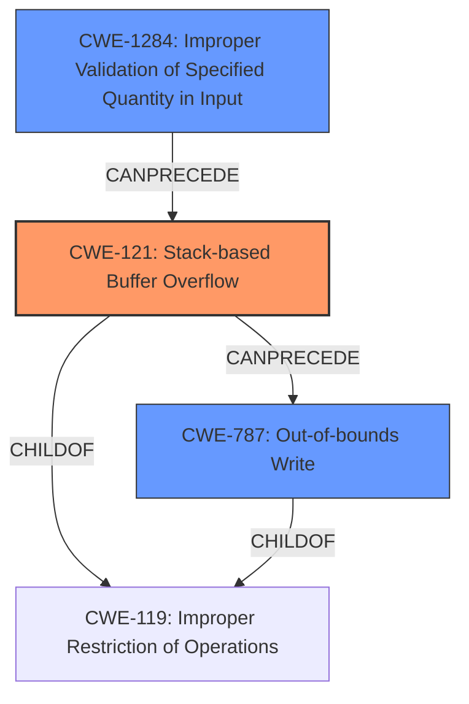

# Final Resolution for CVE-2022-41003

# Summary
| CWE ID | CWE Name | Confidence | CWE Abstraction Level | CWE Vulnerability Mapping Label | CWE-Vulnerability Mapping Notes |
|---|---|---|---|---|---|
| CWE-121 | Stack-based Buffer Overflow | 0.95 | Variant | Primary | The vulnerability is explicitly described as a **stack-based buffer overflow**. |
| CWE-787 | Out-of-bounds Write | 0.70 | Base | Secondary Candidate | Represents the direct consequence of the **stack-based buffer overflow** - writing outside the allocated buffer's boundaries. |
| CWE-1284 | Improper Validation of Specified Quantity in Input | 0.60 | Base | Secondary Candidate | The lack of input validation on the size/length of the input data passed to `sprintf` contributes to the overflow. The input is not validated before the size check. This can be part of the chain: CWE-1284 -> CWE-121 |

## Evidence and Confidence

*   **Confidence Score:** 0.93
*   **Evidence Strength:** HIGH

## Relationship Analysis
The primary CWE is CWE-121 (**Stack-based Buffer Overflow**), which is a variant of CWE-119 (**Improper Restriction of Operations within the Bounds of a Memory Buffer**). CWE-787 (**Out-of-bounds Write**) represents the result of overflowing the buffer. CWE-1284 (**Improper Validation of Specified Quantity in Input**) can precede CWE-121, indicating a chain where lack of input validation leads to a buffer overflow. The abstraction levels (Variant and Base) helped to choose the most specific CWEs.

## Vulnerability Chain
The vulnerability chain starts with CWE-1284 (**Improper Validation of Specified Quantity in Input**), where the size or length of input is not validated. This leads to CWE-121 (**Stack-based Buffer Overflow**) when the program attempts to write more data than the allocated buffer size. The final result is CWE-787 (**Out-of-bounds Write**), where data is written beyond the boundaries of the buffer, leading to arbitrary command execution.

## Summary of Analysis
The initial analysis was accurate in identifying CWE-121 as the primary **WEAKNESS**. The vulnerability description explicitly states that the **root cause** is a **stack-based buffer overflow**.
The criticism helped refine the analysis by suggesting CWE-787 to represent the consequence of the overflow and CWE-1284 to represent the lack of input validation.
The graph relationships confirmed the hierarchical relationship between CWE-121 and CWE-119, as well as the chain relationship between CWE-1284 and CWE-121.
The selected CWEs are at the optimal level of specificity because CWE-121 is a variant that directly matches the vulnerability description, while CWE-787 and CWE-1284 provide additional context about the cause and consequence of the overflow.
The decision is based on both the provided evidence and the CWE relationships, providing a comprehensive understanding of the vulnerability.