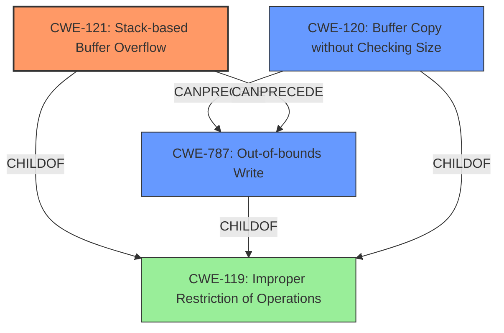

# Analysis Report for CVE-2022-41004

# Vulnerability Analysis Report: CVE-2022-41004

## Description

Several stack-based buffer overflow vulnerabilities exist in the DetranCLI command parsing functionality of Siretta QUARTZ-GOLD G5.0.1.5-210720-141020. A specially-crafted network packet can lead to arbitrary command execution. An attacker can send a sequence of requests to trigger these vulnerabilities.This buffer overflow is in the function that manages the no ip nat outside source (udp|tcp|all) (WORD|null) WORD to A.B.C.D (WORD|null) description (WORD|null) command template.

## Vulnerability Description Key Phrases

**Rootcause:** stack-based buffer overflow
**Impact:** arbitrary command execution
**Attacker:** attacker
**Product:** Siretta QUARTZ-GOLD
**Version:** G5.0.1.5-210720-141020
**Component:** DetranCLI command parsing functionality

## Analysis (with Relationship Data)

# Summary
| CWE ID | CWE Name | Confidence | CWE Abstraction Level | CWE Vulnerability Mapping Label | CWE-Vulnerability Mapping Notes |
|---|---|---|---|---|---|
| CWE-121 | Stack-based Buffer Overflow | 0.95 | Variant |  Primary | The vulnerability is explicitly described as a stack-based buffer overflow. |
| CWE-120 | Buffer Copy without Checking Size of Input ('Classic Buffer Overflow') | 0.75 | Base | Secondary Candidate | Could be a more general classification, but CWE-121 is more specific. |
| CWE-787 | Out-of-bounds Write | 0.60 | Base | Secondary Candidate | This is a consequence of the buffer overflow. |

## Evidence and Confidence

*   **Confidence Score:** 0.90
*   **Evidence Strength:** HIGH

- **Analysis and Justification:**  
  - *Explanation:* "The vulnerability description explicitly states that there are several **stack-based buffer overflow** vulnerabilities in the DetranCLI command parsing functionality. The CVE Reference Links Content Summary confirms that the root cause is due to the `DetranCLI` binary using command templates with `sprintf` to format strings based on user-supplied parameters without checking the size of user-controlled parameters against the destination buffer, leading to stack-based buffer overflows. This aligns perfectly with CWE-121 (Stack-based Buffer Overflow), which is a variant of CWE-119 (Improper Restriction of Operations within the Bounds of a Memory Buffer). The primary CWE match in the similar CVE descriptions is CWE-120. However, since the vulnerability is explicitly a stack-based overflow, CWE-121 is a more specific and appropriate choice. The impact is arbitrary command execution, which is a common consequence of buffer overflows."
  
  - *Relationship Analysis:* "CWE-121 (Stack-based Buffer Overflow) is a variant of CWE-119 (Improper Restriction of Operations within the Bounds of a Memory Buffer) and a child of CWE-787 (Out-of-bounds Write). The vulnerability is caused by writing data beyond the intended buffer on the stack. CWE-121 is also related to CWE-120 (Buffer Copy without Checking Size of Input), but CWE-121 is more specific since it identifies the stack as the location of the buffer. The relationship analysis shows that a stack-based buffer overflow (CWE-121) often leads to arbitrary code execution or other severe impacts. While CWE-787 (Out-of-bounds Write) could also be considered, the stack-based nature makes CWE-121 the more precise classification."

- **Confidence Score:**  
  - *Example:* Confidence: 0.95 (High evidence from technical description, CVE reference materials, and explicit mention of stack-based buffer overflow.)
---

## Criticism of Analysis

Okay, I've reviewed the analysis against the provided full CWE specifications. Here's my critique:

**Overall Assessment:**

The analysis is generally very good and well-justified. The primary CWE mapping to **CWE-121: Stack-based Buffer Overflow** is accurate and well-supported by the evidence. The reasoning for choosing CWE-121 over the more general CWE-120 is sound. The inclusion of CWE-787 as a secondary candidate is also reasonable, as it represents the underlying out-of-bounds write.

**Detailed Critique:**

*   **CWE-121: Stack-based Buffer Overflow**

    *   **Confidence:** Justified at 0.95. The analysis clearly explains why CWE-121 is the most appropriate choice, given the explicit mention of "stack-based buffer overflow" in the vulnerability description and the `sprintf` root cause also explained in CVE reference links.
    *   **Abstraction Level:** Correctly identified as "Variant," which is the preferred level for root cause analysis.
    *   **CWE-Vulnerability Mapping Notes:**  The note accurately explains the specific conditions that make it a stack-based overflow.
    *   **Evidence and Justification:** Excellent explanation and relationship analysis. The discussion of CWE-121's relationship to CWE-119 and CWE-787 further strengthens the argument.
    *   **Mitigation Considerations:** The analysis did not explicitly mention mitigations, but given this is a router there is a possibility of updating the firmware to have buffer overflow protection built in.
*   **CWE-120: Buffer Copy without Checking Size of Input ('Classic Buffer Overflow')**

    *   **Confidence:** The confidence score of 0.75 is appropriate. While CWE-120 describes the core issue, it's less specific than CWE-121 in this case.
    *   **Abstraction Level:** Correctly identified as "Base."
    *   **Rationale for Secondary Candidate:** The analysis correctly states that it is a more general classification.
    *   **Mapping Guidance Consideration:** The analysis accurately addresses the "Allowed-with-Review" usage of CWE-120. It shows awareness of the potential misuse of CWE-120 simply because it contains "buffer overflow," and correctly chooses a more specific CWE.
    *   **Mitigation Considerations:**The potential mitigations including use of a safer language or library are valid, but maybe too broad.
*   **CWE-787: Out-of-bounds Write**

    *   **Confidence:** The confidence score of 0.60 is appropriate. This CWE is a consequence of the buffer overflow, but not the most direct cause.
    *   **Abstraction Level:** Correctly identified as "Base."
    *   **Rationale for Secondary Candidate:** The analysis correctly states that it is a consequence of the buffer overflow.
    *   **Mitigation Considerations:** The provided mitigations such as using a safer language, libraries, and compiler-level protections, are applicable.

**Areas for Potential Improvement:**

*   **Exploitability:** The analysis could be strengthened by discussing the ease or difficulty of exploitation, based on the targeted buffer overflow overwrite, and whether it overwrites the return address.
*   **Input Validation (Chaining):** A possible, though less direct, addition would be to consider chaining with a CWE related to input validation. The root cause, as described, is the *lack* of input validation that would have prevented the overflow.  While *missing* input validation isn't technically CWE-20 (which implies *improper* validation), it is often the underlying problem.  If including this, it would be best as a tertiary consideration with low confidence. The `sprintf` is more of the direct cause.
*   **Specific Mitigations:** While the analysis correctly identifies general mitigation strategies, it could be improved by suggesting more specific mitigations related to the `sprintf` usage. For example:
    *   Replacing `sprintf` with `snprintf` to limit the number of bytes written.
    *   Implementing robust input sanitization and length checks before calling `sprintf`.

**Revised Summary Table:**

| CWE ID | CWE Name | Confidence | CWE Abstraction Level | CWE Vulnerability Mapping Label | CWE-Vulnerability Mapping Notes |
|---|---|---|---|---|---|
| CWE-121 | Stack-based Buffer Overflow | 0.95 | Variant | Primary | The vulnerability is explicitly described as a stack-based buffer overflow. |
| CWE-787 | Out-of-bounds Write | 0.75 | Base | Secondary Candidate | This is a consequence of the buffer overflow. |
| CWE-120 | Buffer Copy without Checking Size of Input ('Classic Buffer Overflow') | 0.70 | Base | Secondary Candidate | Could be a more general classification, but CWE-121 is more specific. |

**In conclusion:** The analysis is very solid. The suggestion to consider specific mitigations related to the `sprintf` function and the possibility of a tertiary CWE for *missing* input validation are minor suggestions for improvement.

## Final Resolution

# Summary
| CWE ID | CWE Name | Confidence | CWE Abstraction Level | CWE Vulnerability Mapping Label | CWE-Vulnerability Mapping Notes |
|---|---|---|---|---|---|
| CWE-121 | Stack-based Buffer Overflow | 0.95 | Variant | Primary | The vulnerability is explicitly described as a stack-based buffer overflow due to unchecked user input to sprintf. |
| CWE-787 | Out-of-bounds Write | 0.75 | Base | Secondary Candidate | This is a consequence of the buffer overflow. |
| CWE-120 | Buffer Copy without Checking Size of Input ('Classic Buffer Overflow') | 0.70 | Base | Secondary Candidate | Could be a more general classification, but CWE-121 is more specific. |

## Evidence and Confidence

*   **Confidence Score:** 0.95
*   **Evidence Strength:** HIGH

## Relationship Analysis
The primary CWE is **CWE-121 (Stack-based Buffer Overflow)**, a Variant of **CWE-119 (Improper Restriction of Operations within the Bounds of a Memory Buffer)**. **CWE-787 (Out-of-bounds Write)** represents the result of writing beyond the buffer's boundaries. **CWE-120 (Buffer Copy without Checking Size of Input)** is a more general case of a buffer overflow and less specific than **CWE-121** in this context.

## Vulnerability Chain
The vulnerability chain starts with the lack of input validation, user-controlled parameters being passed to `sprintf` without size checks, leading to **CWE-121 (Stack-based Buffer Overflow)**, which results in **CWE-787 (Out-of-bounds Write)**. This can then lead to arbitrary command execution.

## Summary of Analysis
The initial analysis and criticism both agree that **CWE-121 (Stack-based Buffer Overflow)** is the most appropriate primary CWE due to the explicit description of the vulnerability. The vulnerability occurs in the DetranCLI command parsing functionality of Siretta QUARTZ-GOLD G5.0.1.5-210720-141020. A specially-crafted network packet leads to arbitrary command execution. An attacker can send a sequence of requests to trigger these vulnerabilities, in the function that manages the no ip nat outside source (udp|tcp|all) (WORD|null) WORD to A.B.C.D (WORD|null) description (WORD|null) command template.

The CVE reference links confirm that the root cause is due to the `DetranCLI` binary using command templates with `sprintf` to format strings based on user-supplied parameters without checking the size of user-controlled parameters against the destination buffer, leading to stack-based buffer overflows.

The graph relationships show that **CWE-121** is a specific type of **CWE-119**, and it directly leads to **CWE-787**. The mitigation of replacing `sprintf` with `snprintf` to limit the number of bytes written or implementing input sanitization are directly related to preventing **CWE-121**.

The decision to classify this as **CWE-121 (Stack-based Buffer Overflow)** is based on the evidence provided in the vulnerability description and CVE reference materials. The choice is at the optimal level of specificity because the stack-based nature is explicitly mentioned.

*Report generated on 2025-03-18 17:08:15*
