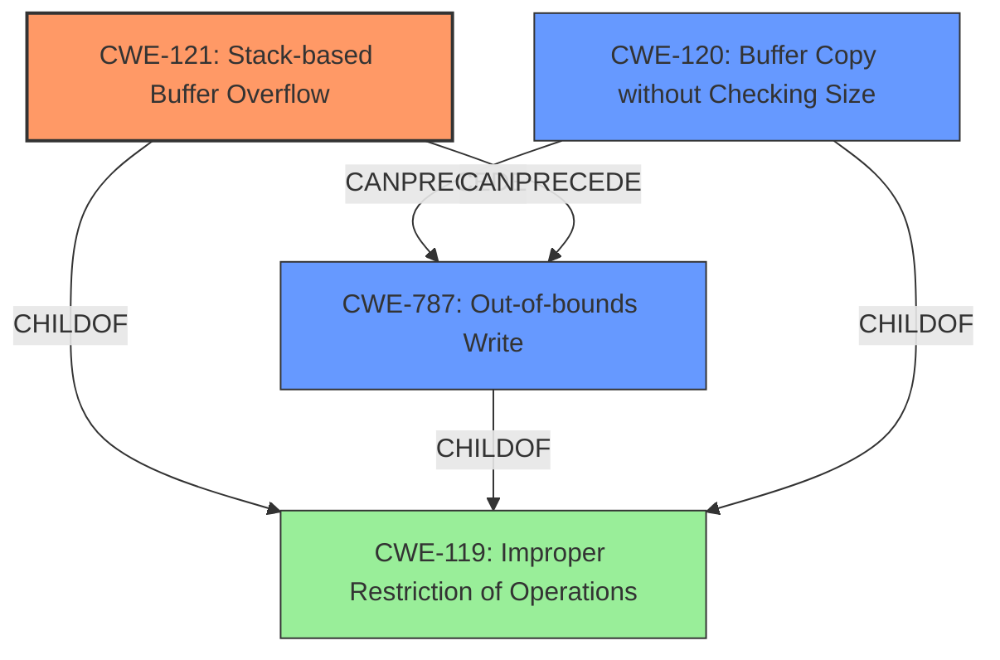

# Final Resolution for CVE-2022-41004

# Summary
| CWE ID | CWE Name | Confidence | CWE Abstraction Level | CWE Vulnerability Mapping Label | CWE-Vulnerability Mapping Notes |
|---|---|---|---|---|---|
| CWE-121 | Stack-based Buffer Overflow | 0.95 | Variant | Primary | The vulnerability is explicitly described as a stack-based buffer overflow due to unchecked user input to sprintf. |
| CWE-787 | Out-of-bounds Write | 0.75 | Base | Secondary Candidate | This is a consequence of the buffer overflow. |
| CWE-120 | Buffer Copy without Checking Size of Input ('Classic Buffer Overflow') | 0.70 | Base | Secondary Candidate | Could be a more general classification, but CWE-121 is more specific. |

## Evidence and Confidence

*   **Confidence Score:** 0.95
*   **Evidence Strength:** HIGH

## Relationship Analysis
The primary CWE is **CWE-121 (Stack-based Buffer Overflow)**, a Variant of **CWE-119 (Improper Restriction of Operations within the Bounds of a Memory Buffer)**. **CWE-787 (Out-of-bounds Write)** represents the result of writing beyond the buffer's boundaries. **CWE-120 (Buffer Copy without Checking Size of Input)** is a more general case of a buffer overflow and less specific than **CWE-121** in this context.

## Vulnerability Chain
The vulnerability chain starts with the lack of input validation, user-controlled parameters being passed to `sprintf` without size checks, leading to **CWE-121 (Stack-based Buffer Overflow)**, which results in **CWE-787 (Out-of-bounds Write)**. This can then lead to arbitrary command execution.

## Summary of Analysis
The initial analysis and criticism both agree that **CWE-121 (Stack-based Buffer Overflow)** is the most appropriate primary CWE due to the explicit description of the vulnerability. The vulnerability occurs in the DetranCLI command parsing functionality of Siretta QUARTZ-GOLD G5.0.1.5-210720-141020. A specially-crafted network packet leads to arbitrary command execution. An attacker can send a sequence of requests to trigger these vulnerabilities, in the function that manages the no ip nat outside source (udp|tcp|all) (WORD|null) WORD to A.B.C.D (WORD|null) description (WORD|null) command template.

The CVE reference links confirm that the root cause is due to the `DetranCLI` binary using command templates with `sprintf` to format strings based on user-supplied parameters without checking the size of user-controlled parameters against the destination buffer, leading to stack-based buffer overflows.

The graph relationships show that **CWE-121** is a specific type of **CWE-119**, and it directly leads to **CWE-787**. The mitigation of replacing `sprintf` with `snprintf` to limit the number of bytes written or implementing input sanitization are directly related to preventing **CWE-121**.

The decision to classify this as **CWE-121 (Stack-based Buffer Overflow)** is based on the evidence provided in the vulnerability description and CVE reference materials. The choice is at the optimal level of specificity because the stack-based nature is explicitly mentioned.