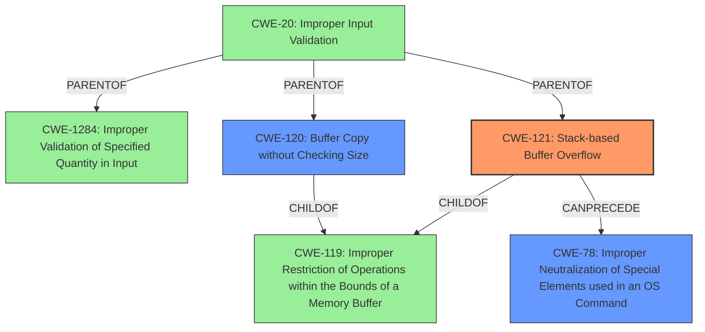

# Final Resolution for CVE-2022-41005

# Summary
| CWE ID    | CWE Name                                                                 | Confidence | CWE Abstraction Level | CWE Vulnerability Mapping Label | CWE-Vulnerability Mapping Notes                                                                                                                                                   |
| :--------- | :----------------------------------------------------------------------- | :--------- | :-------------------- | :------------------------------ | :----------------------------------------------------------------------------------------------------------------------------------------------------------------------------- |
| CWE-121 | Stack-based Buffer Overflow | 0.90       | Variant               | Allowed                         | Primary CWE                                                                                                                                                                 |
| CWE-120   | Buffer Copy without Checking Size of Input ('Classic Buffer Overflow') | 0.70       | Base                    | Allowed-with-Review              | Secondary Candidate. The stack allocation detail makes CWE-121 more specific                                                                                                |
| CWE-78    | Improper Neutralization of Special Elements used in an OS Command ('OS Command Injection') | 0.60       | Class                    | Allowed                         | Secondary Candidate. Only relevant if the overflow is exploitable for command injection. This is an *impact*, not a guaranteed **root cause**.                                       |

## Evidence and Confidence

*   **Confidence Score:** 0.85
*   **Evidence Strength:** HIGH (for CWE-121), MODERATE (for CWE-78)

## Relationship Analysis
The primary relationship is that CWE-121 (Stack-based Buffer Overflow) is a variant of CWE-119 (Improper Restriction of Operations within the Bounds of a Memory Buffer). CWE-120 (Buffer Copy without Checking Size) is also a child of CWE-119, representing a more general case of buffer overflow. The relevance of CWE-78 (OS Command Injection) depends on the exploit strategy; if the overflow leads to command execution, then CWE-78 becomes relevant. The abstraction levels influenced the selection, favoring the more specific variant (CWE-121) over the base class (CWE-120) when the evidence supported it.

## Vulnerability Chain
The vulnerability chain starts with the use of `sprintf` without proper bounds checking when formatting command parameters into a stack buffer (**CWE-121**). This leads to a **stack-based buffer overflow**. The **impact** of this overflow *may* allow for arbitrary command execution (**CWE-78**), depending on the specifics of the exploit. **Improper Input Validation** (**CWE-20**) and specifically, **Improper Validation of Specified Quantity in Input** (**CWE-1284**) are missing links in the chain which could have prevented the buffer overflow.

## Summary of Analysis
The initial analysis correctly identifies CWE-121 as the primary **weakness**, supported by the vulnerability description's explicit mention of a "stack-based buffer overflow". The inclusion of CWE-120 as a secondary candidate is reasonable, given the buffer copy aspect, but CWE-121 provides a more specific classification. The relevance of CWE-78 hinges on whether the overflow leads to command injection, making it an impact rather than a direct **root cause**.

The graph relationships reinforce the choice of CWE-121, being a specific variant of CWE-119. The analysis also considered the mapping guidance for CWE-120, acknowledging potential misuse and justifying its inclusion based on the buffer copy aspect.

The decision to prioritize CWE-121 is based on the principle of selecting the most specific CWE that accurately describes the **root cause**, supported by direct evidence from the vulnerability description.

The analysis explicitly addresses the criticism and suggestions of the reviewer by:
* Acknowledging that the confidence in CWE-78 depends on exploitability of stack buffer overflow to achieve command injection, making it a potential impact rather than a guaranteed **root cause**.
* Explicitly stating that the relevance of CWE-78 hinges on the *specific exploit technique*.
* Including CWE-20 and CWE-1284 to highlight missing input validation as a link that could prevent the buffer overflow.

The final classification represents the optimal level of specificity, providing a clear and well-justified representation of the **vulnerability**.