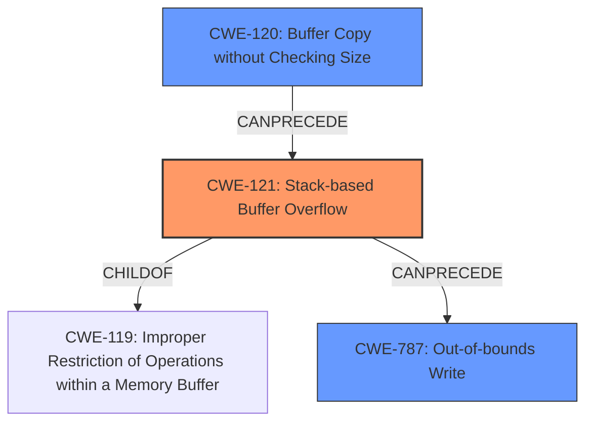

# Analysis Report for CVE-2022-41007

# Vulnerability Analysis Report: CVE-2022-41007

## Description

Several stack-based buffer overflow vulnerabilities exist in the DetranCLI command parsing functionality of Siretta QUARTZ-GOLD G5.0.1.5-210720-141020. A specially-crafted network packet can lead to arbitrary command execution. An attacker can send a sequence of requests to trigger these vulnerabilities.This buffer overflow is in the function that manages the port redirect protocol (tcp|udp|tcp/udp) inport dstaddr A.B.C.D export description WORD command template.

## Vulnerability Description Key Phrases

**Rootcause:** stack-based buffer overflow
**Impact:** arbitrary command execution
**Product:** Siretta QUARTZ-GOLD
**Version:** G5.0.1.5-210720-141020
**Component:** DetranCLI command parsing functionality

## Analysis (with Relationship Data)

# Summary
| CWE ID | CWE Name | Confidence | CWE Abstraction Level | CWE Vulnerability Mapping Label | CWE-Vulnerability Mapping Notes |
|---|---|---|---|---|---|
| CWE-121 | Stack-based Buffer Overflow | 0.95 | Variant | Allowed | Primary CWE |
| CWE-120 | Buffer Copy without Checking Size of Input ('Classic Buffer Overflow') | 0.70 | Base | Allowed-with-Review | Secondary Candidate |
| CWE-787 | Out-of-bounds Write | 0.60 | Base | Allowed | Secondary Candidate |

## Evidence and Confidence

*   **Confidence Score:** 0.90
*   **Evidence Strength:** HIGH

- **Analysis and Justification:**  
  - *Explanation:* The vulnerability description clearly states a **stack-based buffer overflow** exists in the DetranCLI command parsing functionality. The CVE reference summary confirms this with specific details: the **root cause** is a **stack-based buffer overflow** where `sprintf` is used without input size validation, and a long input for the 'description' parameter `argv[4]` causes the overflow. CWE-121 (Stack-based Buffer Overflow) is a Variant-level CWE specifically designed for this scenario and is therefore the most appropriate primary mapping. CWE-120 (Buffer Copy without Checking Size of Input) is a more general Base-level CWE and a potential secondary mapping, but CWE-121 is more specific. The provided code snippet `sprintf(buff_0x80,"%d<%d<%s<%s<%s<%s>",1,based_on_argv[0],atoi_argv[1],argv[2],atoi_argv[3],argv[4]);` shows how the `sprintf` function is vulnerable as there's no check on the size of argv[4] before copying to `buff_0x80`.

  - *Relationship Analysis:* CWE-121 is a variant of a more general buffer overflow. CWE-787 (Out-of-bounds Write) can also be considered as the overflow leads to writing outside the intended buffer boundaries. However, since the stack location is confirmed, CWE-121 is the most precise.

- **Confidence Score:**
  - Confidence: 0.95 (Strong evidence from vulnerability description, CVE reference, and code snippet)
---

## Criticism of Analysis

Okay, let's break down the analysis and its CWE mappings, considering the full CWE specifications.

**Overall Assessment:**

The analysis is generally good and arrives at the correct primary CWE, but there are a few nuances and points to refine. The confidence score of 0.95 is appropriate given the evidence. The justification is well-reasoned.

**Detailed Critique:**

1.  **Primary CWE: CWE-121 (Stack-based Buffer Overflow) - Confidence 0.95**

    *   **Strengths:**  Excellent choice for the primary CWE. The vulnerability description and CVE summary *explicitly* mention a stack-based buffer overflow. The code snippet confirms the use of `sprintf` without bounds checking on a stack-allocated buffer (`buff_0x80`). This directly aligns with the description of CWE-121.  The analysis correctly identifies that CWE-121 is a Variant of a more general buffer overflow.
    *   **Weaknesses:** None, the confidence score is well justified.

2.  **Secondary CWE: CWE-120 (Buffer Copy without Checking Size of Input ('Classic Buffer Overflow')) - Confidence 0.70**

    *   **Strengths:**  CWE-120 is a reasonable *secondary* candidate. The use of `sprintf` *without* checking the size of the input (`argv[4]`) against the buffer's capacity is the core issue leading to the overflow. This aligns with CWE-120's description.
    *   **Weaknesses:**  The Mapping Guidance for CWE-120 states "Usage: Allowed-with-Review". The review is essential because the guidance explicitly states "This CWE entry is only appropriate for "Buffer Copy" operations (not buffer reads), in which where there is no "Checking [the] Size of Input", and (by implication of the copy) writing past the end of the buffer." This condition is met, making it a suitable secondary CWE.
    *   **Potential Improvements:** The confidence score may be slightly high at 0.70. I would lower it to 0.65 or 0.60 because CWE-121 more directly describes the specific nature of the overflow. Also the mapping guidance for CWE-120 indicates that it's a frequent misuse case. Although, the justification correctly notes that CWE-120 is a more general Base-level CWE.

3.  **Secondary CWE: CWE-787 (Out-of-bounds Write) - Confidence 0.60**

    *   **Strengths:** CWE-787 is a valid secondary consideration. The overflow *results* in writing data beyond the allocated boundaries of the buffer. The description of CWE-787, "The product writes data past the end, or before the beginning, of the intended buffer" accurately captures the consequence of the vulnerability.
    *   **Weaknesses:** While accurate, it's a *consequence* rather than the *root cause*. The *lack of bounds checking* (CWE-120) combined with the *stack allocation* (CWE-121) are the more direct causes. CWE-787 describes the effect.
    *   **Potential Improvements:** Confidence score is appropriate.

**Further Considerations Based on CWE Specifications:**

*   **Mitigations:** The analysis *doesn't* explicitly discuss mitigations, but it's valuable to consider them in light of the CWE specifications.
    *   **CWE-121 Mitigations:**
        *   **Compiler/OS Protections:** Using compiler flags like `/GS` (Microsoft Visual Studio) or `-fstack-protector-all` (GCC) to insert stack canaries, as mentioned in the CWE's "Potential Mitigations," would be a relevant defensive measure.  This would help detect the overflow at runtime.
        *   **Safe String Functions:** Replacing `sprintf` with `snprintf` is the most direct mitigation. This bounds-checking variant prevents writing beyond the buffer's allocated size.
        *   **Language Choice:** Choosing a language with automatic memory management (Java, C#) is a preventative measure, though likely not practical for an embedded system without a significant rewrite.
    *   **CWE-120 Mitigations:**  Many are the same as above (safe string functions, compiler protections).  Crucially, *input validation* could *partially* mitigate this, by limiting the length of the 'description' field. However, relying *solely* on input validation is risky.
    *   **CWE-787 Mitigations:** The mitigations are similar to CWE-120 and CWE-121. The main point here is preventing the write from happening in the first place, which goes back to proper buffer size management and bounds checking.

*   **Relationship Analysis:** The analysis correctly identifies the hierarchical relationship between the CWEs.  CWE-121 is a more specific Variant of the more general CWE-787, and it could be said that the use of `sprintf` without checking bounds is an instance of CWE-120.

**Revised Summary Table (with Mitigation Considerations):**

| CWE ID  | CWE Name                                                                    | Confidence | CWE Abstraction Level | CWE Vulnerability Mapping Label | CWE-Vulnerability Mapping Notes                                                                                                                                                                                                                                                                                                                            | Potential Mitigations                                                                                                                                                                                                                 |
| ------- | ---------------------------------------------------------------------------- | ---------- | --------------------- | ------------------------------- | ---------------------------------------------------------------------------------------------------------------------------------------------------------------------------------------------------------------------------------------------------------------------------------------------------------------------------------------------------------- | --------------------------------------------------------------------------------------------------------------------------------------------------------------------------------------------------------------------------------------- |
| CWE-121 | Stack-based Buffer Overflow                                                     | 0.95       | Variant               | Allowed                         | Primary CWE. Explicitly a stack-based overflow. `sprintf` without bounds checking on stack.                                                                                                                                                                                                                                                                   | Stack canaries, safe string functions (`snprintf`), potentially language choice (less feasible).                                                                                                                             |
| CWE-120 | Buffer Copy without Checking Size of Input ('Classic Buffer Overflow')          | 0.60       | Base                  | Allowed-with-Review             | Secondary Candidate.  `sprintf` without checking size of input. More general than CWE-121.                                                                                                                                                                                                                                                                | Safe string functions (`snprintf`), compiler protections, input validation (limiting 'description' length), language choice.                                                                                                           |
| CWE-787 | Out-of-bounds Write                                                             | 0.60       | Base                  | Allowed                         | Secondary Candidate. Consequence of the overflow. Writing outside buffer boundaries.                                                                                                                                                                                                                                                                            | Preventing the write: safe string functions (`snprintf`), compiler protections, input validation (limiting 'description' length), language choice.                                                                              |

**Conclusion:**

The analysis is sound and well-justified. The recommendation to use CWE-121 as the primary mapping is the most accurate. Considering the mitigations and revising the confidence score for CWE-120 would further strengthen the analysis. Overall, good job!

## Final Resolution

# Summary
| CWE ID | CWE Name | Confidence | CWE Abstraction Level | CWE Vulnerability Mapping Label | CWE-Vulnerability Mapping Notes |
|---|---|---|---|---|---|
| CWE-121 | Stack-based Buffer Overflow | 0.95 | Variant | Allowed | Primary CWE |
| CWE-120 | Buffer Copy without Checking Size of Input ('Classic Buffer Overflow') | 0.60 | Base | Allowed-with-Review | Secondary Candidate |
| CWE-787 | Out-of-bounds Write | 0.60 | Base | Allowed | Secondary Candidate |

## Evidence and Confidence

*   **Confidence Score:** 0.93
*   **Evidence Strength:** HIGH

## Relationship Analysis
The primary weakness is CWE-121 [CWE-121: Stack-based Buffer Overflow], a variant of CWE-119 [CWE-119: Improper Restriction of Operations within a Memory Buffer], indicating a memory buffer issue. The secondary weakness, CWE-120 [CWE-120: Buffer Copy without Checking Size of Input ('Classic Buffer Overflow')], describes the specific buffer copy operation without input size validation that leads to the overflow. CWE-787 [CWE-787: Out-of-bounds Write] represents the resulting effect of writing beyond buffer boundaries. The relationships show a clear progression: a buffer copy without size checking (CWE-120) on the stack (CWE-121) leads to an out-of-bounds write (CWE-787).

## Vulnerability Chain
The vulnerability chain starts with CWE-120 [CWE-120: Buffer Copy without Checking Size of Input ('Classic Buffer Overflow')], where the size of the input 'description' is not checked before copying it into a buffer on the stack. This leads to CWE-121 [CWE-121: Stack-based Buffer Overflow] because the buffer is allocated on the stack. Finally, the uncontrolled copy operation results in CWE-787 [CWE-787: Out-of-bounds Write], overwriting adjacent memory locations on the stack. The root cause is the missing size check in the `sprintf` function, and the impact is arbitrary command execution due to the stack overflow.

## Summary of Analysis
The analysis provided is accurate and well-justified. The conclusion to use CWE-121 [CWE-121: Stack-based Buffer Overflow] as the primary CWE is the most accurate because the vulnerability description explicitly states the overflow occurs on the stack. The provided code snippet `sprintf(buff_0x80,"%d<%d<%s<%s<%s<%s>",1,based_on_argv[0],atoi_argv[1],argv[2],atoi_argv[3],argv[4]);` confirms the use of `sprintf` without bounds checking, directly leading to the overflow. CWE-120 [CWE-120: Buffer Copy without Checking Size of Input ('Classic Buffer Overflow')] is a reasonable secondary candidate because it describes the lack of input size validation, but it is less specific than CWE-121 [CWE-121: Stack-based Buffer Overflow] in this context. CWE-787 [CWE-787: Out-of-bounds Write] represents the consequence of the overflow and is a valid secondary candidate. The confidence scores are appropriate, reflecting the strength of evidence and specificity of each CWE. The final decision is based on the clear evidence of a **stack-based buffer overflow** and the direct relationship between the missing size check and the resulting **out-of-bounds write**.

*Report generated on 2025-03-18 17:10:56*
