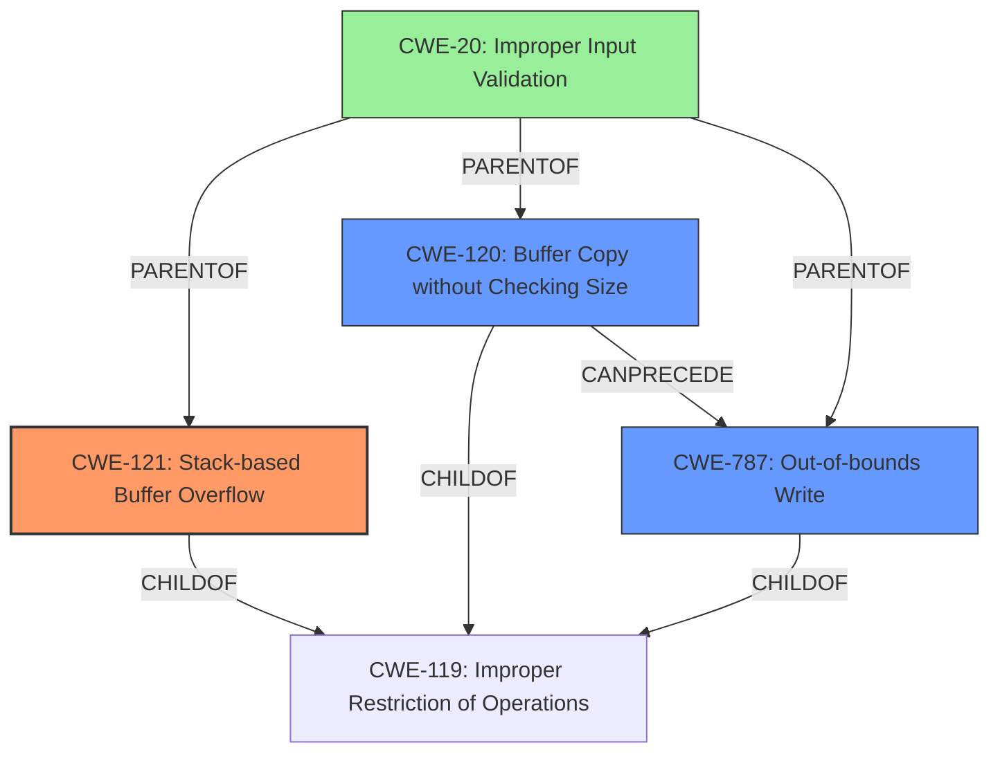

# Final Resolution for CVE-2022-41008

# Summary
| CWE ID | CWE Name | Confidence | CWE Abstraction Level | CWE Vulnerability Mapping Label | CWE-Vulnerability Mapping Notes |
|---|---|---|---|---|---|
| CWE-121 | Stack-based Buffer Overflow | 0.9 | Variant | Primary | Allowed |
| CWE-120 | Buffer Copy without Checking Size of Input ('Classic Buffer Overflow') | 0.7 | Base | Secondary | Allowed-with-Review |
| CWE-787 | Out-of-bounds Write | 0.6 | Base | Secondary | Allowed |
| CWE-20| Improper Input Validation | 0.4 | Class | Contributing|Discouraged |

## Evidence and Confidence

*   **Confidence Score:** 0.9
*   **Evidence Strength:** HIGH

## Relationship Analysis
The primary CWE, CWE-121 (Stack-based Buffer Overflow), is a Variant of CWE-119 (Improper Restriction of Operations within the Bounds of a Memory Buffer). CWE-120 (Buffer Copy without Checking Size of Input) and CWE-787 (Out-of-bounds Write) are also children of CWE-119. CWE-120 can precede CWE-787. CWE-20 (Improper Input Validation) is a parent of CWE-121, CWE-120, and CWE-787. The analysis explicitly dismisses CWE-119 as too general, and acknowledges CWE-20 but discounts it as sprintf itself may be validating the input. The chosen CWEs provide a more specific and descriptive mapping of the vulnerability.

## Vulnerability Chain
The vulnerability chain starts with the use of `sprintf` without proper bounds checking (CWE-120), leading to a **stack-based buffer overflow** (CWE-121), which results in an **out-of-bounds write** (CWE-787). The **lack of input validation** (CWE-20) could be a contributing factor, however the analysis states that the `sprintf` may be validating the input parameters.

## Summary of Analysis
The initial analysis and the criticism both agree on the primary **WEAKNESS** being **CWE-121 (Stack-based Buffer Overflow)**. The explicit mention of "stack-based buffer overflow" in the vulnerability description and CVE reference summary provides strong evidence for this classification.

The secondary CWEs, **CWE-120 (Buffer Copy without Checking Size of Input)** and **CWE-787 (Out-of-bounds Write)**, are also valid contributing factors. **CWE-120** represents the root cause of the overflow, while **CWE-787** describes the consequence of writing beyond the intended buffer boundaries. **CWE-20 (Improper Input Validation)** was considered, however the analysis discounts this by stating that the `sprintf` may be validating the input.

The relationship analysis reinforces these choices. **CWE-121**, **CWE-120**, and **CWE-787** are all related to **CWE-119 (Improper Restriction of Operations within the Bounds of a Memory Buffer)**, but the selected CWEs offer a more specific and descriptive mapping of the vulnerability.

The final decision is based on the available evidence and the relationships between CWEs. The selected CWEs are at the optimal level of specificity, providing a comprehensive understanding of the vulnerability. The high confidence score reflects the strong evidence and clear justification for the chosen classifications.