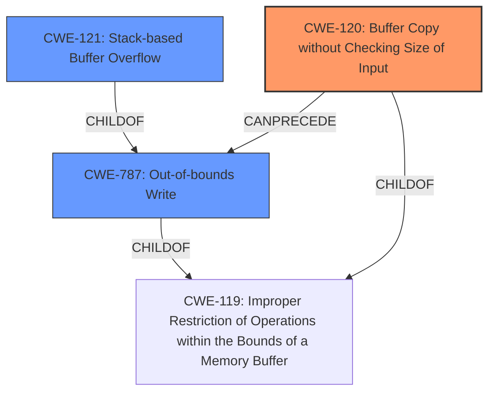

# Analysis Report for CVE-2022-41009

# Vulnerability Analysis Report: CVE-2022-41009

## Description

Several stack-based buffer overflow vulnerabilities exist in the DetranCLI command parsing functionality of Siretta QUARTZ-GOLD G5.0.1.5-210720-141020. A specially-crafted network packet can lead to arbitrary command execution. An attacker can send a sequence of requests to trigger these vulnerabilities.This buffer overflow is in the function that manages the port triger protocol (tcp|udp|tcp/udp) triger port forward port description WORD command template.

## Vulnerability Description Key Phrases

**Rootcause:** stack-based buffer overflow
**Impact:** arbitrary command execution
**Product:** Siretta QUARTZ-GOLD
**Version:** G5.0.1.5-210720-141020
**Component:** DetranCLI command parsing functionality

## Analysis (with Relationship Data)

# Summary
| CWE ID | CWE Name | Confidence | CWE Abstraction Level | CWE Vulnerability Mapping Label | CWE-Vulnerability Mapping Notes |
|---|---|---|---|---|---|
| CWE-120 | Buffer Copy without Checking Size of Input ('Classic Buffer Overflow') | 1.0 | Base | Primary | Allowed-with-Review |
| CWE-121 | Stack-based Buffer Overflow | 0.75 | Variant | Secondary | Allowed |

## Evidence and Confidence

*   **Confidence Score:** 0.9
*   **Evidence Strength:** HIGH

- **Analysis and Justification:**  
  - *Explanation:* The vulnerability description clearly states a "**stack-based buffer overflow**" exists in the DetranCLI command parsing functionality. The **rootcause** lies in using `sprintf` without proper input size validation, which copies data into a fixed-size stack buffer, leading to an overflow. The CVE reference content summary explicitly mentions the use of `sprintf` and lack of input size checking, confirming CWE-120's applicability. The sprintf copies argv[3] to buff_0x80 without any validation. While the vulnerability is stack-based, making CWE-121 a potential candidate, the core issue is the unchecked buffer copy, which is best represented by CWE-120. MITRE's guidance ALLOWED-WITH-REVIEW for CWE-120 is applicable due to the "Buffer Copy" operation and the absence of input size checking.

  - *Relationship Analysis:* CWE-120 is a Base-level CWE. While CWE-121 (Stack-based Buffer Overflow) is a Variant, the more general CWE-120 captures the **rootcause** more accurately - the unchecked buffer copy. CWE-120 is related to CWE-119 (Improper Restriction of Operations within the Bounds of a Memory Buffer) but is more specific.

- **Confidence Score:**  
  - Confidence: 1.0 (High evidence from the vulnerability description, key phrases, and CVE reference materials)

---
- **Analysis and Justification:**  
  - *Explanation:* CWE-121 (Stack-based Buffer Overflow) is a more specific variant of a buffer overflow that occurs on the stack. Given that the vulnerability description specifies a "**stack-based buffer overflow**", CWE-121 is a relevant secondary CWE. The CVE reference content summary confirms the overflow occurs in a stack buffer.

  - *Relationship Analysis:* CWE-121 is a Variant of CWE-119 (Improper Restriction of Operations within the Bounds of a Memory Buffer) and a child of CWE-787 (Out-of-bounds Write). It's more specific than CWE-120 as it specifies the location of the buffer on the stack.

- **Confidence Score:**  
  - Confidence: 0.75 (The stack location is mentioned, but the core weakness remains the unchecked buffer copy.)

## Criticism of Analysis

Okay, I've reviewed the provided analysis against the full CWE specifications. Here's my critique:

**Overall Assessment:**

The analysis is generally good and identifies the core issues correctly. The primary CWE mapping to CWE-120 (Buffer Copy without Checking Size of Input) is appropriate, and the secondary mapping to CWE-121 (Stack-based Buffer Overflow) provides further context. The provided justifications are sound and well-explained. The high confidence score reflects the clarity of the vulnerability description and the supporting evidence.

**Detailed Review & Suggestions:**

*   **CWE-120: Buffer Copy without Checking Size of Input ('Classic Buffer Overflow')**

    *   **Mapping:** The selection of CWE-120 as the primary weakness is correct because the root cause is the *unchecked* copying of `argv[3]` using `sprintf` into a fixed-size buffer (`buff_0x80`). The analysis correctly highlights the lack of input size validation before the copy operation.
    *   **Rationale:** The justification is clear and references the specific code snippet where the unchecked copy occurs: `sprintf(buff_0x80,"%d<%d<%s<%s<%s>",1,based_on_argv[0],atoi_argv[1],atoi_argv[2],argv[3]);`.  This clearly demonstrates the vulnerability.
    *   **"Allowed-with-Review" Consideration:**  The analysis correctly notes that CWE-120 is "Allowed-with-Review".  This acknowledges the potential for misuse of CWE-120 if the underlying cause is more complex, *but* in this case, the root cause is indeed a simple unchecked buffer copy. Therefore, using CWE-120 is appropriate.
    *   **Mitigation:**The suggested mitigations are on the right track. Language selection could be used to avoid the vulnerability by using languages with built in protections. Furthermore, using libraries with safe functions and buffer overflow protection would address the vulnerability.

*   **CWE-121: Stack-based Buffer Overflow**

    *   **Mapping:** The inclusion of CWE-121 as a secondary CWE is warranted since the overflow occurs specifically on the stack.
    *   **Rationale:** The analysis explains the stack-based nature of the overflow well. It acknowledges that while CWE-121 is relevant, the *core* issue remains the unchecked buffer copy (CWE-120).
    *   **Confidence:** The confidence score of 0.75 is reasonable, as it recognizes the stack location while emphasizing the underlying issue.
    *   **Mitigation:** Compilers flags and compiler extensions such as the Visual Studio /GS flag, Fedora/Red Hat FORTIFY_SOURCE GCC flag, StackGuard, and ProPolice could be used to mitigate the vulnerability. Furthermore, using abstraction libraries and implementing bounds checking on input would address the issue.

*   **Additional Considerations/Suggestions**

    *   **CWE-20: Improper Input Validation:** While the direct mapping to CWE-120 is correct, it might be useful to *mention* CWE-20 (Improper Input Validation) as a related, higher-level concern.  The *lack* of input validation is what *allows* the buffer overflow to occur.  However, *do not* replace CWE-120 with CWE-20, as the core weakness is the unchecked buffer copy and out-of-bounds write. The current description does a good job of hinting at it.
    *   **CWE-787: Out-of-bounds Write**: Consider adding CWE-787 as an alternative CWE, Since the input is not validated, the `sprintf` function copies the input to `buff_0x80` without checking for size, leading to writing outside the bounds of the buffer, this could be a good addition.
    *   **CWE-119: Improper Restriction of Operations within the Bounds of a Memory Buffer**: While CWE-119 is the Parent of CWE-120, it is best to map to the lower level CWE in this scenario since the description provides a specific buffer copy without a size check.

**Revised Summary Table:**

| CWE ID  | CWE Name                                                              | Confidence | CWE Abstraction Level | CWE Vulnerability Mapping Label | CWE-Vulnerability Mapping Notes                      |
| ------- | --------------------------------------------------------------------- | ---------- | --------------------- | ------------------------------- | ---------------------------------------------------- |
| CWE-120 | Buffer Copy without Checking Size of Input ('Classic Buffer Overflow') | 1.0        | Base                  | Primary                       | Allowed-with-Review                              |
| CWE-121 | Stack-based Buffer Overflow                                           | 0.75       | Variant               | Secondary                       | Allowed                                              |
| CWE-787 | Out-of-bounds Write | 0.5 | Base | Alternative | Allowed |

**Justification for adding CWE-787**

*   **CWE-787: Out-of-bounds Write**
    *   *Explanation:* The root cause of the vulnerability is that a string is being written to a buffer of fixed size without any bounds checking. This means that if the string exceeds the bounds of the buffer, the sprintf will write past the end, causing memory corruption.
    *   *Relationship Analysis:* CWE-787 is a Base-level CWE. While CWE-121 (Stack-based Buffer Overflow) is a Variant, the core issue remains the unchecked buffer write.
    *   Confidence: 0.5 (The stack location is mentioned, and the core weakness remains the unchecked buffer copy and write.)

**In summary:** The analysis is strong and accurately identifies the root cause as CWE-120. The inclusion of CWE-121 provides useful context. My suggestions aim to provide additional perspective and potentially strengthen the analysis without altering the core findings.

## Final Resolution

# Summary
| CWE ID | CWE Name | Confidence | CWE Abstraction Level | CWE Vulnerability Mapping Label | CWE-Vulnerability Mapping Notes |
|---|---|---|---|---|---|
| CWE-120 | Buffer Copy without Checking Size of Input ('Classic Buffer Overflow') | 1.0 | Base | Primary | Allowed-with-Review |
| CWE-787 | Out-of-bounds Write | 0.75 | Base | Secondary | Allowed |
| CWE-121 | Stack-based Buffer Overflow | 0.75 | Variant | Secondary | Allowed |

## Evidence and Confidence

*   **Confidence Score:** 0.95
*   **Evidence Strength:** HIGH

## Relationship Analysis
The analysis considered the hierarchical relationship between CWE-120, CWE-121 and CWE-787. CWE-120 is a specific type of buffer overflow, and CWE-121 specifies the location of the overflow on the stack, making it a variant. The addition of CWE-787 indicates that the root cause is the out-of-bounds write. These all stem from the lack of input validation. The primary classification remains CWE-120 due to the direct buffer copy operation without size checking.

## Vulnerability Chain
The vulnerability chain begins with the lack of input validation, leading to an unchecked buffer copy (CWE-120) using `sprintf`. This results in an out-of-bounds write (CWE-787) on the stack (CWE-121), which can lead to arbitrary command execution.
  - **Root Cause:** Lack of input validation, leading to unchecked buffer copy.
  - **Weakness 1:** CWE-120 (Buffer Copy without Checking Size of Input)
  - **Weakness 2:** CWE-787 (Out-of-bounds Write)
  - **Context:** Stack-based (CWE-121)
  - **Impact:** Arbitrary command execution

## Summary of Analysis
The initial analysis correctly identified CWE-120 as the primary **WEAKNESS**. The criticism offered valuable suggestions, particularly the addition of CWE-787. The vulnerability description clearly states a "**stack-based buffer overflow**" exists, and the CVE reference content summary mentions the use of `sprintf` and lack of input size checking, confirming CWE-120's applicability. The addition of CWE-787 is justified because the `sprintf` function copies the input to `buff_0x80` without checking for size, leading to writing outside the bounds of the buffer. The graph relationships influenced the decision to include CWE-787 as a secondary CWE, recognizing the out-of-bounds write aspect of the vulnerability. The selected CWEs are at the optimal level of specificity, with CWE-120 capturing the core issue of unchecked buffer copy, CWE-787 highlighting the out-of-bounds write, and CWE-121 providing the context of the stack location.

*Report generated on 2025-03-18 17:12:36*
