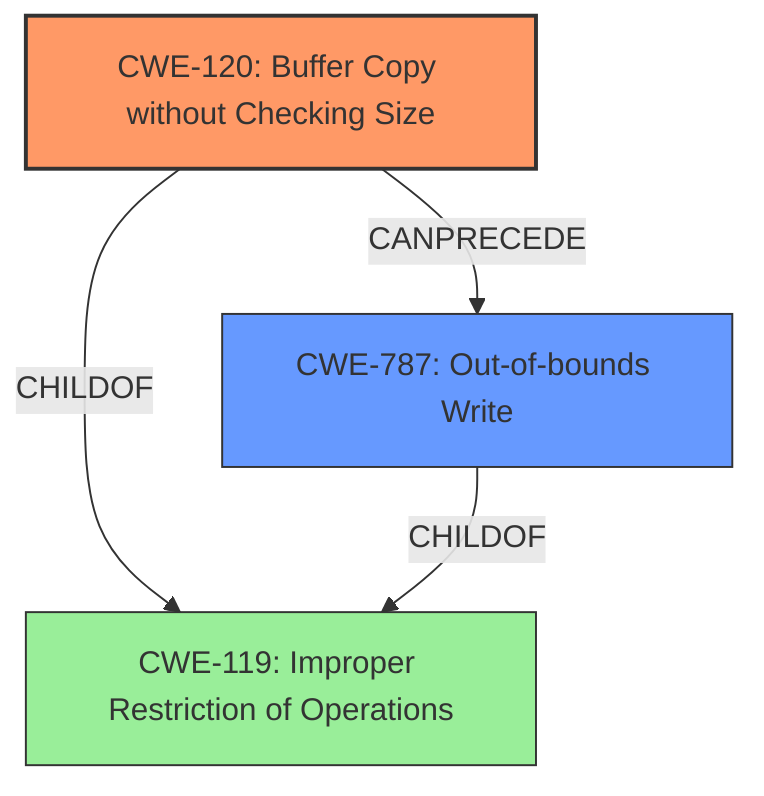

# Final Resolution for CVE-2022-41010

# Summary
| CWE ID | CWE Name | Confidence | CWE Abstraction Level | CWE Vulnerability Mapping Label | CWE-Vulnerability Mapping Notes |
|---|---|---|---|---|---|
| CWE-120 | Buffer Copy without Checking Size of Input ('Classic Buffer Overflow') | 0.95 | Base | Allowed-with-Review | Primary CWE. Root cause is the unbounded `sprintf` copy. |
| CWE-787 | Out-of-bounds Write | 0.70 | Base | Allowed | Secondary Candidate. Represents the *effect* of the buffer overflow. |

## Evidence and Confidence

*   **Confidence Score:** 0.95
*   **Evidence Strength:** HIGH

## Relationship Analysis
The primary relationship that influenced the decision was the parent-child relationship between **CWE-119** [Improper Restriction of Operations within the Bounds of a Memory Buffer] and both **CWE-120** [Buffer Copy without Checking Size of Input ('Classic Buffer Overflow')] and **CWE-787** [Out-of-bounds Write]. **CWE-120** is a specific type of **CWE-119** where the **buffer overflow** occurs due to a copy operation without size checking. **CWE-787** represents the outcome of **CWE-120**. The chain relationship shows that **CWE-120** *CanPrecede* **CWE-787**. There are no peer relationships that significantly alter the classification decision, as **CWE-120** is the most precise representation of the root cause. The base abstraction levels of **CWE-120** and **CWE-787** are appropriate for mapping to the specific vulnerability.

## Vulnerability Chain
The vulnerability chain starts with the use of `sprintf` without bounds checking (**CWE-120**), which leads to writing data beyond the intended buffer boundaries (**CWE-787**).
  - Root Cause: Unbounded `sprintf` copy (**CWE-120**)
  - Weakness: **Stack-based buffer overflow** due to missing input size validation
  - Impact: Arbitrary command execution

## Summary of Analysis
The initial analysis and criticism both converge on the root cause being **CWE-120** [Buffer Copy without Checking Size of Input ('Classic Buffer Overflow')], due to the use of `sprintf` without bounds checking, leading to a **stack-based buffer overflow**. The vulnerability description states: "This buffer overflow is in the function that manages the no port triger protocol (tcp|udp|tcp/udp) triger port forward port description WORD command template."

The graph relationships confirm that **CWE-120** is a specific type of **CWE-119** [Improper Restriction of Operations within the Bounds of a Memory Buffer], and **CWE-787** [Out-of-bounds Write] is the direct consequence. The mapping guidance for **CWE-120** indicates that it is ALLOWED-WITH-REVIEW, with the rationale that it should only be used for "Buffer Copy" operations where there is no "Checking [the] Size of Input". This vulnerability fits that description.

The selection of **CWE-120** as the primary CWE is at the optimal level of specificity because it directly addresses the root cause of the vulnerability, which is the **buffer copy** operation without proper size checks.