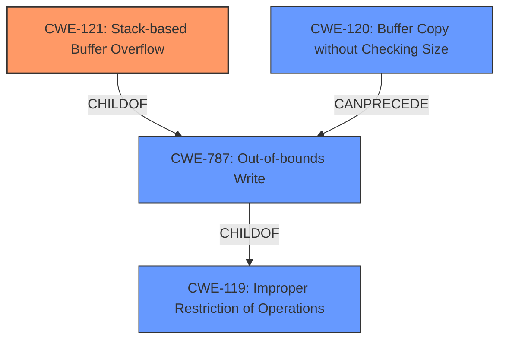

# Final Resolution for CVE-2022-41011

# Summary
| CWE ID | CWE Name | Confidence | CWE Abstraction Level | CWE Vulnerability Mapping Label | CWE-Vulnerability Mapping Notes |
|---|---|---|---|---|---|
| CWE-121 | Stack-based Buffer Overflow | 0.95 | Variant | Allowed | Primary CWE |
| CWE-120 | Buffer Copy without Checking Size of Input ('Classic Buffer Overflow') | 0.75 | Base | Allowed-with-Review | Secondary Candidate |
| CWE-787 | Out-of-bounds Write | 0.60 | Base | Allowed | Secondary Candidate |

## Evidence and Confidence

*   **Confidence Score:** 0.95
*   **Evidence Strength:** HIGH

## Relationship Analysis
The primary weakness is identified as CWE-121 (**Stack-based Buffer Overflow**), a variant of CWE-787 (**Out-of-bounds Write**) and CWE-119 (**Improper Restriction of Operations within the Bounds of a Memory Buffer**). CWE-120 (**Buffer Copy without Checking Size**) can lead to CWE-787. Since the overflow occurs specifically on the stack, CWE-121 is a more specific and appropriate classification than the base CWE-120 and CWE-787.

## Vulnerability Chain
The vulnerability chain starts with the lack of input validation which is then followed by a buffer copy without checking the size, leading to a stack-based buffer overflow and finally an out-of-bounds write that can lead to arbitrary command execution.
  - **Root Cause:** Missing or insufficient input validation.
  - **Weakness 1:** CWE-120 (**Buffer Copy without Checking Size**) - The `sprintf` function copies data without validating the size of the input.
  - **Weakness 2:** CWE-121 (**Stack-based Buffer Overflow**) - Because data is copied without size checking, a stack-based buffer is overflowed.
  - **Impact:** Arbitrary command execution.

## Summary of Analysis
The initial analysis and criticism both correctly identified CWE-121 (**Stack-based Buffer Overflow**) as the primary CWE. The vulnerability description explicitly mentions a "stack-based buffer overflow," which strongly supports this classification. The CVE Reference Links Content Summary further reinforces this by stating the use of `sprintf` without bounds checking. This explicit evidence makes CWE-121 the most accurate and specific choice.

The graph relationships confirm that CWE-121 is a variant of CWE-787 (**Out-of-bounds Write**) and CWE-119 (**Improper Restriction of Operations**), but it provides the necessary specificity given the stack location. CWE-120 (**Buffer Copy without Checking Size**) is a reasonable secondary candidate as it describes the mechanism that leads to the overflow.

The selection of CWE-121 as the primary CWE is justified due to the explicit mention of "stack-based buffer overflow" in the vulnerability description, the supporting evidence from the CVE reference, and the hierarchical relationship that places it as a specific variant of a more general out-of-bounds write. The use of a Variant CWE here is appropriate because it is more precise than the Base or Class level CWEs. The confidence score of 0.95 reflects the high degree of certainty in this classification.