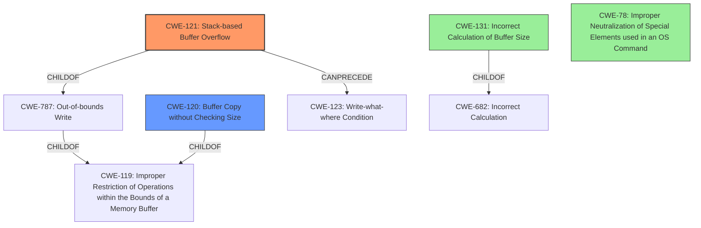

# Analysis Report for CVE-2022-41012

# Vulnerability Analysis Report: CVE-2022-41012

## Description

Several stack-based buffer overflow vulnerabilities exist in the DetranCLI command parsing functionality of Siretta QUARTZ-GOLD G5.0.1.5-210720-141020. A specially-crafted network packet can lead to arbitrary command execution. An attacker can send a sequence of requests to trigger these vulnerabilities.This buffer overflow is in the function that manages the no schedule link1 WORD link2 WORD policy (failover|backup) description (WORD|null) command template.

## Vulnerability Description Key Phrases

**Rootcause:** stack-based buffer overflow
**Impact:** arbitrary command execution
**Product:** Siretta QUARTZ-GOLD
**Version:** G5.0.1.5-210720-141020
**Component:** DetranCLI command parsing functionality

## Analysis (with Relationship Data)

# Summary
| CWE ID | CWE Name | Confidence | CWE Abstraction Level | CWE Vulnerability Mapping Label | CWE-Vulnerability Mapping Notes |
|---|---|---|---|---|---|
| CWE-121 | Stack-based Buffer Overflow | 0.95 | Variant | Allowed | Primary CWE |
| CWE-120 | Buffer Copy without Checking Size of Input ('Classic Buffer Overflow') | 0.75 | Base | Allowed-with-Review | Secondary Candidate |
| CWE-131 | Incorrect Calculation of Buffer Size | 0.60 | Base | Allowed | Secondary Candidate |

## Evidence and Confidence

*   **Confidence Score:** 0.90
*   **Evidence Strength:** HIGH

- **Analysis and Justification:**
  - *Explanation:* The vulnerability description explicitly states a "**stack-based buffer overflow**" in the DetranCLI command parsing functionality. The CVE reference confirms that the `sprintf` function is used without proper size checks, leading to a **buffer overflow** on the stack. CWE-121 (Stack-based Buffer Overflow) is a Variant-level CWE specifically designed for this scenario, making it the most appropriate primary mapping. The description aligns well with the characteristics of CWE-121, which involves overwriting a buffer allocated on the stack, leading to potential arbitrary command execution.

  - *Relationship Analysis:* CWE-121 is a variant of CWE-119 (Improper Restriction of Operations within the Bounds of a Memory Buffer), which is a more general class. The specific mention of "stack-based" justifies selecting the more specific CWE-121. CWE-787 (Out-of-bounds Write) is a parent of CWE-121 but CWE-121 is more specific to the stack.

- **Confidence Score:**
  - Confidence: 0.95 (High confidence due to explicit mention of stack-based buffer overflow and confirmation from CVE details.)

- **Analysis and Justification:**
  - *Explanation:* CWE-120 (Buffer Copy without Checking Size of Input) is a potential secondary CWE. The vulnerability involves copying data into a buffer without checking the size of the input. The CVE details mention the use of `sprintf` which can cause a buffer overflow if the input parameters are too large. The retriever results also listed CWE-120 as the top result. While relevant, CWE-121 is more precise because it specifies the location of the buffer (stack). CWE-120 is a Base level CWE, while CWE-121 is a Variant. Given the context, CWE-120 is included as a secondary candidate.

  - *Relationship Analysis:* CWE-120 is a child of CWE-119 (Improper Restriction of Operations within the Bounds of a Memory Buffer). CWE-120 can precede CWE-123 (Write-what-where Condition) as a buffer overflow can lead to arbitrary memory writes.

- **Confidence Score:**
  - Confidence: 0.75 (Medium-High confidence as the root cause involves copying data without size checks but the stack context is key.)

- **Analysis and Justification:**
  - *Explanation:* CWE-131 (Incorrect Calculation of Buffer Size) is another potential secondary CWE. The vulnerability description and CVE details indicate that the size to be used when allocating a buffer may not be correctly calculated, contributing to the buffer overflow. Specifically, the **rootcause** is that command parameters size is not checked against the size of the `stack_buffer` before calling sprintf. This could be due to incorrect calculation of the expected buffer size, making CWE-131 relevant.

  - *Relationship Analysis:* CWE-131 is a child of CWE-682 (Incorrect Calculation).

- **Confidence Score:**
  - Confidence: 0.60 (Medium confidence because while the size check is missing, indicating a potential incorrect size calculation, it's not the primary focus of the vulnerability.)

## Criticism of Analysis

Okay, I've reviewed the analysis and the full CWE specifications provided. Here's my critique:

**Overall Assessment:**

The analysis is generally good and well-reasoned. The primary CWE mapping to CWE-121 (Stack-based Buffer Overflow) is highly appropriate and justified. The selection of secondary candidates (CWE-120 and CWE-131) is also defensible, although their confidence levels reflect a more nuanced understanding of their roles.

**Detailed Breakdown:**

*   **CWE-121: Stack-based Buffer Overflow (Primary)**

    *   **Confidence:** The assigned confidence of 0.95 is accurate. The description explicitly mentions "stack-based buffer overflow," making this a strong match.
    *   **Justification:** The justification is solid, clearly explaining why CWE-121 is the most specific and appropriate choice compared to its parents like CWE-119 and CWE-787.
    *   **Mapping Guidance:** The analysis correctly notes that CWE-121 is at the Variant level of abstraction, which aligns with the CWE's guidance for usage.
    *   **Mitigations:** The analysis correctly points out mitigation strategies like using memory-safe languages, utilizing abstraction libraries, and implementing bounds checking.
*   **CWE-120: Buffer Copy without Checking Size of Input ('Classic Buffer Overflow') (Secondary)**

    *   **Confidence:** A confidence of 0.75 is appropriate. While the vulnerability involves copying data without size checks, the stack context makes CWE-121 a better fit.
    *   **Justification:** The justification correctly identifies the relationship between CWE-120 and the lack of size checks in `sprintf`. However, it clearly distinguishes why CWE-121 is superior due to its specific stack context.
    *   **Mapping Guidance:** It aligns with CWE-120's "Allowed-with-Review" usage, as it involves a buffer overflow but requires careful consideration due to the potential for misuse. The comments included in the guidance recommend considering children of CWE-20 (Input Validation) or CWE-131 (Incorrect Buffer Calculation) if further analysis is available. The inclusion of CWE-131 as a tertiary candidate follows this advice.
    *   **Mitigations:** The identified mitigations, like using memory-safe languages, and libraries (SafeStr, Strsafe.h) are correct, but they are more generic and less specific to a stack-based context compared to the mitigations for CWE-121.
*   **CWE-131: Incorrect Calculation of Buffer Size (Secondary)**

    *   **Confidence:** A confidence of 0.60 is reasonable. The vulnerability's root cause involves the command parameters size not being checked against the size of the `stack_buffer` before calling sprintf, which *could* be traced back to an incorrect calculation. However, it is also simply a lack of any calculation, which is a more general problem.
    *   **Justification:** The description is accurate, explaining how the absence of size checks can imply an incorrect buffer size calculation.
    *   **Mapping Guidance:** The analysis appropriately recognizes that although the lack of a size check might indicate an incorrect size calculation, it is not the primary focus.
    *   **Mitigations:** The identified mitigations of ensuring adequate memory and understanding the programming language are accurate, but less directly related to the identified vulnerability, compared to the other candidates.

**Critiques and Suggestions:**

1.  **CWE-787: Out-of-bounds Write:** While CWE-121 is more specific, consider explicitly mentioning CWE-787 (Out-of-bounds Write) in the "Relationship Analysis" section for CWE-121. CWE-787 is a parent of CWE-121, representing the more general "writing outside the buffer's boundaries" concept. This would strengthen the analysis by acknowledging the broader context.

2.  **Chaining/Composite Considerations:** The analysis could briefly explore whether a chaining or composite relationship exists between these CWEs.  For example, is the *cause* of the stack-based buffer overflow directly related to the lack of size checking (CWE-120) or a miscalculated size (CWE-131)?

    *   A stronger case could be made for a composite view where CWE-120 is a necessary condition for triggering CWE-121 in this specific instance.  Without the unchecked copy operation, the stack-based buffer overflow wouldn't occur.
    *   CWE-787 and CWE-123 as consequences of CWE-121 should be briefly mentioned. If exploitation is successful then the attacker could overwrite the return address to gain arbitrary code execution, which would be a write-what-where vulnerability (CWE-123).
3.  **Mitigation Specificity:** While the mitigations listed are generally correct, consider adding a sentence or two within each CWE's mitigation section about *how* those mitigations specifically apply to the stack-based scenario. For example, for CWE-121, discuss how stack canaries specifically protect against return address overwrites.

4.  **Retriever Results:** The retriever results listed CWE-78 "Improper Neutralization of Special Elements used in an OS Command" and this aligns with the impact of this vulnerability. Although command injection is not present, the arbitrary command execution could indicate this as a tertiary CWE candidate to be explored.

**Revised Summary Table:**

| CWE ID | CWE Name | Confidence | CWE Abstraction Level | CWE Vulnerability Mapping Label | CWE-Vulnerability Mapping Notes |
|---|---|---|---|---|---|
| CWE-121 | Stack-based Buffer Overflow | 0.95 | Variant | Allowed | Primary CWE |
| CWE-120 | Buffer Copy without Checking Size of Input ('Classic Buffer Overflow') | 0.75 | Base | Allowed-with-Review | Secondary Candidate |
| CWE-131 | Incorrect Calculation of Buffer Size | 0.60 | Base | Allowed | Tertiary Candidate |
| CWE-78 | Improper Neutralization of Special Elements used in an OS Command ('OS Command Injection') | 0.30 | Base | Allowed | Quaternary Candidate |

**In summary, this is a strong analysis. My suggestions are primarily aimed at adding further depth and explicitly connecting the chosen CWEs to the specific characteristics of the vulnerability.**

## Final Resolution

# Summary
| CWE ID | CWE Name | Confidence | CWE Abstraction Level | CWE Vulnerability Mapping Label | CWE-Vulnerability Mapping Notes |
|---|---|---|---|---|---|
| CWE-121 | Stack-based Buffer Overflow | 0.95 | Variant | Allowed | Primary CWE |
| CWE-120 | Buffer Copy without Checking Size of Input ('Classic Buffer Overflow') | 0.75 | Base | Allowed-with-Review | Secondary Candidate |
| CWE-131 | Incorrect Calculation of Buffer Size | 0.60 | Base | Allowed | Tertiary Candidate |
| CWE-78 | Improper Neutralization of Special Elements used in an OS Command ('OS Command Injection') | 0.30 | Base | Allowed | Quaternary Candidate |

## Evidence and Confidence

*   **Confidence Score:** 0.92
*   **Evidence Strength:** HIGH

## Relationship Analysis
The primary CWE is CWE-121 (Stack-based Buffer Overflow), which is a variant of CWE-119 (Improper Restriction of Operations within the Bounds of a Memory Buffer) and a child of CWE-787 (Out-of-bounds Write). The analysis correctly identifies CWE-121 as the most specific and appropriate choice due to the explicit mention of "stack-based buffer overflow" in the vulnerability description. CWE-120 (Buffer Copy without Checking Size) is considered as a secondary candidate, as it represents the lack of size checks when copying data into the buffer. CWE-131 (Incorrect Calculation of Buffer Size) is a tertiary candidate because the lack of size check implies an incorrect buffer size calculation. CWE-78 (Improper Neutralization of Special Elements used in an OS Command) is considered as a quaternary candidate because the result of the buffer overflow could lead to arbitrary command execution.

## Vulnerability Chain
The vulnerability chain starts with the lack of size checks when copying data into a stack-based buffer (CWE-120). This can stem from an incorrect calculation of the buffer size (CWE-131), though this is less direct. The unchecked copy operation leads to a stack-based buffer overflow (CWE-121), which allows an attacker to overwrite memory on the stack, including the return address. If successful, the attacker could achieve arbitrary command execution, which can be related to improper neutralization of special elements used in an OS command (CWE-78) and can lead to a write-what-where condition (CWE-123).

## Summary of Analysis
The initial analysis and criticism are well-reasoned and supported by evidence from the vulnerability description. The primary CWE mapping to CWE-121 is highly appropriate and justified due to the explicit mention of "stack-based buffer overflow." The selection of secondary candidates (CWE-120 and CWE-131) is also defensible, although their confidence levels reflect a more nuanced understanding of their roles. The inclusion of CWE-78 is a valid consideration based on the potential impact of the vulnerability.

The graph relationships influenced the final selection by highlighting the hierarchical relationships between the CWEs. CWE-121 is a variant of CWE-119 and a child of CWE-787, representing the specific case of a stack-based buffer overflow. The other CWEs are included as contributing factors or potential consequences of the vulnerability.

The selected CWEs are at the optimal level of specificity. CWE-121 is a Variant-level CWE that accurately describes the stack-based nature of the buffer overflow. CWE-120 and CWE-131 are included as contributing factors, while CWE-78 represents the potential impact of the vulnerability.

*Report generated on 2025-03-18 17:15:22*
