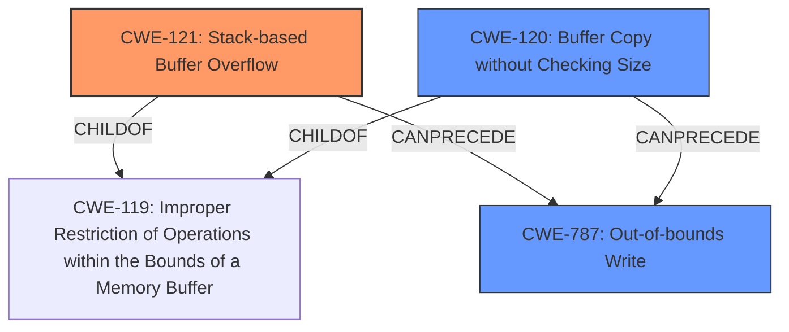

# Analysis Report for CVE-2022-41014

# Vulnerability Analysis Report: CVE-2022-41014

## Description

Several stack-based buffer overflow vulnerabilities exist in the DetranCLI command parsing functionality of Siretta QUARTZ-GOLD G5.0.1.5-210720-141020. A specially-crafted network packet can lead to arbitrary command execution. An attacker can send a sequence of requests to trigger these vulnerabilities.This buffer overflow is in the function that manages the no static dhcp mac WORD (WORD|null) ip A.B.C.D hostname (WORD|null) description (WORD|null) command template.

## Vulnerability Description Key Phrases

**Rootcause:** stack-based buffer overflow
**Impact:** arbitrary command execution
**Vector:** specially-crafted network packet
**Product:** Siretta QUARTZ-GOLD
**Version:** G5.0.1.5-210720-141020
**Component:** DetranCLI command parsing functionality

## Analysis (with Relationship Data)

# Summary
| CWE ID | CWE Name | Confidence | CWE Abstraction Level | CWE Vulnerability Mapping Label | CWE-Vulnerability Mapping Notes |
|---|---|---|---|---|---|
| CWE-121 | Stack-based Buffer Overflow | 0.95 | Variant | Allowed | Primary CWE |
| CWE-120 | Buffer Copy without Checking Size of Input ('Classic Buffer Overflow') | 0.75 | Base | Allowed-with-Review | Secondary Candidate |

## Evidence and Confidence

*   **Confidence Score:** 0.90
*   **Evidence Strength:** HIGH

- **Analysis and Justification:**  
  - *Explanation:* The vulnerability description explicitly states "**stack-based buffer overflow**" in the DetranCLI command parsing functionality. The CVE Reference Links Content Summary reinforces this by stating that the root cause is a stack-based buffer overflow and the `sprintf` function copies command parameters into a stack buffer without proper size checks. This aligns directly with CWE-121 (Stack-based Buffer Overflow), which is a variant of CWE-119 (Improper Restriction of Operations within the Bounds of a Memory Buffer). While CWE-120 (Buffer Copy without Checking Size of Input) is a close match and listed as the Primary CWE Match for similar vulnerabilities, the explicit mention of "stack-based" makes CWE-121 a more precise mapping. The MITRE mapping guidance for CWE-121 states that it is ALLOWED.

  - *Relationship Analysis:* CWE-121 is a variant (child) of CWE-119. CWE-120 is a peer. Choosing CWE-121 provides a more specific classification. CWE-121 can lead to other vulnerabilities like CWE-787 (Out-of-bounds Write), as a stack buffer overflow results in writing outside the intended buffer.

- **Confidence Score:**  
  - Confidence: 0.95 (High confidence due to explicit mention of "stack-based buffer overflow" and confirmation in the CVE Reference Links Content Summary)

---

## Criticism of Analysis

Okay, I've reviewed the provided analysis and the complete CWE specifications. Here's my critique:

**Overall Assessment:**

The analysis is generally good and arrives at a reasonable conclusion. The explicit mention of "stack-based buffer overflow" in both the vulnerability description and the CVE Reference Links Content Summary makes a strong case for CWE-121 as the primary CWE. The analysis clearly lays out the justification and relationship between the potential CWEs.

**Specific Comments:**

1.  **Primary CWE: CWE-121 (Stack-based Buffer Overflow)**

    *   **Accuracy:** The choice of CWE-121 is appropriate and well-justified. The analysis emphasizes the "stack-based" aspect, making it more specific than CWE-120.
    *   **Confidence:** The high confidence score (0.95) is justified given the explicit evidence.
    *   **CWE Specification Compliance:** The analysis correctly notes that CWE-121 is a *Variant* and that the Mapping Guidance allows its use.
    *   **Mitigations:** The provided mitigations for CWE-121 (Operation, Build and Compilation, Architecture and Design and Implementation) are all relevant, given a lack of checking the size of the input.
    *   **Relationships:** The analysis mentions that CWE-121 is a child of CWE-787 and CWE-788 which accurately reflects its position within the CWE hierarchy.
    *   **Overall:** A strong choice and well-supported.

2.  **Secondary CWE Candidate: CWE-120 (Buffer Copy without Checking Size of Input)**

    *   **Accuracy:** CWE-120 is definitely a relevant candidate.  The core issue is a buffer copy operation where the input size is not checked. However, without the explicit "stack-based" information, it would be the better choice.
    *   **Abstraction Level:** As the analysis notes, CWE-120 is a *Base* CWE, whereas CWE-121 is a *Variant*.  Mapping Guidance is "Allowed with Review". This means its use is acceptable so long as a review is performed and the more specific CWE is unavailable.
    *   **Why CWE-121 is Preferred:** Because "stack-based" is mentioned, CWE-121 provides a more precise classification.
    *   **Overall:** A valid secondary candidate and the analysis provides a good explanation of why it was not chosen as primary.

3. **Top Combined Retriever Results and Analysis:**
    * The retriever results correctly identifies CWE-120 and CWE-121 as the top two CWEs.
    * Other CWEs such as integer overflow (CWE-190), improper null termination (CWE-170), Off-by-one Error (CWE-193), Incorrect Calculation of Buffer Size (CWE-131), Heap-based Buffer Overflow (CWE-122), and Buffer Over-read (CWE-126) are not the primary cause, and therefore should not be considered as the primary CWE. They may however be a contributing factor or a chained weakness.
    * The retriever results provide good suggestions for additional CWEs to investigate.

**Minor Suggestions/Improvements:**

*   **CWE-787 (Out-of-bounds Write):** While CWE-121 is more specific as the root cause, it may be valuable to explicitly mention that a stack-based buffer overflow (CWE-121) *results in* an out-of-bounds write (CWE-787). This could be added as a chained relationship.  The analysis mentions this in the "*Relationship Analysis:*", which is good but could be highlighted more prominently.
* The analysis could suggest that CWE-120 can lead to CWE-787 as an alternative path of exploitation.

**In summary, this is a well-reasoned and accurate analysis. The choice of CWE-121 as the primary CWE is strongly supported by the evidence and the explanation of why it's preferred over CWE-120 is clear and logical.**

## Final Resolution

# Summary

| CWE ID    | CWE Name                                                              | Confidence | CWE Abstraction Level | CWE Vulnerability Mapping Label | CWE-Vulnerability Mapping Notes |
| :---------- | :-------------------------------------------------------------------- | :--------- | :-------------------- | :-------------------------------- | :------------------------------ |
| CWE-121     | Stack-based Buffer Overflow                                           | 0.95       | Variant               | Allowed                         | Primary CWE                     |
| CWE-120     | Buffer Copy without Checking Size of Input ('Classic Buffer Overflow') | 0.75       | Base                  | Allowed-with-Review             | Secondary Candidate             |
| CWE-787     | Out-of-bounds Write                                                   | 0.60       | Base                  | Allowed                         | Secondary Candidate             |

## Evidence and Confidence

*   **Confidence Score:** 0.92
*   **Evidence Strength:** HIGH

## Relationship Analysis

The primary relationship that impacted the decision was the parent-child relationship between CWE-119 (Improper Restriction of Operations within the Bounds of a Memory Buffer) and both CWE-121 and CWE-120. CWE-121 is a variant of CWE-119, representing a stack-based buffer overflow, making it more specific than CWE-120, which is a base-level CWE describing a buffer copy without checking size. Additionally, CWE-787 (Out-of-bounds Write) is a consequence of both CWE-121 and CWE-120. This led to including CWE-787 as a secondary candidate. Choosing CWE-121 provides a more precise classification due to the explicit mention of "stack-based" in the vulnerability description.

## Vulnerability Chain

The vulnerability chain starts with a missing check on the size of the input when copying data into a stack-allocated buffer. This lack of validation (**ROOTCAUSE: CWE-120** or **ROOTCAUSE: CWE-121**) leads to a **WEAKNESS: CWE-787**, where the buffer is overwritten. This out-of-bounds write allows an attacker to potentially execute arbitrary commands.

## Summary of Analysis

The initial analysis correctly identified CWE-121 as the primary issue due to the explicit mention of a "stack-based buffer overflow" in the vulnerability description: "Several **stack-based buffer overflow** vulnerabilities exist...". The CVE Reference Links Content Summary reinforces this: "root cause is a **stack-based buffer overflow** and the `sprintf` function copies command parameters into a stack buffer without proper size checks."

The criticism highlighted the importance of acknowledging that CWE-121 leads to CWE-787 (Out-of-bounds Write). Thus, I've added CWE-787 as a secondary candidate.

The graph relationships influenced the final selection by emphasizing the hierarchical relationship between CWE-119, CWE-120 and CWE-121. I considered the parent-child relationship to select the most specific CWE available. Additionally, the potential for CWE-121 and CWE-120 to lead to CWE-787 was considered for the vulnerability chain.

The selected CWEs are at the optimal level of specificity. CWE-121 is a Variant, providing more detail than the Base CWE-120. Given the available information, CWE-121 accurately reflects the root cause of the vulnerability.

*Report generated on 2025-03-18 17:16:59*
