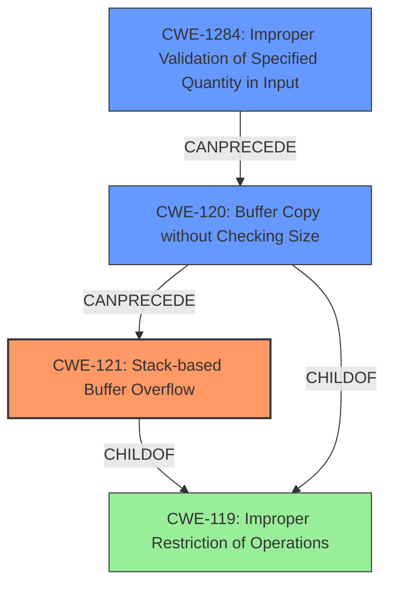

# Final Resolution for CVE-2022-41015

# Summary
| CWE ID   | CWE Name                                                              | Confidence | CWE Abstraction Level | CWE Vulnerability Mapping Label | CWE-Vulnerability Mapping Notes                                                                                                                                                                                                        |
| :------- | :-------------------------------------------------------------------- | :--------- | :-------------------- | :------------------------------ | :------------------------------------------------------------------------------------------------------------------------------------------------------------------------------------------------------------------------------------- |
| CWE-121  | Stack-based Buffer Overflow                                           | 0.95       | Variant               | Allowed                         | Primary CWE                                                                                                                                                                                                                            |
| CWE-1284 | Improper Validation of Specified Quantity in Input                    | 0.85       | Base                  | Allowed                         | Contributing Factor - The size of the input parameters is not validated before being used in `sprintf`, leading to the overflow.                                                                                                    |
| CWE-120  | Buffer Copy without Checking Size of Input ('Classic Buffer Overflow') | 0.75       | Base                  | Allowed-with-Review           | Secondary Candidate - Describes the fundamental problem.                                                                                                                                                                                 |

## Evidence and Confidence

*   **Confidence Score:** 0.90
*   **Evidence Strength:** HIGH

## Relationship Analysis
The primary relationship is that CWE-121 (Stack-based Buffer Overflow) is a variant of the more general CWE-119 (Improper Restriction of Operations within the Bounds of a Memory Buffer). CWE-120 (Buffer Copy without Checking Size) is a related base CWE that describes the lack of input size checking which contributes to buffer overflows. CWE-1284 (Improper Validation of Specified Quantity in Input) is also a base CWE and contributes as the root cause since the size of the input parameters are not validated before being used in `sprintf`. The relationships show that the vulnerability occurs because of a lack of input validation which leads to a buffer copy without checking size and finally a stack based buffer overflow. Selecting CWE-121, CWE-1284, and CWE-120 provides a detailed and accurate description of the vulnerability.

## Vulnerability Chain
The vulnerability chain starts with **CWE-1284 (Improper Validation of Specified Quantity in Input)**, where the size of the input parameters for the `vpn basic protocol` command is not validated. This leads to **CWE-120 (Buffer Copy without Checking Size)**, as the `sprintf` function copies data into a buffer without checking if the input size exceeds the buffer's capacity. Finally, this results in **CWE-121 (Stack-based Buffer Overflow)**, as the buffer is allocated on the stack and overwritten due to the unchecked copy operation.
  - The initial flaw is the missing input size validation (**ROOTCAUSE**).
  - This leads to the unchecked buffer copy.
  - Ultimately causing a stack-based buffer overflow that could result in arbitrary command execution.

## Summary of Analysis
The initial analysis correctly identified **CWE-121 (Stack-based Buffer Overflow)** as the primary weakness. However, by adding **CWE-1284 (Improper Validation of Specified Quantity in Input)**, the analysis is improved by explicitly stating the root cause that leads to the **stack-based buffer overflow**. The vulnerability description states a "**stack-based buffer overflow**" exists and that the `sprintf` function writes to a stack buffer without proper bounds checking. This confirms the primary weakness is **CWE-121**. The use of `sprintf` without input size validation is the **rootcause**, causing the **stack-based buffer overflow**. Adding **CWE-1284** explicitly highlights the lack of validation of the input parameters used in `sprintf`. The graph relationships show that **CWE-1284** can precede **CWE-120**, which in turn can precede **CWE-121**. This makes **CWE-1284** a strong candidate as a secondary CWE. Both **CWE-121** and **CWE-1284** are at the optimal level of specificity, with **CWE-121** being a Variant and **CWE-1284** being a Base CWE. **CWE-120** is included as a secondary candidate due to the unchecked buffer copy.