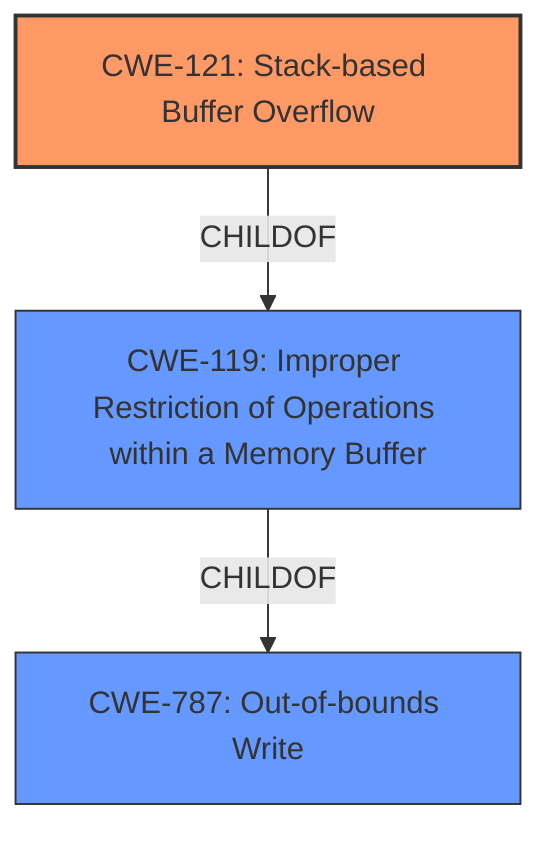

# Final Resolution for CVE-2022-41016

# Summary
| CWE ID | CWE Name | Confidence | CWE Abstraction Level | CWE Vulnerability Mapping Label | CWE-Vulnerability Mapping Notes |
|---|---|---|---|---|---|
| CWE-121 | Stack-based Buffer Overflow | 0.95 | Variant | Allowed | Primary CWE. Vulnerability caused by the use of `sprintf` with user-supplied input without proper size checks in `DetranCLI` command parsing. |

## Evidence and Confidence

*   **Confidence Score:** 0.95
*   **Evidence Strength:** HIGH

## Relationship Analysis
The primary relationship that impacted the decision was the hierarchical relationship between CWE-787 (**Out-of-bounds Write**), CWE-119 (**Improper Restriction of Operations within a Memory Buffer**), and CWE-121 (**Stack-based Buffer Overflow**). CWE-121 is a variant of CWE-119, which in turn is a child of CWE-787. Selecting CWE-121 provides the most specific classification, as the vulnerability is explicitly described as a stack-based buffer overflow.

## Vulnerability Chain
The vulnerability chain starts with the use of `sprintf` without proper size checks on user-supplied input within the `DetranCLI` command parsing functionality. This leads to a **stack-based buffer overflow** (CWE-121), where data is written beyond the intended buffer on the stack. The consequence of this overflow can be arbitrary command execution.

## Summary of Analysis
The initial analysis correctly identified CWE-121 (**Stack-based Buffer Overflow**) as the primary CWE. The criticism highlighted the importance of explicitly addressing why other potential CWEs were rejected and suggested including specific mitigations.

The decision is primarily based on the provided evidence, specifically the vulnerability description stating "Several stack-based buffer overflow vulnerabilities exist" and the CVE Reference Links Content Summary stating "Stack-based buffer overflow (CWE-120) in the `DetranCLI` command parsing functionality.".

The graph relationships influenced the final selection by confirming that CWE-121 is the most specific and appropriate classification within the hierarchy of buffer overflow related CWEs.

The selected CWE is at the optimal level of specificity because it accurately reflects the nature of the vulnerability as a **stack-based buffer overflow**, and the evidence strongly supports this classification. The use of `sprintf` without validation is the **rootcause** that allows the buffer overflow.