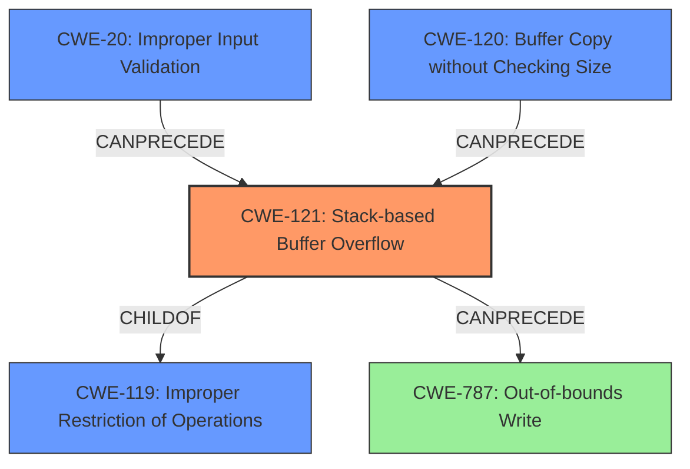

# Analysis Report for CVE-2022-41017

# Vulnerability Analysis Report: CVE-2022-41017

## Description

Several stack-based buffer overflow vulnerabilities exist in the DetranCLI command parsing functionality of Siretta QUARTZ-GOLD G5.0.1.5-210720-141020. A specially-crafted network packet can lead to arbitrary command execution. An attacker can send a sequence of requests to trigger these vulnerabilities.This buffer overflow is in the function that manages the vpn basic protocol (l2tp|pptp) name WORD server WORD username WORD passsword WORD firmwall (on|off) defroute (on|off) localip A.B.C.D command template.

## Vulnerability Description Key Phrases

**Rootcause:** stack-based buffer overflow
**Impact:** arbitrary command execution
**Product:** Siretta QUARTZ-GOLD
**Version:** G5.0.1.5-210720-141020
**Component:** DetranCLI command parsing functionality

## Analysis (with Relationship Data)

```markdown
# Summary 
| CWE ID  | CWE Name                                                                    | Confidence | CWE Abstraction Level | CWE Vulnerability Mapping Label | CWE-Vulnerability Mapping Notes |
| :-------- | :-------------------------------------------------------------------------- | :---------- | :-------------------- | :------------------------------ | :----------------------------- |
| CWE-121 | Stack-based Buffer Overflow                                               | 0.90      | Variant               | Primary                         | Allowed                        |
| CWE-120 | Buffer Copy without Checking Size of Input ('Classic Buffer Overflow') | 0.75      | Base                  | Secondary                       | Allowed-with-Review           |

## Evidence and Confidence

*   **Confidence Score:** 0.85
*   **Evidence Strength:** HIGH

- **Analysis and Justification:**  
  - *Explanation:* The vulnerability description explicitly states a "**stack-based buffer overflow**" exists. The CVE reference summary confirms this, stating the "**root cause** of the vulnerability is a **stack-based buffer overflow**" due to the use of `sprintf` without proper bounds checking. CWE-121 (Stack-based Buffer Overflow) directly addresses this weakness. While CWE-120 (Buffer Copy without Checking Size of Input) is a broader classification and was identified as a primary match for similar CVE descriptions, the explicit mention of "stack-based" makes CWE-121 a more precise fit. The `sprintf` function copies data into a fixed-size stack buffer without validating the input size. This can lead to overwriting adjacent data on the stack, including the return address, which can lead to arbitrary code execution. MITRE's mapping guidance designates CWE-121 as ALLOWED, making it appropriate.

  - *Relationship Analysis:* CWE-121 is a variant of a buffer overflow and is a child of CWE-119 (Improper Restriction of Operations within the Bounds of a Memory Buffer). The vulnerability can potentially lead to CWE-787 (Out-of-bounds Write).

- **Confidence Score:**  
  - Confidence: 0.90 (High confidence due to explicit mention of stack-based buffer overflow and corroborating evidence from the CVE reference.)
```
```markdown
# Summary 
| CWE ID  | CWE Name                                                                    | Confidence | CWE Abstraction Level | CWE Vulnerability Mapping Label | CWE-Vulnerability Mapping Notes |
| :-------- | :-------------------------------------------------------------------------- | :---------- | :-------------------- | :------------------------------ | :----------------------------- |
| CWE-121 | Stack-based Buffer Overflow                                               | 0.90      | Variant               | Primary                         | Allowed                        |
| CWE-120 | Buffer Copy without Checking Size of Input ('Classic Buffer Overflow') | 0.75      | Base                  | Secondary                       | Allowed-with-Review           |

## Evidence and Confidence

*   **Confidence Score:** 0.85
*   **Evidence Strength:** HIGH

- **Analysis and Justification:**  
  - *Explanation:* The vulnerability description explicitly states a "**stack-based buffer overflow**" exists. The CVE reference summary confirms this, stating the "**root cause** of the vulnerability is a **stack-based buffer overflow**" due to the use of `sprintf` without proper bounds checking. CWE-121 (Stack-based Buffer Overflow) directly addresses this weakness. While CWE-120 (Buffer Copy without Checking Size of Input) is a broader classification and was identified as a primary match for similar CVE descriptions, the explicit mention of "stack-based" makes CWE-121 a more precise fit. The `sprintf` function copies data into a fixed-size stack buffer without validating the input size. This can lead to overwriting adjacent data on the stack, including the return address, which can lead to arbitrary code execution. MITRE's mapping guidance designates CWE-121 as ALLOWED, making it appropriate.

  - *Relationship Analysis:* CWE-121 is a variant of a buffer overflow and is a child of CWE-119 (Improper Restriction of Operations within the Bounds of a Memory Buffer). The vulnerability can potentially lead to CWE-787 (Out-of-bounds Write).

- **Confidence Score:**  
  - Confidence: 0.90 (High confidence due to explicit mention of stack-based buffer overflow and corroborating evidence from the CVE reference.)
```

## Criticism of Analysis

Okay, here's a detailed review of the provided CWE analysis, considering the full CWE specifications.

**Overall Assessment:**

The analysis is generally good and correctly identifies the primary CWE as CWE-121 (Stack-based Buffer Overflow). The explanation is clear and well-justified.  However, there are some areas where the analysis could be strengthened, especially regarding secondary CWEs and potential contributing factors. The overall confidence score of 0.85 and confidence of 0.90 for CWE-121 are reasonable, reflecting the explicit nature of the vulnerability description.

**Detailed Review by Section:**

**1. Summary Table:**

*   **CWE-121:** Stack-based Buffer Overflow - Confidence: 0.90, Primary.  Excellent. The justification below is solid.
*   **CWE-120:** Buffer Copy without Checking Size of Input - Confidence: 0.75, Secondary.  Acceptable, but requires more nuance (see comments below).

**2. Evidence and Confidence:**

*   **Confidence Score (Overall):** 0.85 - Appropriate.
*   **Evidence Strength:** HIGH - Justified.

*   **Analysis and Justification (CWE-121):**
    *   The explanation is excellent.  It clearly articulates why CWE-121 is the most specific and accurate mapping.
    *   The explanation of how `sprintf` leads to the overflow is precise.
    *   Acknowledging MITRE's ALLOWED designation is good practice.

*   **Relationship Analysis:**
    *   "CWE-121 is a variant of a buffer overflow and is a child of CWE-119..." - Correct.
    *   "The vulnerability can potentially lead to CWE-787 (Out-of-bounds Write)." - Correct and important. This highlights the direct consequence of the overflow.

*   **Confidence Score (CWE-121):** 0.90 - Well-justified.

**Critiques and Suggestions:**

1.  **CWE-120: Buffer Copy without Checking Size of Input:**

    *   **The mapping guidance says:** "This CWE entry is only appropriate for "Buffer Copy" operations (not buffer reads), in which where there is no "Checking [the] Size of Input", and (by implication of the copy) writing past the end of the buffer."

    *   The `sprintf` function *is* a buffer copy operation.  The problem is that the size of the *input* to `sprintf` is not checked against the available *output* buffer size, leading to the overflow.

    *   **Recommendation:** Maintain CWE-120 as a *contributing* factor, but lower the confidence slightly (perhaps to 0.65).  The primary issue isn't simply the buffer copy itself; it's the *lack of validation* on the input sizes being used in the copy.

2.  **Missing CWE: CWE-20 Improper Input Validation**

    *   The analysis is missing a key contributing factor: **CWE-20 (Improper Input Validation).** The root cause here is that the lengths of the input strings (`argv[1]`, `argv[2]`, `argv[3]`, `argv[4]`, and `argv[7]`) are *not validated* *before* being used in the `sprintf` function.  This lack of validation is what *allows* the attacker to control the size of the input data and trigger the overflow.
    *   **Mapping Guidance for CWE-20 States:** "...When software does not validate input properly, an attacker is able to craft the input in a form that is not expected by the rest of the application. This will lead to parts of the system receiving unintended input, which may result in altered control flow, arbitrary control of a resource, or arbitrary code execution."  This directly applies to the `sprintf`'s arguments, as the code assumes that the data is of a certain size, when it's not checked.
    *   **Relationship Considerations**: The full description states that "Input validation is not necessarily the only protection mechanism available for avoiding such problems, and in some cases it is not even sufficient". So relying on this one CWE alone would not be sufficient to resolve the vulnerability.
    *   **Also mapping guidance notes:** Consider lower-level children such as Improper Use of Validation Framework (CWE-1173) or improper validation involving specific types or properties of input such as Specified Quantity (CWE-1284). The specified quantity fits here, so consider CWE-1284 for specific cases.
    *   **Recommendation:**  Add CWE-20 as a *contributing factor* (confidence: 0.75), and consider adding CWE-1284 also as a lower lever variant, or a chained element. In the Explanation, state that the lengths of the `argv[]` values are not validated before being used in `sprintf`.
    *   **Mitigation Consideration**: Proper input validation should be used to check the length of the input strings against the maximum buffer size, before the sprintf is called.

3.  **CWE-787 Out-of-Bounds Write**:

    *   The current analysis notes that CWE-787 can be a POTENTIAL consequence of the vulnerability. In most cases, CWE-787 is the direct result of the buffer overflow. It should be listed as a secondary CWE. The root cause is still the stack-based overflow, but you are directly writing outside the bounds of the buffer.
    *   **Recommendation**: Add CWE-787 as a secondary CWE with confidence 0.7, and improve the relationship analysis to include this point.

4.  **Mitigation Recommendations**:
    *   The mitigations suggested by the full CWE specifications can be included in the report.
    *   For example, if including CWE-20, include its mitigation recommendation:
       "Assume all input is malicious. Use an "accept known good" input validation strategy, i.e., use a list of acceptable inputs that strictly conform to specifications. Reject any input that does not strictly conform to specifications, or transform it into something that does."
    *   For CWE-121, using compiler options such as /GS or FORTIFY_SOURCE.

5.  **Clarify Scope (DetranCLI)**:  The analysis mentions the `DetranCLI` interface, but it could be made clearer who has access to this interface (e.g., local administrators, remote authenticated users).  This helps in understanding the attack vector and required attacker capabilities.

**Revised Summary Table (Suggested):**

| CWE ID  | CWE Name                                                                    | Confidence | CWE Abstraction Level | CWE Vulnerability Mapping Label | CWE-Vulnerability Mapping Notes |
| :-------- | :-------------------------------------------------------------------------- | :---------- | :-------------------- | :------------------------------ | :----------------------------- |
| CWE-121 | Stack-based Buffer Overflow                                               | 0.90      | Variant               | Primary                         | Allowed                        |
| CWE-120 | Buffer Copy without Checking Size of Input ('Classic Buffer Overflow') | 0.65      | Base                  | Contributing                    | Allowed-with-Review           |
| CWE-20  | Improper Input Validation                                                   | 0.75      | Class                 | Contributing                    | Allowed                        |
| CWE-787  | Out-of-bounds Write                                                         | 0.70      | Base                  | Secondary                       | Allowed                        |

**Revised Evidence and Confidence (Example):**

**Confidence Score:** 0.90
**Evidence Strength:** HIGH

- **Analysis and Justification:**
  - *Explanation:* The vulnerability description explicitly states a "**stack-based buffer overflow**" exists. The CVE reference summary confirms this, stating the "**root cause** of the vulnerability is a **stack-based buffer overflow**" due to the use of `sprintf` without proper bounds checking. CWE-121 (Stack-based Buffer Overflow) directly addresses this weakness. The `sprintf` function copies data into a fixed-size stack buffer without validating the input size. This can lead to overwriting adjacent data on the stack, including the return address, which can lead to arbitrary code execution. The lengths of the input arguments to the sprintf function (`argv[1]`, `argv[2]`, `argv[3]`, `argv[4]`, and `argv[7]`) are not validated, allowing an attacker to control the size of the copied data. This is a violation of CWE-20 (Improper Input Validation) and a contributing factor to the buffer overflow. The direct consequence is an out-of-bounds write (CWE-787). MITRE's mapping guidance designates CWE-121 as ALLOWED, making it appropriate.

  - *Relationship Analysis:* CWE-121 is a variant of a buffer overflow and is a child of CWE-119 (Improper Restriction of Operations within the Bounds of a Memory Buffer). The vulnerability can potentially lead to CWE-787 (Out-of-bounds Write). The lack of input validation (CWE-20) is a key contributing factor that allows the attacker to control the size of the input data, leading to the overflow.

- **Confidence Score:**
  - Confidence: 0.90 (High confidence due to explicit mention of stack-based buffer overflow and corroborating evidence from the CVE reference.)

By adding CWE-2

## Final Resolution

# Summary
| CWE ID  | CWE Name                                                                    | Confidence | CWE Abstraction Level | CWE Vulnerability Mapping Label | CWE-Vulnerability Mapping Notes |
| :-------- | :-------------------------------------------------------------------------- | :---------- | :-------------------- | :------------------------------ | :----------------------------- |
| CWE-121 | Stack-based Buffer Overflow                                               | 0.90      | Variant               | Primary                         | Allowed                        |
| CWE-20  | Improper Input Validation                                                   | 0.75      | Class                 | Contributing                    | Allowed                        |
| CWE-120 | Buffer Copy without Checking Size of Input ('Classic Buffer Overflow') | 0.65      | Base                  | Contributing                    | Allowed-with-Review           |
| CWE-787  | Out-of-bounds Write                                                         | 0.70      | Base                  | Secondary                       | Allowed                        |

## Evidence and Confidence

*   **Confidence Score:** 0.90
*   **Evidence Strength:** HIGH

## Relationship Analysis
The primary **WEAKNESS** is a **CWE-121 (Stack-based Buffer Overflow)**, which is a variant of **CWE-119 (Improper Restriction of Operations within the Bounds of a Memory Buffer)**. The overflow occurs because the input size isn't validated (**CWE-20 (Improper Input Validation)**) before being copied using `sprintf`, a buffer copy operation (**CWE-120 (Buffer Copy without Checking Size of Input)**). The result of the overflow is an out-of-bounds write (**CWE-787 (Out-of-bounds Write)**).



## Vulnerability Chain
The vulnerability chain starts with **CWE-20 (Improper Input Validation)**, where the size of the input strings is not validated. This leads to **CWE-120 (Buffer Copy without Checking Size of Input)** via the `sprintf` function, resulting in **CWE-121 (Stack-based Buffer Overflow)**. The direct consequence of the overflow is **CWE-787 (Out-of-bounds Write)**, which can lead to arbitrary code execution.
  - **Root Cause:** Improper Input Validation (CWE-20)
  - **Weakness:** Stack-based Buffer Overflow (CWE-121)
  - **Impact:** Out-of-bounds Write (CWE-787)

## Summary of Analysis
The initial analysis correctly identified **CWE-121 (Stack-based Buffer Overflow)** as the primary **WEAKNESS**. The criticism highlighted the importance of **CWE-20 (Improper Input Validation)** as a contributing factor, since the root cause is the lack of input validation on the arguments. Additionally, the criticism suggested including **CWE-787 (Out-of-bounds Write)** as a secondary consequence. The vulnerability description explicitly states a "stack-based buffer overflow" exists. The CVE reference summary confirms this, stating the "**root cause** of the vulnerability is a **stack-based buffer overflow**" due to the use of `sprintf` without proper bounds checking. The graph relationships clearly show how the lack of input validation leads to the buffer overflow and subsequent out-of-bounds write.

The selected CWEs are at the optimal level of specificity because:
  - **CWE-121** is a variant that accurately describes the type of buffer overflow (stack-based).
  - **CWE-20** captures the root cause of the vulnerability, which is the lack of input validation.
  - **CWE-787** represents the direct consequence of the buffer overflow.
  - **CWE-120** is a contributing factor as the overflow is caused by a buffer copy without size checking.


*Report generated on 2025-03-18 17:19:24*
