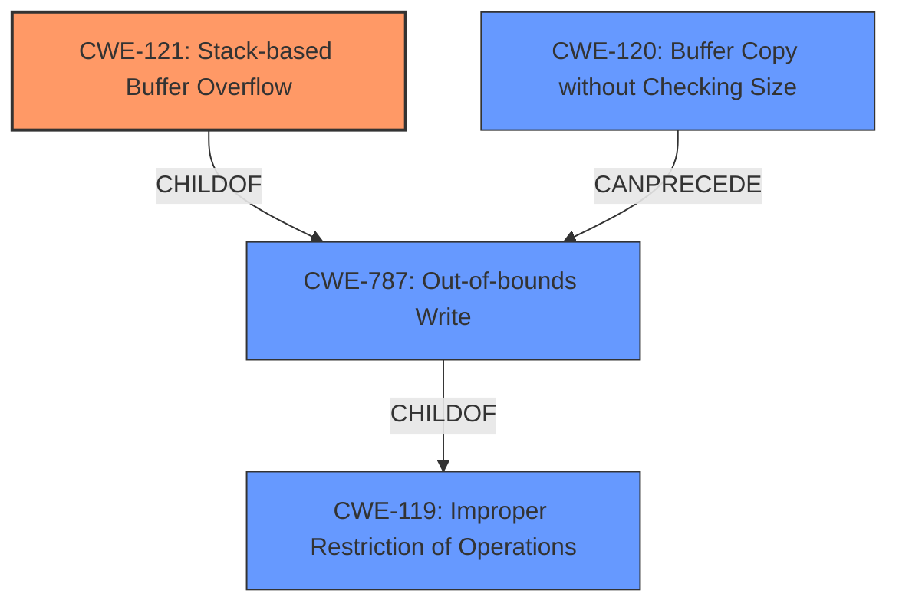

# Analysis Report for CVE-2022-41018

# Vulnerability Analysis Report: CVE-2022-41018

## Description

Several stack-based buffer overflow vulnerabilities exist in the DetranCLI command parsing functionality of Siretta QUARTZ-GOLD G5.0.1.5-210720-141020. A specially-crafted network packet can lead to arbitrary command execution. An attacker can send a sequence of requests to trigger these vulnerabilities.This buffer overflow is in the function that manages the no vpn basic protocol (l2tp|pptp) name WORD server WORD username WORD passsword WORD firmwall (on|off) defroute (on|off) localip A.B.C.D command template.

## Vulnerability Description Key Phrases

**Rootcause:** stack-based buffer overflow
**Impact:** arbitrary command execution
**Vector:** specially-crafted network packet
**Product:** Siretta QUARTZ-GOLD
**Version:** G5.0.1.5-210720-141020
**Component:** DetranCLI command parsing functionality

## Analysis (with Relationship Data)

# Summary
| CWE ID | CWE Name | Confidence | CWE Abstraction Level | CWE Vulnerability Mapping Label | CWE-Vulnerability Mapping Notes |
|---|---|---|---|---|---|
| CWE-121 | Stack-based Buffer Overflow | 0.95 | Variant | Allowed | Primary CWE |
| CWE-120 | Buffer Copy without Checking Size of Input ('Classic Buffer Overflow') | 0.75 | Base | Allowed-with-Review | Secondary Candidate |

## Evidence and Confidence

*   **Confidence Score:** 0.9
*   **Evidence Strength:** HIGH

- **Analysis and Justification:**  
  - *Explanation:* The vulnerability description clearly states "**stack-based buffer overflow**" as the root cause. The CVE Reference Links Content Summary further confirms that the `DetranCLI` binary uses `sprintf` to format command parameters into a stack buffer without size checks, leading to the overflow. CWE-121 (Stack-based Buffer Overflow) is a Variant of a buffer overflow that occurs on the stack, which perfectly matches the description. CWE-120 (Buffer Copy without Checking Size of Input) is a more general case of a buffer overflow. While CWE-120 is present in the Retriever Results with a high score, CWE-121 is more specific and accurately reflects the stack-based nature of the vulnerability.
  
  - *Relationship Analysis:* CWE-121 is a variant of buffer overflow. While not explicitly stated in the provided relationships, it is understood to be a more specific type of CWE-119 (Improper Restriction of Operations within the Bounds of a Memory Buffer).

- **Confidence Score:**  
  - Confidence: 0.95 (Strong evidence directly from the vulnerability description and supporting documents)

---

## Criticism of Analysis

Okay, I've reviewed the analysis with the full CWE specifications. Here's my critique:

**Overall Assessment:**

The analysis is generally good and arrives at the correct primary CWE, CWE-121 (Stack-based Buffer Overflow). The justification is clear and well-supported by the information provided in the vulnerability description and CVE reference summary. The decision to prioritize CWE-121 over the more general CWE-120 is also appropriate, given the explicit mention of "stack-based" in the vulnerability report. The confidence level of 0.95 is justified.

**Detailed Review:**

*   **CWE-121 (Stack-based Buffer Overflow) - Primary CWE:**

    *   **Mapping:** The mapping to CWE-121 is accurate. The vulnerability description explicitly states "stack-based buffer overflow," aligning perfectly with CWE-121's definition: *A stack-based buffer overflow condition is a condition where the buffer being overwritten is allocated on the stack.*
    *   **Abstraction Level:** The analysis correctly identifies CWE-121 as a Variant, which is generally preferred for root cause analysis because it provides a more specific description of the vulnerability.
    *   **Evidence and Justification:** The justification is sound. It directly references the vulnerability description and the CVE Reference Links Content Summary. The use of `sprintf` without bounds checking is a common cause of stack-based buffer overflows.
    *   **Confidence:** The high confidence score (0.95) is warranted due to the clear evidence.
    *   **Mitigations:** The mitigations listed in the CWE specification for CWE-121 (using compiler flags, abstraction libraries, and input validation) are all relevant and would be appropriate to consider for addressing this vulnerability.

*   **CWE-120 (Buffer Copy without Checking Size of Input) - Secondary Candidate:**

    *   **Mapping:** CWE-120 is a broader category that applies to buffer overflows in general. It's appropriate to consider it as a secondary candidate because the core issue *is* a buffer copy without proper size checking.
    *   **Rationale for Not Selecting as Primary:** The analysis correctly explains why CWE-121 is preferred. While CWE-120 is accurate, it lacks the specificity of the stack-based location.
    *   **Mapping Guidance Adherence**: Correctly notes that CWE-120's mapping guidance indicates "Allowed-with-Review" due to its potential for misuse.
    *    **Mitigations:** the mitigations in CWE-120 are also relevant, and largely overlap the mitigations for CWE-121.  This includes language selection, use of safer libraries, and compiler-based protections.

*   **Retriever Results:**

    *   The Retriever Results section is helpful for understanding how the analysis was derived. It's good to see that CWE-120 was a top result, validating its relevance.
    *   Other CWEs in the Retriever Results such as CWE-193 (Off-by-one Error), CWE-190 (Integer Overflow), CWE-1284 (Improper Validation of Specified Quantity in Input), and CWE-78 (OS Command Injection) are less likely to be the root cause in this particular vulnerability, but could be present in related vulnerabilities or represent contributing factors. For example, improper input validation (CWE-1284) is often a precursor to buffer overflows, but the primary flaw is the lack of bounds checking during the copy operation, not the input validation itself.

*   **General Observations:**

    *   **Clarity:** The analysis is well-written and easy to understand.
    *   **Justification:** The justification for the selected CWEs is thorough and convincing.
    *   **Completeness:** The inclusion of CWE examples and relevant specifications further enhances the analysis.
    *   **Relationships:** Explicitly stating relationships is valuable.

**Minor Suggestions:**

*   **Elaborate on relationship to CWE-787:** Since CWE-121 is also a child of CWE-787 (Out-of-bounds Write), it might be worth briefly mentioning this relationship. Even though CWE-787 is a base class, acknowledging the out-of-bounds write aspect adds another layer of understanding.
*   **Mention OS Command Injection risks:** While not the primary cause, the fact that arbitrary command execution is the impact suggests that a successful exploit could lead to OS Command Injection, therefore it can be documented as a secondary impact, which is a more general issue where an attacker is able to run OS commands.

**Conclusion:**

The analysis is accurate, well-justified, and adheres to CWE mapping best practices. The selection of CWE-121 as the primary CWE is appropriate, and the discussion of CWE-120 provides valuable context. The minor suggestions above are simply for further refinement and do not detract from the overall quality of the analysis.

## Final Resolution

# Summary
| CWE ID | CWE Name | Confidence | CWE Abstraction Level | CWE Vulnerability Mapping Label | CWE-Vulnerability Mapping Notes |
|---|---|---|---|---|---|
| CWE-121 | Stack-based Buffer Overflow | 0.95 | Variant | Allowed | Primary CWE |
| CWE-120 | Buffer Copy without Checking Size of Input ('Classic Buffer Overflow') | 0.75 | Base | Allowed-with-Review | Secondary Candidate |
| CWE-787 | Out-of-bounds Write | 0.50 | Base | Allowed | Secondary Candidate |

## Evidence and Confidence

*   **Confidence Score:** 0.95
*   **Evidence Strength:** HIGH

## Relationship Analysis
The primary CWE, CWE-121 (**Stack-based Buffer Overflow**), is a variant of CWE-119 (**Improper Restriction of Operations within the Bounds of a Memory Buffer**) and CWE-787 (**Out-of-bounds Write**). CWE-120 (**Buffer Copy without Checking Size**) is a related **ROOTCAUSE** that can lead to both stack and heap overflows, but is less specific than CWE-121 in this case. The analysis appropriately selected the more specific CWE-121.

## Vulnerability Chain
The vulnerability chain starts with a **ROOTCAUSE** of insufficient bounds checking during a buffer copy operation (CWE-120). This leads to an out-of-bounds write (CWE-787) on the stack, specifically a **stack-based buffer overflow** (CWE-121). The final impact is arbitrary command execution.

## Summary of Analysis
The initial analysis correctly identified CWE-121 (**Stack-based Buffer Overflow**) as the primary **WEAKNESS**, supported by strong evidence from the vulnerability description, which explicitly mentions "stack-based buffer overflow". The CVE Reference Links Content Summary further confirms that `sprintf` is used without size checks, leading to the overflow. This aligns perfectly with CWE-121's definition. The selection of CWE-121 is at the optimal level of specificity, and the high confidence score (0.95) is warranted. The inclusion of CWE-120 (**Buffer Copy without Checking Size**) as a secondary candidate provides valuable context. Finally, including CWE-787 as a secondary candidate documents that this is fundamentally an out-of-bounds write.

*Report generated on 2025-03-18 17:20:12*
