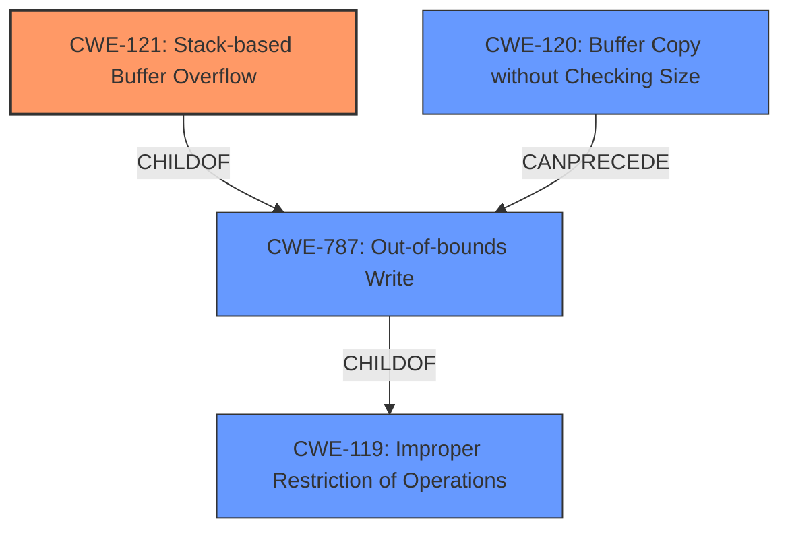

# Final Resolution for CVE-2022-41018

# Summary
| CWE ID | CWE Name | Confidence | CWE Abstraction Level | CWE Vulnerability Mapping Label | CWE-Vulnerability Mapping Notes |
|---|---|---|---|---|---|
| CWE-121 | Stack-based Buffer Overflow | 0.95 | Variant | Allowed | Primary CWE |
| CWE-120 | Buffer Copy without Checking Size of Input ('Classic Buffer Overflow') | 0.75 | Base | Allowed-with-Review | Secondary Candidate |
| CWE-787 | Out-of-bounds Write | 0.50 | Base | Allowed | Secondary Candidate |

## Evidence and Confidence

*   **Confidence Score:** 0.95
*   **Evidence Strength:** HIGH

## Relationship Analysis
The primary CWE, CWE-121 (**Stack-based Buffer Overflow**), is a variant of CWE-119 (**Improper Restriction of Operations within the Bounds of a Memory Buffer**) and CWE-787 (**Out-of-bounds Write**). CWE-120 (**Buffer Copy without Checking Size**) is a related **ROOTCAUSE** that can lead to both stack and heap overflows, but is less specific than CWE-121 in this case. The analysis appropriately selected the more specific CWE-121.

## Vulnerability Chain
The vulnerability chain starts with a **ROOTCAUSE** of insufficient bounds checking during a buffer copy operation (CWE-120). This leads to an out-of-bounds write (CWE-787) on the stack, specifically a **stack-based buffer overflow** (CWE-121). The final impact is arbitrary command execution.

## Summary of Analysis
The initial analysis correctly identified CWE-121 (**Stack-based Buffer Overflow**) as the primary **WEAKNESS**, supported by strong evidence from the vulnerability description, which explicitly mentions "stack-based buffer overflow". The CVE Reference Links Content Summary further confirms that `sprintf` is used without size checks, leading to the overflow. This aligns perfectly with CWE-121's definition. The selection of CWE-121 is at the optimal level of specificity, and the high confidence score (0.95) is warranted. The inclusion of CWE-120 (**Buffer Copy without Checking Size**) as a secondary candidate provides valuable context. Finally, including CWE-787 as a secondary candidate documents that this is fundamentally an out-of-bounds write.