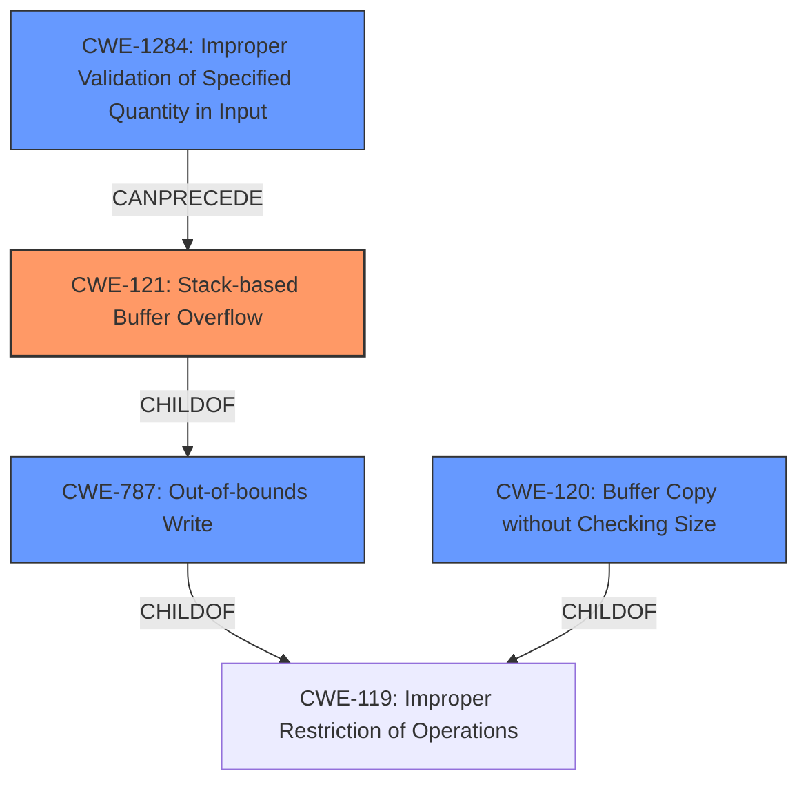

# Final Resolution for CVE-2022-41024

# Summary
| CWE ID | CWE Name | Confidence | CWE Abstraction Level | CWE Vulnerability Mapping Label | CWE-Vulnerability Mapping Notes |
|---|---|---|---|---|---|
| CWE-121 | Stack-based Buffer Overflow | 0.9 | Variant | Allowed | Primary CWE |
| CWE-787 | Out-of-bounds Write | 0.7 | Base | Allowed | Secondary Candidate |
| CWE-1284 | Improper Validation of Specified Quantity in Input | 0.6 | Base | Allowed | Contributing Factor |
| CWE-120 | Buffer Copy without Checking Size of Input ('Classic Buffer Overflow') | 0.5 | Base | Allowed-with-Review | Contributing Factor |

## Evidence and Confidence

*   **Confidence Score:** 0.9
*   **Evidence Strength:** HIGH

## Relationship Analysis
The primary CWE is CWE-121 (**Stack-based Buffer Overflow**), which is a variant of CWE-119 (**Improper Restriction of Operations within the Bounds of a Memory Buffer**) and a child of CWE-787 (**Out-of-bounds Write**). CWE-1284 (**Improper Validation of Specified Quantity in Input**) contributes to the vulnerability by not validating the size of the input before it's copied to the stack buffer. CWE-120 (**Buffer Copy without Checking Size of Input**) is a base class of buffer overflow that describes the core issue of copying without size checks. The relationships demonstrate a clear progression from input validation failure to out-of-bounds write on the stack. The abstraction levels are appropriately chosen to reflect the specificity of the vulnerability.

## Vulnerability Chain
The vulnerability chain starts with **CWE-1284 (Improper Validation of Specified Quantity in Input)**, where the size of the input 'WORD' parameter is not validated. This leads to **CWE-120 (Buffer Copy without Checking Size of Input)** when `sprintf` copies the unvalidated input to a stack buffer without checking its size. This results in **CWE-121 (Stack-based Buffer Overflow)**, a specific type of **CWE-787 (Out-of-bounds Write)**, as data is written beyond the boundaries of the stack-allocated buffer. The ultimate impact is arbitrary command execution.

## Summary of Analysis
The initial analysis correctly identified **CWE-121 (Stack-based Buffer Overflow)** as the primary weakness, based on the explicit mention in the vulnerability description: "Several stack-based buffer overflow vulnerabilities exist...". The criticism suggested adding **CWE-787 (Out-of-bounds Write)** and **CWE-1284 (Improper Validation of Specified Quantity in Input)** as contributing factors, which is a valuable addition. The `sprintf` function's use without size validation leads to the overflow. The final determination includes **CWE-121** as the primary issue, **CWE-787** as a general out-of-bounds write, and **CWE-1284** and **CWE-120** as contributing factors that lead to the overflow. The chosen CWEs are at the optimal level of specificity, with **CWE-121** accurately representing the stack-based nature of the overflow, **CWE-787** representing the more general out-of-bounds write, and **CWE-1284** capturing the lack of input validation.

The vulnerability description states, "This buffer overflow is in the function that manages the no vpn pptp advanced name WORD dns (yes|no) mtu mru mppe (on|off) stateful (on|off) command template." The `WORD` parameter is copied to a stack buffer via `sprintf`, and if this parameter is not validated for size, a stack-based buffer overflow can occur.

The graph relationships influenced the selection by highlighting the hierarchical relationship between **CWE-121** and its parents, **CWE-787** and **CWE-119**. This helped to ensure that the chosen CWEs were at the appropriate level of specificity. The `CANPRECEDE` relationship from **CWE-1284** to **CWE-121** helped to identify the role of input validation in the vulnerability.