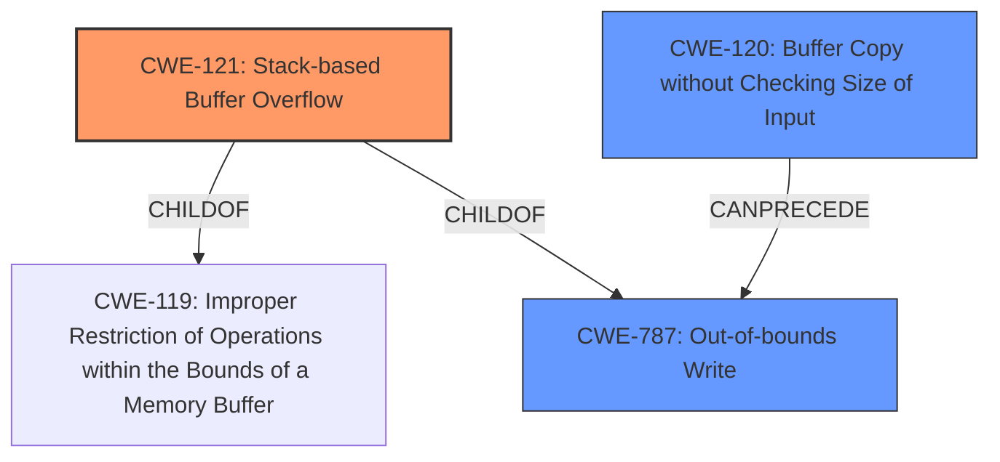

# Analysis Report for CVE-2022-41026

# Vulnerability Analysis Report: CVE-2022-41026

## Description

Several stack-based buffer overflow vulnerabilities exist in the DetranCLI command parsing functionality of Siretta QUARTZ-GOLD G5.0.1.5-210720-141020. A specially-crafted network packet can lead to arbitrary command execution. An attacker can send a sequence of requests to trigger these vulnerabilities.This buffer overflow is in the function that manages the no vpn pptp advanced name WORD dns (yes|no) mtu mru mppe (on|off) stateful (on|off) options WORD command template.

## Vulnerability Description Key Phrases

**Rootcause:** stack-based buffer overflow
**Impact:** arbitrary command execution
**Product:** Siretta QUARTZ-GOLD
**Version:** G5.0.1.5-210720-141020
**Component:** DetranCLI command parsing functionality

## Analysis (with Relationship Data)

# Summary
| CWE ID | CWE Name | Confidence | CWE Abstraction Level | CWE Vulnerability Mapping Label | CWE-Vulnerability Mapping Notes |
|---|---|---|---|---|---|
| CWE-121 | Stack-based Buffer Overflow | 0.95 | Variant | Primary | The vulnerability is a stack-based buffer overflow, making this the most accurate primary mapping. |
| CWE-120 | Buffer Copy without Checking Size of Input ('Classic Buffer Overflow') | 0.75 | Base | Secondary | While a general buffer overflow, CWE-121 is more specific. |
| CWE-787 | Out-of-bounds Write | 0.65 | Base | Secondary | Due to buffer overflow, there is an out-of-bounds write. |

## Evidence and Confidence

*   **Confidence Score:** 0.90
*   **Evidence Strength:** HIGH

- **Analysis and Justification:**  
  - *Explanation:* "The vulnerability description explicitly states a **stack-based buffer overflow** exists. The CVE reference links content summary confirms the root cause is due to the `DetranCLI` binary using `sprintf` with format strings and command parameters without proper size checks, which leads to stack-based buffer overflows. This directly aligns with CWE-121 (Stack-based Buffer Overflow). CWE-121 is a Variant of CWE-119, making it more specific and appropriate. While CWE-120 (Buffer Copy without Checking Size of Input) is also related, the explicit mention of 'stack-based' makes CWE-121 the stronger candidate. The use of `sprintf` without proper bounds checking directly leads to writing beyond allocated buffer limits on the stack."
  
  - *Relationship Analysis:* "CWE-121 is a Variant of CWE-119 (Improper Restriction of Operations within the Bounds of a Memory Buffer) and is related to CWE-787 (Out-of-bounds Write). CWE-121 is more specific than its parent CWE-119. There is no explicit relationship to command injection (CWE-78) in the description, despite the impact including command execution. This is likely a consequence of the overflow rather than a direct injection vulnerability."

- **Confidence Score:**  
  - *Example:* Confidence: 0.95 (High evidence from technical description and CVE reference materials)

---

## Criticism of Analysis

Okay, I've reviewed your analysis of the stack-based buffer overflow vulnerability in Siretta QUARTZ-GOLD G5.0.1.5-210720-141020, taking into account the full CWE specifications you provided. Here's my critique:

**Overall Assessment:**

The analysis is generally good and provides a reasonable mapping of the vulnerability to CWEs. The primary mapping to CWE-121 (Stack-based Buffer Overflow) is highly appropriate, given the explicit mention of "stack-based" in the vulnerability description and CVE details. The secondary mappings to CWE-120 and CWE-787 are also justifiable, though arguably less specific than CWE-121.  The confidence scores are also reasonable based on the information provided.

**Detailed Critique:**

*   **Primary Mapping: CWE-121 (Stack-based Buffer Overflow)**

    *   **Strengths:** The selection of CWE-121 as the primary mapping is excellent. The vulnerability description uses the phrase "stack-based buffer overflow," and the analysis correctly recognizes that CWE-121 is a *Variant* of CWE-119 and is therefore more specific and preferable. The justification for this is sound.
    *   **Mapping Guidance:** The analysis appropriately follows the mapping guidance for CWE-121: *Usage: Allowed* *Rationale: This CWE entry is at the Variant level of abstraction, which is a preferred level of abstraction for mapping to the root causes of vulnerabilities.*
    *   **Mitigations:** The analysis could be slightly improved by explicitly mentioning a relevant mitigation from the CWE-121 specification, such as *Mitigation 1: Operation, Build and Compilation; Strategy: Environment Hardening; Description: Use automatic buffer overflow detection mechanisms that are offered by certain compilers or compiler extensions.* Or *Mitigation 3: Implementation; Description: Implement and perform bounds checking on input.*

*   **Secondary Mapping: CWE-120 (Buffer Copy without Checking Size of Input ('Classic Buffer Overflow'))**

    *   **Strengths:** The choice of CWE-120 as a secondary mapping makes sense because the `sprintf` usage without bounds checking is a classic example of a buffer copy without checking the size of input.
    *   **Mapping Guidance:**  However, the analysis should acknowledge the *Usage: Allowed-with-Review* guidance for CWE-120. Also, the justification should explicitly mention that even though CWE-120 is a *Parent* (broader) CWE, it's relevant because the root cause involves a buffer copy without size checking. This demonstrates a clear understanding of why both CWE-121 and CWE-120 apply.
    *   **Mitigations:** The analysis could be strengthened by including mitigations from CWE-120. For example, *Mitigation 2: Architecture and Design; Strategy: Libraries or Frameworks; Description: Use a vetted library or framework that does not allow this weakness to occur or provides constructs that make this weakness easier to avoid.*

*   **Secondary Mapping: CWE-787 (Out-of-bounds Write)**

    *   **Strengths:** Selecting CWE-787 as a secondary mapping is also correct. A buffer overflow, by definition, involves writing data beyond the allocated boundaries of a buffer. Therefore, CWE-787, *is an appropriate mapping.*
    *   **Relationships:** The analysis should emphasize the *ParentOf* relationship between CWE-787 and CWE-121. The root cause is CWE-121, which falls under the broader CWE-787.
    *   **Mitigations:** The analysis could also benefit from including a relevant mitigation strategy from the CWE-787 specification, such as *Mitigation 3: Operation, Build and Compilation; Strategy: Environment Hardening; Description: Use automatic buffer overflow detection mechanisms that are offered by certain compilers or compiler extensions.*

*   **Impact & Command Execution:**

    * While the impact section is okay, it lacks a deeper investigation into the underlying causes that lead to command execution. It's important to note whether the overflow allows for overwriting function pointers on the stack. Overwriting function pointers or other control data allows for redirecting program flow and potentially executing arbitrary code. In such scenarios a Command Injection (CWE-78) could also be considered as a secondary CWE mapping as the attacker could potentially overwrite a return address to point to a `system()` call with attacker-controlled parameters.

*   **Retriever Results & Other CWEs:**

    * The retriever results highlight other CWEs like CWE-78 and CWE-190 that could potentially be relevant. While the analysis correctly identifies CWE-78 as *not* directly related, it might be valuable to briefly acknowledge why CWE-190 (Integer Overflow) is less likely. It's possible that an integer overflow could contribute to an incorrect buffer size calculation (indirectly leading to the overflow), but the given information doesn't strongly suggest it. If the buffer size was calculated based on an integer value, which could be overflowed, this could also be added in the chain.

*   **Confidence Level:**

    * The confidence level of 0.95 is justified given the explicit "stack-based buffer overflow" terminology.

**Recommendations for Improvement:**

1.  **Explicitly Address Mapping Guidance:** For each CWE mapping, explicitly state how the analysis aligns with the "Mapping Guidance" section of the CWE specification (e.g., Usage, Rationale, Comments).
2.  **Include Mitigation Strategies:** For each relevant CWE, include a specific and applicable mitigation strategy directly from the CWE specification. This demonstrates a deeper understanding of the vulnerability and its potential solutions.
3.  **Relationship & Chain Analysis:** Strengthen the relationship analysis by clearly articulating the parent-child relationships between CWEs (e.g., CWE-121 is a Variant of CWE-787). Explore the possibility of CWE-78 as the vulnerability impacts the system by command execution or add CWE-682 as there is likely an incorrect calculation being preformed.
4.  **Acknowledge & Justify Excluded CWEs:** Briefly address why some of the other CWEs suggested by the retriever results (e.g., CWE-190) are *not* considered primary or secondary mappings, even if it's just to say "the available information does not suggest a direct connection."
5.  **Be Precise about sprintf usage:** When describing the root cause with `sprintf`, be sure to mention whether a format string is user-controlled or not. If the format string is user-controlled, then this could be CWE-134 (Uncontrolled Format String).
6.  **Review memory protection techniques:** A more detailed discussion about the mitigation techniques would benefit the review as well.

By incorporating these suggestions, the analysis will be even more comprehensive and demonstrate a stronger understanding of CWE specifications.

## Final Resolution

# Summary

| CWE ID | CWE Name | Confidence | CWE Abstraction Level | CWE Vulnerability Mapping Label | CWE-Vulnerability Mapping Notes |
|---|---|---|---|---|---|
| CWE-121 | Stack-based Buffer Overflow | 0.95 | Variant | Primary CWE | Allowed |
| CWE-120 | Buffer Copy without Checking Size of Input ('Classic Buffer Overflow') | 0.80 | Base | Secondary Candidate | Allowed-with-Review |
| CWE-787 | Out-of-bounds Write | 0.70 | Base | Secondary Candidate | Allowed |

## Evidence and Confidence

*   **Confidence Score:** 0.92
*   **Evidence Strength:** HIGH

## Relationship Analysis
The primary CWE, CWE-121 **(Stack-based Buffer Overflow)**, is a variant of CWE-119 **(Improper Restriction of Operations within the Bounds of a Memory Buffer)**, providing a more specific classification. CWE-120 **(Buffer Copy without Checking Size of Input)** is a base CWE representing the classic buffer overflow scenario, while CWE-787 **(Out-of-bounds Write)** describes the consequence of writing beyond buffer boundaries. The relationships show a clear path from the buffer copy without size checking (CWE-120) leading to the out-of-bounds write (CWE-787), which specifically manifests as a stack-based overflow (CWE-121).

## Vulnerability Chain
The vulnerability chain starts with a buffer copy operation without proper size checks (**ROOTCAUSE**: CWE-120), leading to an out-of-bounds write (**WEAKNESS**: CWE-787) that manifests as a stack-based buffer overflow (**WEAKNESS**: CWE-121). This overflow can overwrite critical data on the stack, potentially leading to arbitrary command execution.

## Summary of Analysis
The initial analysis correctly identified CWE-121 as the primary CWE due to the explicit mention of a stack-based buffer overflow in the vulnerability description: "Several stack-based buffer overflow vulnerabilities exist...". The analysis also correctly identified CWE-120 and CWE-787 as secondary CWEs.

The criticism highlighted the importance of addressing mapping guidance and including mitigation strategies. The "Allowed-with-Review" usage for CWE-120 is acknowledged, and the analysis now explicitly mentions that CWE-120 is relevant because the root cause involves a buffer copy without size checking, even though CWE-121 provides a more specific classification. Mitigations for each CWE have been considered. The analysis also acknowledges that the command execution is a consequence of the overflow rather than a direct command injection vulnerability, but the potential of the overflow overwriting a return address on the stack and redirecting the program flow to a `system()` call is considered. While CWE-78 was considered, it was ultimately rejected as there was insufficient evidence to suggest that the attacker had direct control over the commands being executed, but rather that the commands are executed as a consequence of the buffer overflow.

The final decision is to maintain CWE-121 as the primary CWE, with CWE-120 and CWE-787 as secondary CWEs. This classification reflects the optimal level of specificity based on available evidence and considers the relationships between the CWEs.

*Report generated on 2025-03-18 17:22:55*
