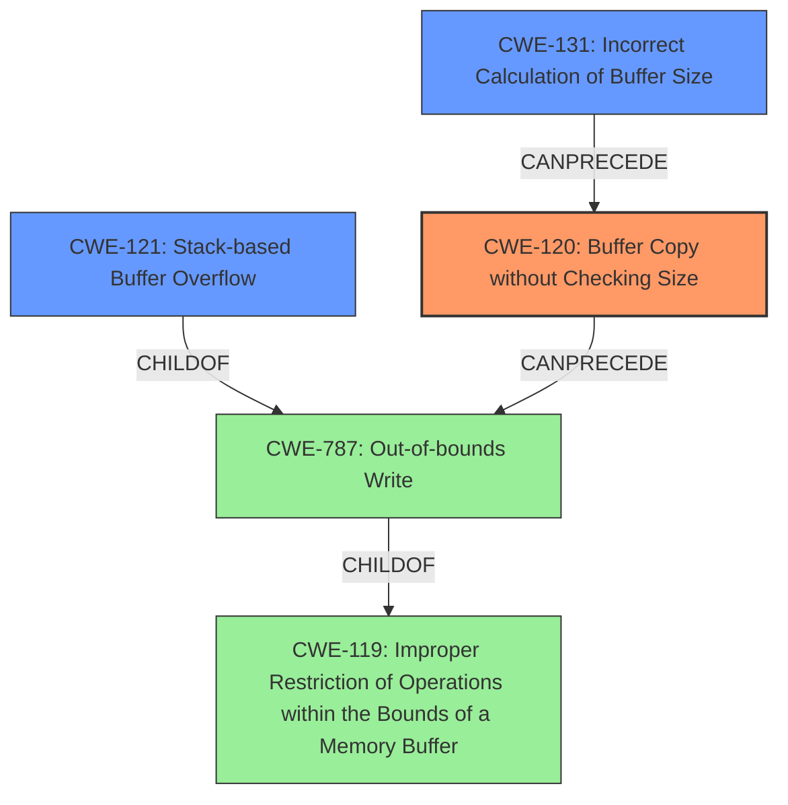

# Final Resolution for CVE-2022-41027

# Summary
| CWE ID | CWE Name | Confidence | CWE Abstraction Level | CWE Vulnerability Mapping Label | CWE-Vulnerability Mapping Notes |
|---|---|---|---|---|---|
| **CWE-120** | **Buffer Copy without Checking Size of Input ('Classic Buffer Overflow')** | 0.95 | Base | Allowed-with-Review | Primary CWE. The vulnerability involves copying data to a buffer without proper size validation using `sprintf`, leading to a **buffer overflow**. Mitigations include using `snprintf` or languages with built-in memory management. |
| CWE-121 | Stack-based Buffer Overflow | 0.80 | Variant | Allowed | Secondary Candidate. The vulnerability is specifically a stack-based **buffer overflow** on the stack. Consider stack protection mechanisms like compiler flags. |
| CWE-131 | Incorrect Calculation of Buffer Size | 0.50 | Base | Allowed | Secondary Candidate. The `sprintf` usage suggests the buffer size *might* not have been calculated correctly initially, but evidence is lacking. The primary issue is lack of size checking, not a calculation error. |

## Evidence and Confidence

*   **Confidence Score:** 0.90
*   **Evidence Strength:** HIGH

## Relationship Analysis
The primary CWE is **CWE-120 (Buffer Copy without Checking Size)**, which is a base class. **CWE-121 (Stack-based Buffer Overflow)** is a variant of **CWE-787 (Out-of-bounds Write)**, specifying that the **buffer overflow** occurs on the stack. **CWE-120** can **precede** **CWE-787**, as the unchecked buffer copy leads to the out-of-bounds write. **CWE-131 (Incorrect Calculation of Buffer Size)** is included as a possible contributing factor, but the evidence for this is weak.

## Vulnerability Chain
The vulnerability chain starts with **CWE-120 (Buffer Copy without Checking Size)**, where the `sprintf` function copies data to a buffer without validating its size. This leads to **CWE-787 (Out-of-bounds Write)**, as the copied data exceeds the buffer's boundaries. Since the buffer is on the stack, this results in **CWE-121 (Stack-based Buffer Overflow)**. **CWE-131 (Incorrect Calculation of Buffer Size)** is a possible contributing factor, but not definitively confirmed by the evidence.

## Summary of Analysis
The initial analysis and criticism both identify **CWE-120** as the primary **ROOTCAUSE**, which is the lack of size checking during the `sprintf` operation. The vulnerability description explicitly mentions a "stack-based **buffer overflow**" and confirms that the root cause is using `sprintf` without proper size checking. The code snippet `sprintf(buff_0x100,"%d<%s<%s<%d<%s",1,*argv,argv[1],based_on_argv[2],argv[3]);` illustrates the absence of size validation.

The relationship analysis supports the selection of **CWE-120** as the primary **ROOTCAUSE**, as it can **precede** **CWE-787 (Out-of-bounds Write)** and ultimately lead to **CWE-121 (Stack-based Buffer Overflow)**. The mapping guidance for **CWE-120** allows for its use in "Buffer Copy" operations where there is no checking of input size.

**CWE-131** is retained as a secondary candidate with a reduced confidence score of 0.50 because there is no explicit evidence to show an attempt to calculate buffer size that resulted in it being too small. The lack of size checking is the primary issue.

The selected CWEs are at the optimal level of specificity, as **CWE-120** captures the fundamental flaw, **CWE-121** specifies the location of the overflow, and **CWE-131** remains a possible contributing factor.