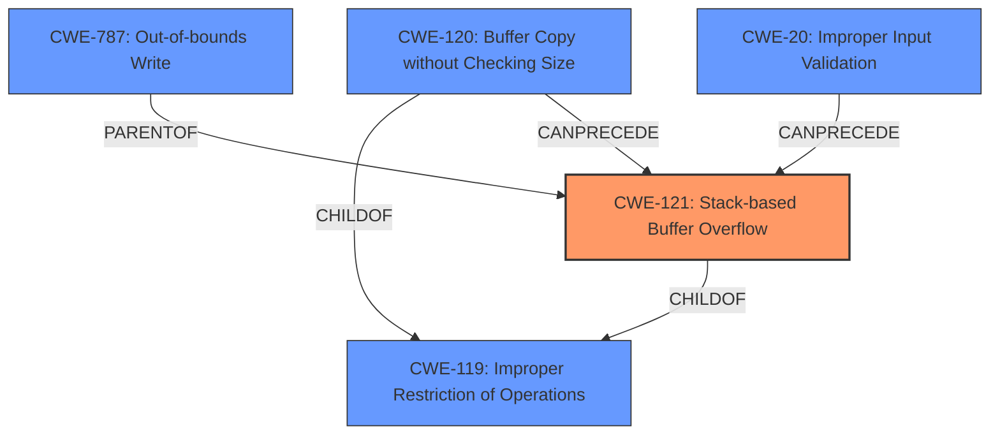

# Analysis Report for CVE-2022-41028

# Vulnerability Analysis Report: CVE-2022-41028

## Description

Several stack-based buffer overflow vulnerabilities exist in the DetranCLI command parsing functionality of Siretta QUARTZ-GOLD G5.0.1.5-210720-141020. A specially-crafted network packet can lead to arbitrary command execution. An attacker can send a sequence of requests to trigger these vulnerabilities.This buffer overflow is in the function that manages the no vpn schedule name1 WORD name2 WORD policy (failover|backup) description (WORD|null) command template.

## Vulnerability Description Key Phrases

**Rootcause:** stack-based buffer overflow
**Impact:** arbitrary command execution
**Attacker:** attacker
**Product:** Siretta QUARTZ-GOLD
**Version:** G5.0.1.5-210720-141020
**Component:** DetranCLI command parsing functionality

## Analysis (with Relationship Data)

# Summary
| CWE ID | CWE Name | Confidence | CWE Abstraction Level | CWE Vulnerability Mapping Label | CWE-Vulnerability Mapping Notes |
|---|---|---|---|---|---|
| CWE-121 | Stack-based Buffer Overflow | 0.95 | Variant | Allowed | Primary CWE |
| CWE-120 | Buffer Copy without Checking Size of Input ('Classic Buffer Overflow') | 0.75 | Base | Allowed-with-Review | Secondary Candidate |
| CWE-787 | Out-of-bounds Write | 0.65 | Base | Allowed | Secondary Candidate |

## Evidence and Confidence

*   **Confidence Score:** 0.90
*   **Evidence Strength:** HIGH

- **Analysis and Justification:**  
  - *Explanation:* The vulnerability description explicitly states a **stack-based buffer overflow** exists in the DetranCLI command parsing functionality. The CVE Reference Links Content Summary further confirms that the root cause is the `DetranCLI` binary using `sprintf` to format command parameters into a stack buffer without checking the size of the input parameters, leading to a stack-based buffer overflow. This aligns directly with the definition of CWE-121 (Stack-based Buffer Overflow), which is a variant of buffer overflow where the buffer being overwritten is allocated on the stack.
  - *Relationship Analysis:* CWE-121 is a variant of CWE-119 (Improper Restriction of Operations within the Bounds of a Memory Buffer) and is related to CWE-120 (Buffer Copy without Checking Size of Input). However, CWE-121 is more specific because it identifies the location of the buffer (stack), making it a more appropriate choice given the available information. CWE-787 (Out-of-bounds Write) is a parent of CWE-121, but CWE-121 is more specific and therefore preferred.

- **Confidence Score:**  
  - Confidence: 0.95 (High confidence due to clear evidence of a stack-based buffer overflow from both the vulnerability description and CVE reference materials)

---
- **Analysis and Justification:**  
  - *Explanation:* While CWE-121 is the most specific and accurate, CWE-120 (Buffer Copy without Checking Size of Input ('Classic Buffer Overflow')) is also relevant. The vulnerability involves copying data into a buffer without proper size checks, as the `sprintf` function is used without validating input lengths. However, since the stack location is confirmed, CWE-121 is the primary choice. CWE-120 is a base level CWE and broader than CWE-121. The "Allowed-with-Review" usage designation for CWE-120 is due to potential misuse when more specific information is available, which is the case here.
  - *Relationship Analysis:* CWE-120 is a parent of CWE-121, but the evidence supports the more specific CWE-121.

- **Confidence Score:**  
  - Confidence: 0.75 (Moderate confidence; relevant but less specific than CWE-121)

---
- **Analysis and Justification:**  
  - *Explanation:* CWE-787 (Out-of-bounds Write) describes the general condition of writing data outside the intended buffer boundaries. While this is a consequence of the vulnerability, it doesn't capture the stack-specific nature as precisely as CWE-121. However, it is still a relevant secondary candidate as it describes the fundamental issue of writing beyond buffer boundaries.
  - *Relationship Analysis:* CWE-787 is a parent of CWE-121, indicating that a stack-based buffer overflow is a specific type of out-of-bounds write.

- **Confidence Score:**  
  - Confidence: 0.65 (Moderate confidence; describes the general issue but lacks the specificity of CWE-121)

## Criticism of Analysis

Okay, I've reviewed the provided analysis against the full CWE specifications. Here's my critique:

**Overall Assessment:**

The analysis is well-reasoned and provides a strong argument for CWE-121 (Stack-based Buffer Overflow) as the primary CWE.  The use of secondary candidates (CWE-120, CWE-787) acknowledges the broader context of the vulnerability and the potential for a less specific, but still relevant, categorization.  The confidence scores are appropriate, reflecting the strength of the evidence.

**Detailed Critique:**

*   **CWE-121 (Stack-based Buffer Overflow) - Primary CWE:**

    *   **Justification Strength:** Excellent. The evidence directly points to a stack-based buffer overflow scenario.  The use of `sprintf` without bounds checking into a stack buffer is a classic example.
    *   **Abstraction Level:** Variant - Correct. This is the preferred abstraction level.
    *   **Mapping Guidance:**  The analysis correctly notes that the "Allowed" usage designation for CWE-121 is appropriate here.
    *   **Potential Mitigations:** The analysis doesn't explicitly mention potential mitigations, but it's implied by highlighting that `sprintf` is the cause of the issue and no bounds checking done. In this instance, some mitigation examples would be to use `snprintf` instead to limit the amount of written data.

*   **CWE-120 (Buffer Copy without Checking Size of Input ('Classic Buffer Overflow')) - Secondary Candidate:**

    *   **Justification Strength:** Strong. The analysis acknowledges that the vulnerability involves a buffer copy without size checking, which is directly related to CWE-120. However, the analysis correctly prioritizes the *stack* location which makes CWE-121 more applicable.
    *   **Abstraction Level:** Base - Correct. This CWE is of a more general classification.
    *   **Mapping Guidance:**  The analysis mentions the "Allowed-with-Review" usage designation for CWE-120 correctly. It is important to be more precise if more information is known.
    *   **Potential Mitigations:** In this instance, using a memory safe language or library would be a mitigation example.

*   **CWE-787 (Out-of-bounds Write) - Secondary Candidate:**

    *   **Justification Strength:** Good. This CWE captures the fundamental issue of writing beyond the buffer's intended boundaries. However, it lacks the specific context of the stack location.
    *   **Abstraction Level:** Base - Correct.
    *   **Mapping Guidance:** Allowed usage designation is appropriate.
    *   **Potential Mitigations:** Address Space Layout Randomization and Data Execution Prevention are some potential mitigations to this type of attack.

**Suggestions for Improvement:**

*   **Explicitly Mention Mitigations:** While the analysis demonstrates a solid understanding of the vulnerability, it would be beneficial to explicitly mention potential mitigations for *each* of the CWEs identified. Referring to the "Potential Mitigations" sections of the CWE specifications would strengthen the analysis and make it more actionable. Some examples are provided above.
*   **Consider Chain/Composite Relationships:** It could be argued that there is a chain of vulnerabilities leading to the Stack-Based Buffer Overflow. CWE-20 (Improper Input Validation) may be present here, as the root cause of the vulnerability is a lack of input validation.

**Additional Considerations:**

*   **CWE-131 (Incorrect Calculation of Buffer Size):** Because `sprintf` is being used and no bounds are being calculated to limit the number of bytes that will be written, this could also be included as a potential CWE as well. However, `sprintf` in itself does not calculate the number of bytes to be written, only if a specified size is given.

**Revised Table with Explicit Mitigations:**

| CWE ID | CWE Name | Confidence | CWE Abstraction Level | CWE Vulnerability Mapping Label | CWE-Vulnerability Mapping Notes | Example Potential Mitigations |
|---|---|---|---|---|---|---|
| CWE-121 | Stack-based Buffer Overflow | 0.95 | Variant | Allowed | Primary CWE | Use `snprintf` instead of `sprintf` or Address Space Layout Randomization. |
| CWE-120 | Buffer Copy without Checking Size of Input ('Classic Buffer Overflow') | 0.75 | Base | Allowed-with-Review | Secondary Candidate | Use memory-safe languages or libraries. |
| CWE-787 | Out-of-bounds Write | 0.65 | Base | Allowed | Secondary Candidate | Data Execution Prevention. |

By incorporating these suggestions, the analysis becomes even more comprehensive and useful for vulnerability remediation and prevention.

## Final Resolution

# Summary
| CWE ID | CWE Name | Confidence | CWE Abstraction Level | CWE Vulnerability Mapping Label | CWE-Vulnerability Mapping Notes |
|---|---|---|---|---|---|
| CWE-121 | Stack-based Buffer Overflow | 0.95 | Variant | Allowed | Primary CWE |
| CWE-120 | Buffer Copy without Checking Size of Input ('Classic Buffer Overflow') | 0.75 | Base | Allowed-with-Review | Secondary Candidate |
| CWE-787 | Out-of-bounds Write | 0.65 | Base | Allowed | Secondary Candidate |
| CWE-20 | Improper Input Validation | 0.50 | Class | Discouraged | Secondary Candidate |

## Evidence and Confidence

*   **Confidence Score:** 0.92
*   **Evidence Strength:** HIGH

## Relationship Analysis
The primary CWE is CWE-121 (**Stack-based Buffer Overflow**), which is a variant of CWE-119 (**Improper Restriction of Operations within the Bounds of a Memory Buffer**). CWE-120 (**Buffer Copy without Checking Size**) can lead to CWE-121 if the buffer is on the stack. CWE-787 (**Out-of-bounds Write**) is a general term that encompasses CWE-121. CWE-20 (**Improper Input Validation**) can precede buffer overflows. The abstraction levels influenced the selection by prioritizing the most specific CWE (Variant) when the evidence supports it.

## Vulnerability Chain
The vulnerability chain starts with a lack of input validation (potentially CWE-20), leading to a buffer copy operation without checking the size of the input (CWE-120). Because the buffer is allocated on the stack, this results in a stack-based buffer overflow (CWE-121), which is a specific type of out-of-bounds write (CWE-787). The final impact is arbitrary command execution.

## Summary of Analysis
The initial analysis and criticism both correctly identify CWE-121 as the primary weakness. The evidence from the vulnerability description, "Several stack-based buffer overflow vulnerabilities exist... A specially-crafted network packet can lead to arbitrary command execution," directly supports this classification. The use of `sprintf` without bounds checking, as mentioned in the CVE reference, reinforces this.

The graph relationships confirm that CWE-121 is the most specific and appropriate choice, being a variant of the more general CWE-119 and a specific case of CWE-787. CWE-120 is a relevant secondary weakness as it describes the buffer copy without size checking that leads to the overflow.

I'm adding CWE-20 (**Improper Input Validation**) as a secondary candidate with lower confidence. While not explicitly stated, the **stack-based buffer overflow** caused by using `sprintf` without input validation strongly suggests that **improper input validation** is a contributing factor. This is because the vulnerability description mentions that "a specially-crafted network packet can lead to arbitrary command execution", and it can be assumed the network packet contains the improperly validated input. CWE-20 is a Class level CWE and is discouraged, but it is still applicable.

The selected CWEs are at the optimal level of specificity because they accurately reflect the root cause and contributing factors to the vulnerability, based on the available evidence and relationship analysis.

*Report generated on 2025-03-18 17:25:03*
