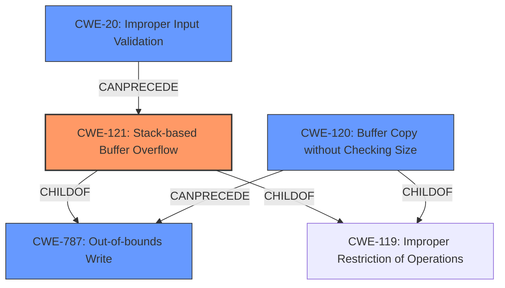

# Final Resolution for CVE-2022-41029

# Summary
| CWE ID | CWE Name | Confidence | CWE Abstraction Level | CWE Vulnerability Mapping Label | CWE-Vulnerability Mapping Notes |
|---|---|---|---|---|---|
| CWE-121 | Stack-based Buffer Overflow | 0.95 | Variant | Allowed | Primary CWE |
| CWE-20 | Improper Input Validation | 0.75 | Class | Allowed | Secondary Candidate |
| CWE-120 | Buffer Copy without Checking Size of Input ('Classic Buffer Overflow') | 0.70 | Base | Allowed-with-Review | Secondary Candidate |
| CWE-787 | Out-of-bounds Write | 0.60 | Base | Allowed | Secondary Candidate |

## Evidence and Confidence

*   **Confidence Score:** 0.90
*   **Evidence Strength:** HIGH

## Relationship Analysis
The decision was influenced by several CWE relationships. CWE-121 (Stack-based Buffer Overflow) is a variant of CWE-119 (Improper Restriction of Operations within the Bounds of a Memory Buffer) and a child of CWE-787 (Out-of-bounds Write), indicating that it is a more specific case of a general out-of-bounds write. CWE-20 (Improper Input Validation) can precede buffer overflows because a lack of input validation can lead to conditions where overflows are possible. The abstraction levels played a role in prioritizing CWE-121 (Variant) over CWE-787 (Base) because the vulnerability description clearly indicates a stack-based overflow.

## Vulnerability Chain
The vulnerability chain starts with **CWE-20 (Improper Input Validation)**, where the size of the user-provided input `argv[1]` is not validated. This leads to **CWE-121 (Stack-based Buffer Overflow)** because `sprintf` is used to copy this unvalidated input into a fixed-size buffer on the stack, resulting in **CWE-787 (Out-of-bounds Write)**. The consequence is arbitrary command execution.

## Summary of Analysis
The initial analysis correctly identified **CWE-121 (Stack-based Buffer Overflow)** as the primary **WEAKNESS**. The criticism highlighted the importance of considering **CWE-20 (Improper Input Validation)** and provided a more nuanced explanation of why **CWE-121 (Stack-based Buffer Overflow)** is more appropriate than **CWE-120 (Buffer Copy without Checking Size of Input)** and **CWE-787 (Out-of-bounds Write)**.

The analysis is based on the provided evidence from the vulnerability description, which mentions a "stack-based buffer overflow" and the use of `sprintf` with user-provided input without size checks. This directly supports the selection of **CWE-121 (Stack-based Buffer Overflow)**.

The graph relationships influenced the final selection by confirming that **CWE-121 (Stack-based Buffer Overflow)** is a more specific variant of **CWE-787 (Out-of-bounds Write)** and that **CWE-20 (Improper Input Validation)** can precede **CWE-121 (Stack-based Buffer Overflow)**.

The selected CWEs are at the optimal level of specificity because **CWE-121 (Stack-based Buffer Overflow)** accurately describes the type and location of the overflow, while **CWE-20 (Improper Input Validation)** explains a contributing factor. **CWE-120 (Buffer Copy without Checking Size of Input)** and **CWE-787 (Out-of-bounds Write)** are less specific and therefore less descriptive of the vulnerability.