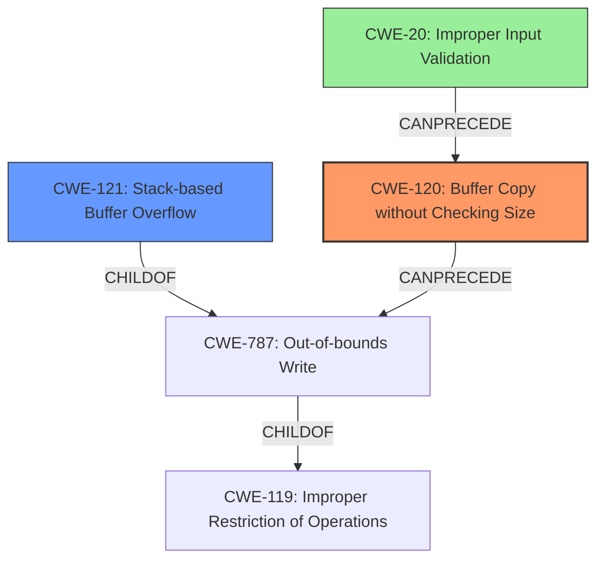

# Final Resolution for CVE-2022-41030

# Summary
| CWE ID | CWE Name | Confidence | CWE Abstraction Level | CWE Vulnerability Mapping Label | CWE-Vulnerability Mapping Notes |
|---|---|---|---|---|---|
| CWE-120 | Buffer Copy without Checking Size of Input ('Classic Buffer Overflow') | 0.9 | Base | Allowed-with-Review | Primary CWE. The vulnerability involves copying data to a buffer without checking the size of the input, leading to a buffer overflow. |
| CWE-121 | Stack-based Buffer Overflow | 0.7 | Variant | Allowed | Secondary candidate. The vulnerability specifically mentions a stack-based buffer overflow. |
| CWE-20 | Improper Input Validation | 0.3 | Class | Allowed | Contributing factor. The root cause includes the lack of validating the size of the input before it is copied to a buffer. |

## Evidence and Confidence

*   **Confidence Score:** 0.9
*   **Evidence Strength:** HIGH

## Relationship Analysis
The primary relationship is that CWE-121 (Stack-based Buffer Overflow) is a variant of CWE-787 (Out-of-bounds Write), which in turn is a child of CWE-119 (Improper Restriction of Operations within the Bounds of a Memory Buffer). CWE-120 (Buffer Copy without Checking Size of Input) can precede CWE-787. CWE-20 (Improper Input Validation) can also precede CWE-120, representing a broader class of input handling issues that can lead to buffer overflows. The abstraction levels influenced the selection by prioritizing the more specific Base CWE-120 as the primary cause, with the Variant CWE-121 providing context on where the overflow occurs.

## Vulnerability Chain
The vulnerability chain starts with **CWE-20 (Improper Input Validation)**, where the size of the input is not validated. This leads to **CWE-120 (Buffer Copy without Checking Size of Input)**, where the unchecked input is copied to a buffer. The consequence of this unchecked copy is **CWE-121 (Stack-based Buffer Overflow)**, as the buffer is located on the stack and the copied data exceeds the buffer's boundaries. The final impact is arbitrary command execution due to the overflow.

## Summary of Analysis
The initial analysis and criticism correctly identified CWE-120 as the primary weakness due to the use of `sprintf` without proper size checks, as stated in the CVE summary. The criticism's suggestion to include CWE-20 is valid, as the lack of input validation is a contributing factor.

The graph relationships confirm that CWE-120 is a more direct cause than CWE-119, as CWE-120 specifically addresses the buffer copy operation without size checking. CWE-121 is a variant describing the location of the overflow. Adding CWE-20 provides a more complete picture of the vulnerability chain, starting from the initial lack of input validation.

The selected CWEs are at the optimal level of specificity. CWE-120 is a Base CWE that directly addresses the buffer copy issue. CWE-121 is a Variant that specifies the location of the overflow. CWE-20 is a Class CWE that highlights the lack of input validation as a contributing factor.

The evidence from the vulnerability description ("**stack-based buffer overflow**") and the CVE summary (use of `sprintf` without proper size checks) supports this classification. The relationship analysis and mapping guidance further strengthen the decision.