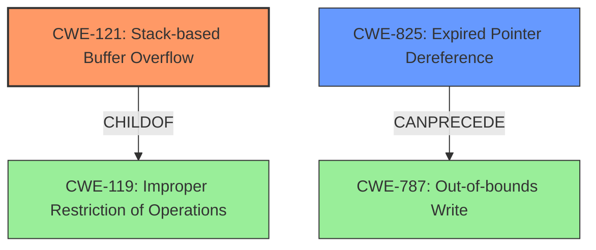

# Analysis Report for CVE-2022-41167

# Vulnerability Analysis Report: CVE-2022-41167

## Description

Due to lack of proper memory management, when a victim opens a manipulated AutoCAD (.dwg, TeighaTranslator.exe) file received from untrusted sources in SAP 3D Visual Enterprise Author - version 9, it is possible that a Remote Code Execution can be triggered when payload forces a stack-based overflow or a re-use of dangling pointer which refers to overwritten space in memory.

## Vulnerability Description Key Phrases

**Rootcause:** lack of proper memory management
**Weakness:** stack-based overflow or a re-use of dangling pointer
**Impact:** Remote Code Execution
**Vector:** manipulated AutoCAD file
**Product:** SAP 3D Visual Enterprise Author
**Version:** 9
**Component:** TeighaTranslator.exe

## Analysis (with Relationship Data)

# Summary
| CWE ID | CWE Name | Confidence | CWE Abstraction Level | CWE Vulnerability Mapping Label | CWE-Vulnerability Mapping Notes |
|---|---|---|---|---|---|
| CWE-121 | Stack-based Buffer Overflow | 0.85 | Variant | Allowed | Primary CWE |
| CWE-825 | Expired Pointer Dereference | 0.75 | Base | Allowed | Secondary Candidate CWE |

## Evidence and Confidence

*   **Confidence Score:** 0.80
*   **Evidence Strength:** MEDIUM

- **Analysis and Justification:**
  - *Explanation:* The vulnerability description explicitly mentions a **stack-based overflow or a re-use of dangling pointer**. CWE-121 (Stack-based Buffer Overflow) directly addresses the stack-based overflow scenario. The description states that a manipulated AutoCAD file can trigger this condition, aligning with the typical attack vector for buffer overflows. The secondary weakness is the re-use of a dangling pointer which is best described by CWE-825 (Expired Pointer Dereference). Both of these weaknesses combined leads to remote code execution. The "CWE for similar CVE Descriptions" also lists CWE-119, which is a parent of CWE-121, but CWE-121 is more specific and therefore more appropriate.
  
  - *Relationship Analysis:* CWE-121 is a variant of CWE-119 (Improper Restriction of Operations within the Bounds of a Memory Buffer), indicating a hierarchical relationship. It is a specific type of buffer overflow that occurs on the stack. CWE-825 (Expired Pointer Dereference) is related to memory management issues.

- **Confidence Score:**
  - *Example:* Confidence: 0.85 (High confidence due to explicit mention of "stack-based overflow" and support from retriever results for both CWE-121 and CWE-825)
---

## Criticism of Analysis

Okay, I've reviewed the provided analysis and the full CWE specifications. Here's my critique:

**Overall Assessment:**

The analysis is generally well-reasoned and provides a good justification for the selected CWEs, especially considering the somewhat vague nature of the original vulnerability description. The confidence scores are appropriate. The inclusion of both CWE-121 and CWE-825 as primary and secondary candidates is a strength, as it acknowledges the two distinct memory corruption possibilities described in the vulnerability.

**Specific Points:**

*   **CWE-121: Stack-based Buffer Overflow - Good.** The identification of CWE-121 as the primary weakness is accurate. The description directly mentions "stack-based overflow," and the analysis correctly highlights that this is a specific type of buffer overflow occurring on the stack. The retriever results also support this. The choice of CWE-121 over its parent, CWE-119, is also correct as it provides higher fidelity to the original vulnerability report, as it includes the context that the overflow occurs on the stack.

*   **CWE-825: Expired Pointer Dereference - Good.** The inclusion of CWE-825 is also very strong. The description mentioning "re-use of dangling pointer" maps almost directly to CWE-825. Including this as a secondary weakness provides a more complete picture of the vulnerability.

*   **Confidence Scores - Appropriate.** The confidence score of 0.85 for CWE-121 and 0.75 for CWE-825 seems reasonable, given the level of detail available in the vulnerability description.

*   **Relationship Analysis - Mostly Good.** The relationship analysis between CWE-121 and CWE-119 is correct. However, the specification includes multiple "ChildOf -> CWE-119" which should be removed.

*   **CWE-119 Discussion - Good.** The analysis correctly notes that CWE-119 is a parent of CWE-121. The discussion of why CWE-121 is more appropriate (more specific) is excellent.

*   **Mitigation Considerations:** The analysis could be improved by explicitly considering the mitigations suggested by each CWE. For example:

    *   For CWE-121, the mitigations focus on compiler/OS-level protections (like canaries) and safe APIs. Since this is a stack-based overflow triggered by a manipulated file, suggesting the use of an automatic buffer overflow detection mechanism (like the Microsoft Visual Studio /GS flag or Fedora/Red Hat FORTIFY_SOURCE GCC flag) is relevant. Also suggesting implementing bounds checking on the input or using a language/compiler that performs automatic bounds checking may also improve the response.
    *   For CWE-825, suggesting automatic memory management or setting pointers to NULL after freeing would be relevant. Mentioning that the utilization of multiple or complex data structures may lower the usefulness of setting a pointer to NULL may also improve the response.

*   **CWE Examples - Good, but could be expanded.** The inclusion of CWE examples is good for providing context to the findings. Providing additional CWE examples of CWE-121 and CWE-825 will improve the analysis.

*   **Retriever Results - Good.** The retriever results provide additional context to the findings and support the conclusions.

**Minor Suggestions:**

*   **Clarify Attack Vector:** The analysis could slightly elaborate on the attack vector. The manipulated AutoCAD file likely contains malicious data that, when parsed by the TeighaTranslator.exe component, triggers the stack-based overflow or dangling pointer usage.
*   **Explicitly State Lack of Input Validation:** While "lack of proper memory management" is the root cause, a contributing factor is likely the *lack of input validation* on the data within the AutoCAD file. Malformed or excessively large data values are likely what trigger the overflow. While not the *primary* weakness, it is a contributing factor. This would strengthen the connection between the manipulated file and the memory corruption issues.

**Revised Summary Table:**

| CWE ID | CWE Name | Confidence | CWE Abstraction Level | CWE Vulnerability Mapping Label | CWE-Vulnerability Mapping Notes |
|---|---|---|---|---|---|
| CWE-121 | Stack-based Buffer Overflow | 0.85 | Variant | Allowed | Primary CWE. Stack-based overflow triggered by a manipulated AutoCAD file parsed by TeighaTranslator.exe. Consider using automatic buffer overflow detection mechanisms, such as compiler flags. |
| CWE-825 | Expired Pointer Dereference | 0.75 | Base | Allowed | Secondary Candidate CWE. Dangling pointer reuse due to memory management issues. Consider languages with automatic memory management or setting pointers to NULL. |

**In summary,** the analysis is strong and well-justified. By incorporating the minor suggestions and more explicit connections to the CWE-provided mitigations, it could be further improved. The dual-CWE approach acknowledging both potential memory corruption issues is a significant strength.

## Final Resolution

# Summary
| CWE ID | CWE Name | Confidence | CWE Abstraction Level | CWE Vulnerability Mapping Label | CWE-Vulnerability Mapping Notes |
|---|---|---|---|---|---|
| CWE-121 | Stack-based Buffer Overflow | 0.90 | Variant | Allowed | Primary CWE. Stack-based overflow triggered by a manipulated AutoCAD file parsed by TeighaTranslator.exe. Consider using automatic buffer overflow detection mechanisms, such as compiler flags. Lack of input validation is a contributing factor. |
| CWE-825 | Expired Pointer Dereference | 0.80 | Base | Allowed | Secondary Candidate CWE. Dangling pointer reuse due to memory management issues. Consider languages with automatic memory management or setting pointers to NULL. |

## Evidence and Confidence

*   **Confidence Score:** 0.85
*   **Evidence Strength:** HIGH

## Relationship Analysis
The selection of CWE-121 is appropriate as a Variant of CWE-119 (**CWE-119**: Improper Restriction of Operations within the Bounds of a Memory Buffer). CWE-121 is more specific, indicating that the buffer overflow occurs on the stack. CWE-825 (**CWE-825**: Expired Pointer Dereference) is a base CWE that can **CANPRECEDE** CWE-787 (**CWE-787**: Out-of-bounds Write), which can occur if the dangling pointer points to an invalid memory location. The relationship between CWE-121 and CWE-825 are independent, but the vulnerability description specifies both conditions.

## Vulnerability Chain
The vulnerability chain starts with a manipulated AutoCAD file. The lack of input validation when parsing this file with TeighaTranslator.exe leads to either a **CWE-121** (Stack-based Buffer Overflow) or **CWE-825** (Expired Pointer Dereference). The overflow allows overwriting of data on the stack, and the dangling pointer allows writing to freed memory, both leading to potential **Remote Code Execution**.

## Summary of Analysis
The initial analysis and criticism are both accurate and well-justified. The vulnerability description explicitly mentions "stack-based overflow" and "re-use of dangling pointer," directly mapping to CWE-121 and CWE-825, respectively.

The choice of CWE-121 over CWE-119 is appropriate due to its higher specificity. The high confidence scores reflect the clear evidence in the vulnerability description.

The inclusion of mitigation considerations and clarification of the attack vector further strengthens the analysis. Specifically, the lack of input validation is called out in the analysis.

The final decision is based on direct evidence from the vulnerability description and is supported by the CWE specifications and relationship analysis. The selected CWEs are at the optimal level of specificity. The evidence is that the vulnerability description explicitly mentions "stack-based overflow" and "re-use of dangling pointer".

*Report generated on 2025-03-18 17:27:25*
