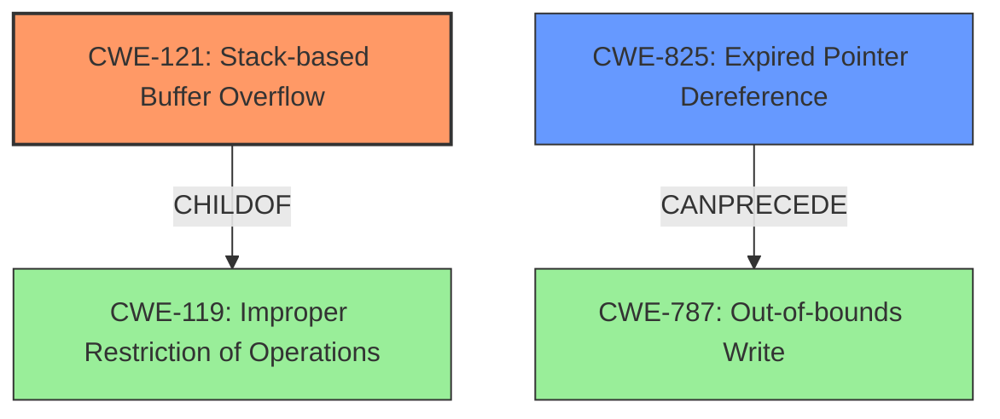

# Final Resolution for CVE-2022-41167

# Summary
| CWE ID | CWE Name | Confidence | CWE Abstraction Level | CWE Vulnerability Mapping Label | CWE-Vulnerability Mapping Notes |
|---|---|---|---|---|---|
| CWE-121 | Stack-based Buffer Overflow | 0.90 | Variant | Allowed | Primary CWE. Stack-based overflow triggered by a manipulated AutoCAD file parsed by TeighaTranslator.exe. Consider using automatic buffer overflow detection mechanisms, such as compiler flags. Lack of input validation is a contributing factor. |
| CWE-825 | Expired Pointer Dereference | 0.80 | Base | Allowed | Secondary Candidate CWE. Dangling pointer reuse due to memory management issues. Consider languages with automatic memory management or setting pointers to NULL. |

## Evidence and Confidence

*   **Confidence Score:** 0.85
*   **Evidence Strength:** HIGH

## Relationship Analysis
The selection of CWE-121 is appropriate as a Variant of CWE-119 (**CWE-119**: Improper Restriction of Operations within the Bounds of a Memory Buffer). CWE-121 is more specific, indicating that the buffer overflow occurs on the stack. CWE-825 (**CWE-825**: Expired Pointer Dereference) is a base CWE that can **CANPRECEDE** CWE-787 (**CWE-787**: Out-of-bounds Write), which can occur if the dangling pointer points to an invalid memory location. The relationship between CWE-121 and CWE-825 are independent, but the vulnerability description specifies both conditions.

## Vulnerability Chain
The vulnerability chain starts with a manipulated AutoCAD file. The lack of input validation when parsing this file with TeighaTranslator.exe leads to either a **CWE-121** (Stack-based Buffer Overflow) or **CWE-825** (Expired Pointer Dereference). The overflow allows overwriting of data on the stack, and the dangling pointer allows writing to freed memory, both leading to potential **Remote Code Execution**.

## Summary of Analysis
The initial analysis and criticism are both accurate and well-justified. The vulnerability description explicitly mentions "stack-based overflow" and "re-use of dangling pointer," directly mapping to CWE-121 and CWE-825, respectively.

The choice of CWE-121 over CWE-119 is appropriate due to its higher specificity. The high confidence scores reflect the clear evidence in the vulnerability description.

The inclusion of mitigation considerations and clarification of the attack vector further strengthens the analysis. Specifically, the lack of input validation is called out in the analysis.

The final decision is based on direct evidence from the vulnerability description and is supported by the CWE specifications and relationship analysis. The selected CWEs are at the optimal level of specificity. The evidence is that the vulnerability description explicitly mentions "stack-based overflow" and "re-use of dangling pointer".