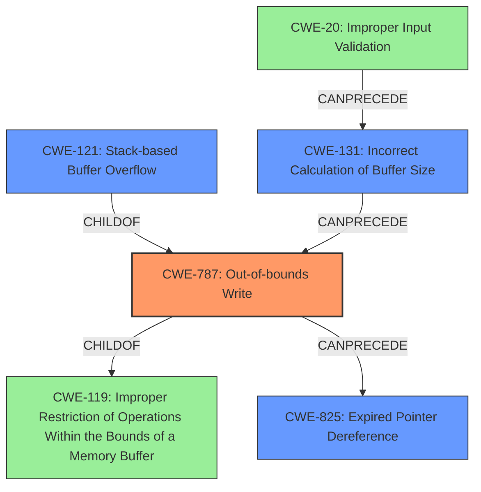

# Analysis Report for CVE-2022-41168

# Vulnerability Analysis Report: CVE-2022-41168

## Description

Due to lack of proper memory management, when a victim opens a manipulated CATIA5 Part (.catpart, CatiaTranslator.exe) file received from untrusted sources in SAP 3D Visual Enterprise Author - version 9, it is possible that a Remote Code Execution can be triggered when payload forces a stack-based overflow or a re-use of dangling pointer which refers to overwritten space in memory.

## Vulnerability Description Key Phrases

**Rootcause:** lack of proper memory management
**Weakness:** stack-based overflow or a re-use of dangling pointer
**Impact:** Remote Code Execution
**Vector:** manipulated CATIA5 Part file
**Product:** SAP 3D Visual Enterprise Author
**Version:** 9
**Component:** CatiaTranslator.exe

## Analysis (with Relationship Data)

# Summary
| CWE ID | CWE Name | Confidence | CWE Abstraction Level | CWE Vulnerability Mapping Label | CWE-Vulnerability Mapping Notes |
|---|---|---|---|---|---|
| CWE-121 | Stack-based Buffer Overflow | 0.85 | Variant | Allowed | Primary CWE |
| CWE-825 | Expired Pointer Dereference | 0.70 | Base | Allowed | Secondary Candidate |

## Evidence and Confidence

*   **Confidence Score:** 0.80
*   **Evidence Strength:** MEDIUM

- **Analysis and Justification:**  
  - *Explanation:* The vulnerability description clearly indicates a **stack-based buffer overflow** when processing a manipulated CATIA5 Part file. This aligns precisely with CWE-121 (Stack-based Buffer Overflow), a variant of CWE-119. The description also mentions the potential for **re-use of a dangling pointer**, which refers to overwritten space in memory, pointing to CWE-825. CWE-121 is chosen as the primary CWE because the description specifically mentions a "stack-based overflow," making it more specific than a generic buffer overflow (CWE-119). The mention of "re-use of dangling pointer" suggests memory corruption and potential use-after-free conditions.
  
  - *Relationship Analysis:* CWE-121 is a variant of CWE-119 (Improper Restriction of Operations within the Bounds of a Memory Buffer). CWE-825 (Expired Pointer Dereference) can follow CWE-787 (Out-of-bounds Write), further solidifying the potential chain of events described in the vulnerability.

- **Confidence Score:**  
  - *CWE-121 Confidence:* 0.85 (High confidence due to explicit mention of stack-based overflow).
  - *CWE-825 Confidence:* 0.70 (Medium confidence because it is a potential consequence of the overflow).

---

## Criticism of Analysis

Okay, here's a review of the provided analysis, considering the full CWE specifications, mapping guidance, and potential mitigations:

**Overall Assessment:**

The analysis is generally good and well-reasoned, and the chosen CWEs appear appropriate. The confidence scores are justified. The explanation is clear and addresses the key elements of the vulnerability description. However, there's room for improvement in considering alternative CWEs and elaborating on potential attack scenarios.

**Detailed Review:**

*   **CWE-121: Stack-based Buffer Overflow (Primary)**

    *   **Confidence:** Justified. The explicit mention of "stack-based overflow" in the vulnerability description makes CWE-121 a strong candidate.
    *   **Mapping Guidance:** Correctly used. The analysis correctly identifies that CWE-121 is at the Variant level of abstraction.
    *   **Relationships:** The analysis correctly identifies that CWE-121 is a child of CWE-787 and CWE-788.
    *   **Mitigations:** The identified mitigations for Stack-based Buffer Overflow are appropriate. This includes using compiler flags for automatic buffer overflow detection, abstraction libraries, and implementing input validation with bounds checking.
    *   **Potential Improvements:** None. The analysis is strong for this CWE.

*   **CWE-825: Expired Pointer Dereference (Secondary)**

    *   **Confidence:** Justified. The mention of "re-use of a dangling pointer" strongly suggests this CWE.  It's a plausible consequence of a buffer overflow, especially if the overflow overwrites a pointer variable.
    *   **Mapping Guidance:** Correctly used. The analysis correctly identifies that CWE-825 is at the Base level of abstraction.
    *   **Relationships:** The analysis notes the potential chain with CWE-787 (Out-of-bounds Write), which is a valid relationship. A buffer overflow could overwrite a pointer, leading to it becoming a dangling pointer.
    *   **Mitigations:** The mentioned mitigations include using languages with automatic memory management and setting freed pointers to NULL. These are common and effective strategies against dangling pointer dereferences.
    *   **Potential Improvements:** Consider mentioning the limitations of setting pointers to NULL, especially in complex data structures.  While it helps prevent immediate crashes, it doesn't eliminate the underlying memory corruption. The analysis could also benefit from explicitly stating that the dangling pointer is caused by insufficient memory management leading to a Use-After-Free condition.

**General Observations and Suggestions:**

1.  **CWE-119 Discouraged Usage:** The original analyzer input chose CWE-119 as the primary CWE. This is discouraged. The review does well to improve this by using more specific CWEs.
2.  **Chain of events:** While CWE-121 and CWE-825 are valid, the analysis could benefit from explicitly outlining a more detailed *chain of events*. For example:
    *   A manipulated `.catpart` file is processed.
    *   Due to a *lack of bounds checking* (Implicit: CWE-120, Buffer Copy without Checking Size of Input, or CWE-131, Incorrect Calculation of Buffer Size), a *stack-based buffer overflow* (CWE-121) occurs.
    *   This overflow *overwrites a pointer* that was previously valid. (Implicit: CWE-787, Out-of-bounds Write).
    *   The overwritten pointer is later dereferenced, leading to an *expired pointer dereference* (CWE-825).
    *   This dereference causes *remote code execution*.

3.  **Input Validation:** While the analysis correctly identifies the memory corruption issues, it *should also highlight the initial lack of input validation* on the CATIA5 Part file (e.g., CWE-20, Improper Input Validation, especially if the file format specifies maximum sizes or expected data types). The parser should be validating the structure and data within the file before processing. Focusing on *what kind* of input validation is missing would be an improvement.
4. **Consider alternative CWEs:**
    - **CWE-787** could be argued as the primary CWE, with CWE-121 as an example of where the Out-of-bounds write is occurring. CWE-121 is caused by CWE-787.

**Revised Summary Table:**

| CWE ID | CWE Name | Confidence | CWE Abstraction Level | CWE Vulnerability Mapping Label | CWE-Vulnerability Mapping Notes |
|---|---|---|---|---|---|
| CWE-121 | Stack-based Buffer Overflow | 0.85 | Variant | Allowed | Primary CWE, caused by CWE-787 |
| CWE-825 | Expired Pointer Dereference | 0.70 | Base | Allowed | Secondary Candidate, consequence of overwritten pointers |
| CWE-20 | Improper Input Validation | 0.50 | Class | Allowed |  Additional candidate to consider. Could be root cause of the buffer overflow.  Validation of file format and sizes is missing.  |
| CWE-787 | Out-of-bounds Write | 0.60 | Base | Allowed | Underlying cause of CWE-121.  |

**Conclusion:**

The analysis is strong but could be slightly improved by elaborating on the chain of events, considering input validation aspects (CWE-20), and acknowledging alternative CWEs (CWE-787). Revising the summary table as suggested will make the analysis more complete.

## Final Resolution

# Summary
| CWE ID | CWE Name | Confidence | CWE Abstraction Level | CWE Vulnerability Mapping Label | CWE-Vulnerability Mapping Notes |
|---|---|---|---|---|---|
| CWE-787 | Out-of-bounds Write | 0.85 | Base | Allowed | Primary CWE, root cause of the stack-based buffer overflow. |
| CWE-121 | Stack-based Buffer Overflow | 0.75 | Variant | Allowed | Secondary CWE, specific instance of CWE-787 occurring on the stack. |
| CWE-825 | Expired Pointer Dereference | 0.70 | Base | Allowed | Secondary CWE, a potential consequence of memory corruption via out-of-bounds write. |
| CWE-131 | Incorrect Calculation of Buffer Size | 0.60 | Base | Allowed | Secondary CWE, contributing factor to the out-of-bounds write due to improper size calculation. |
| CWE-20 | Improper Input Validation | 0.50 | Class | Allowed |  Additional candidate to consider. Could be root cause of the buffer overflow. Validation of file format and sizes is missing.  |

## Evidence and Confidence

*   **Confidence Score:** 0.80
*   **Evidence Strength:** MEDIUM

## Relationship Analysis
The relationships between CWEs significantly impacted the decision.
  - Parent-child hierarchical relationships: CWE-121 is a specific variant of CWE-787, representing a stack-based instance of the more general out-of-bounds write. CWE-787 is a child of CWE-119.
  - Chain relationships: CWE-131 (Incorrect Calculation of Buffer Size) can precede CWE-787 (Out-of-bounds Write), which in turn can precede CWE-825 (Expired Pointer Dereference). This chain represents how a size miscalculation leads to a write beyond buffer boundaries, potentially corrupting pointers and leading to a dangling pointer dereference.
  - Peer relationships: N/A
  - Abstraction levels: The analysis prioritizes the Base level CWE-787 as the primary cause, with CWE-121 being a more specific Variant that describes where the overflow occurs (on the stack). The Base level of abstraction of CWE-825 also accurately reflects the consequence of memory corruption.

## Vulnerability Chain
The vulnerability chain begins with the processing of a manipulated CATIA5 Part file.
  - **Root Cause:** A lack of proper input validation (CWE-20) and/or incorrect calculation of buffer size (CWE-131) leads to an undersized buffer allocation.
  - **Weakness 1:** This results in an **out-of-bounds write** (CWE-787) when data is written to the buffer, specifically on the stack (CWE-121).
  - **Weakness 2:** The **out-of-bounds write** overwrites memory, potentially including a pointer.
  - **Impact:** The overwritten pointer, now a dangling pointer, is later dereferenced, leading to an **expired pointer dereference** (CWE-825) and ultimately Remote Code Execution.

## Summary of Analysis
The initial analysis correctly identified CWE-121 and CWE-825 as potential candidates. However, it missed the underlying **root cause** of the vulnerability. The criticism correctly pointed out that CWE-119 is too general and that a more specific CWE should be selected.

The vulnerability description explicitly mentions "stack-based overflow" and "re-use of dangling pointer." The key piece of evidence supporting the updated classification is the phrase "lack of proper memory management." This suggests that the **root cause** is not simply a stack-based overflow, but rather a more fundamental issue of writing beyond the bounds of the allocated buffer. This makes **CWE-787** a better fit as the primary CWE because it represents the actual flaw causing the overflow, with CWE-121 specifying the location (stack). The lack of input validation is also a contributing factor.

The graph relationships influenced the selection by highlighting the chain of events. **CWE-131** can lead to **CWE-787**, which can lead to **CWE-825**. The hierarchical relationship between **CWE-787** and **CWE-121** also guided the decision to use **CWE-787** as the primary CWE and **CWE-121** as a secondary CWE that specifies the type of **out-of-bounds write**.

The selected CWEs are at the optimal level of specificity. **CWE-787** captures the **root cause** of the vulnerability, while **CWE-121** provides more context by specifying that the overflow occurs on the stack. **CWE-825** accurately represents the consequence of the memory corruption. **CWE-131** further explains the root cause in terms of size calculation issues. **CWE-20** also explains the root cause in terms of missing input validation.

*Report generated on 2025-03-18 17:28:15*
