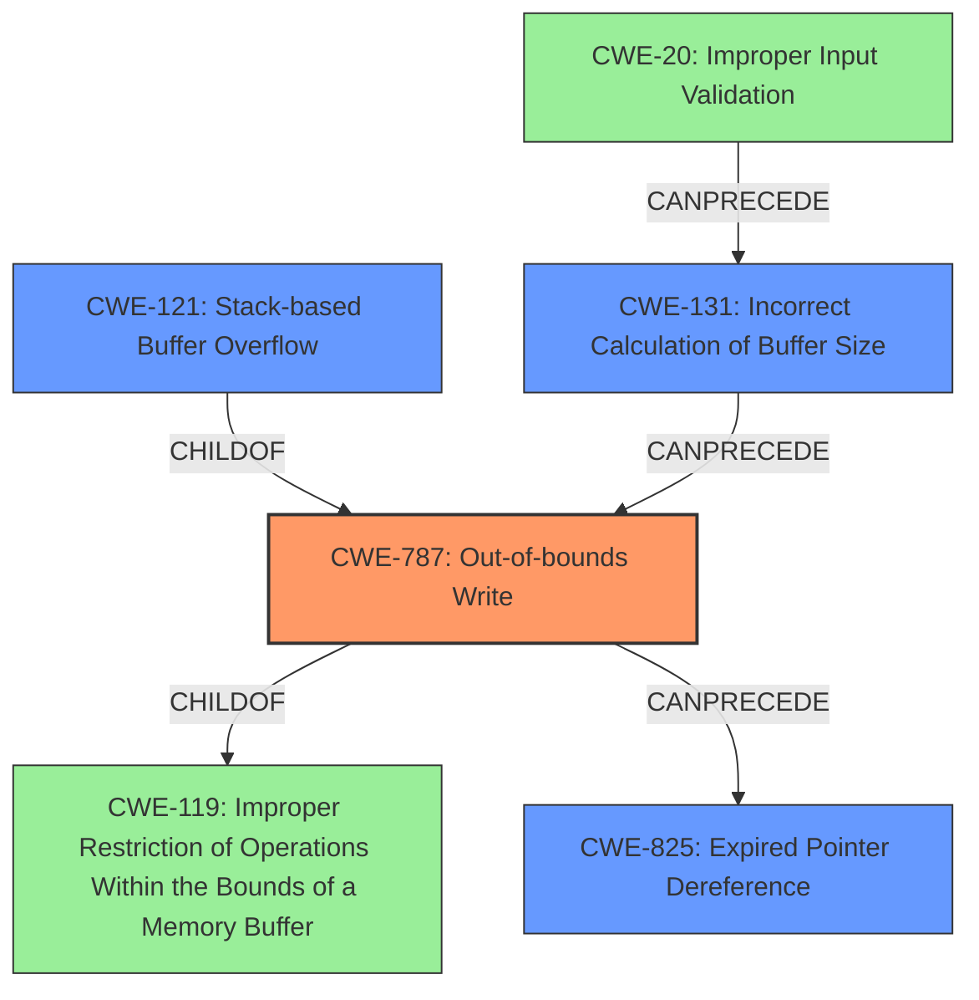

# Final Resolution for CVE-2022-41168

# Summary
| CWE ID | CWE Name | Confidence | CWE Abstraction Level | CWE Vulnerability Mapping Label | CWE-Vulnerability Mapping Notes |
|---|---|---|---|---|---|
| CWE-787 | Out-of-bounds Write | 0.85 | Base | Allowed | Primary CWE, root cause of the stack-based buffer overflow. |
| CWE-121 | Stack-based Buffer Overflow | 0.75 | Variant | Allowed | Secondary CWE, specific instance of CWE-787 occurring on the stack. |
| CWE-825 | Expired Pointer Dereference | 0.70 | Base | Allowed | Secondary CWE, a potential consequence of memory corruption via out-of-bounds write. |
| CWE-131 | Incorrect Calculation of Buffer Size | 0.60 | Base | Allowed | Secondary CWE, contributing factor to the out-of-bounds write due to improper size calculation. |
| CWE-20 | Improper Input Validation | 0.50 | Class | Allowed |  Additional candidate to consider. Could be root cause of the buffer overflow. Validation of file format and sizes is missing.  |

## Evidence and Confidence

*   **Confidence Score:** 0.80
*   **Evidence Strength:** MEDIUM

## Relationship Analysis
The relationships between CWEs significantly impacted the decision.
  - Parent-child hierarchical relationships: CWE-121 is a specific variant of CWE-787, representing a stack-based instance of the more general out-of-bounds write. CWE-787 is a child of CWE-119.
  - Chain relationships: CWE-131 (Incorrect Calculation of Buffer Size) can precede CWE-787 (Out-of-bounds Write), which in turn can precede CWE-825 (Expired Pointer Dereference). This chain represents how a size miscalculation leads to a write beyond buffer boundaries, potentially corrupting pointers and leading to a dangling pointer dereference.
  - Peer relationships: N/A
  - Abstraction levels: The analysis prioritizes the Base level CWE-787 as the primary cause, with CWE-121 being a more specific Variant that describes where the overflow occurs (on the stack). The Base level of abstraction of CWE-825 also accurately reflects the consequence of memory corruption.

## Vulnerability Chain
The vulnerability chain begins with the processing of a manipulated CATIA5 Part file.
  - **Root Cause:** A lack of proper input validation (CWE-20) and/or incorrect calculation of buffer size (CWE-131) leads to an undersized buffer allocation.
  - **Weakness 1:** This results in an **out-of-bounds write** (CWE-787) when data is written to the buffer, specifically on the stack (CWE-121).
  - **Weakness 2:** The **out-of-bounds write** overwrites memory, potentially including a pointer.
  - **Impact:** The overwritten pointer, now a dangling pointer, is later dereferenced, leading to an **expired pointer dereference** (CWE-825) and ultimately Remote Code Execution.

## Summary of Analysis
The initial analysis correctly identified CWE-121 and CWE-825 as potential candidates. However, it missed the underlying **root cause** of the vulnerability. The criticism correctly pointed out that CWE-119 is too general and that a more specific CWE should be selected.

The vulnerability description explicitly mentions "stack-based overflow" and "re-use of dangling pointer." The key piece of evidence supporting the updated classification is the phrase "lack of proper memory management." This suggests that the **root cause** is not simply a stack-based overflow, but rather a more fundamental issue of writing beyond the bounds of the allocated buffer. This makes **CWE-787** a better fit as the primary CWE because it represents the actual flaw causing the overflow, with CWE-121 specifying the location (stack). The lack of input validation is also a contributing factor.

The graph relationships influenced the selection by highlighting the chain of events. **CWE-131** can lead to **CWE-787**, which can lead to **CWE-825**. The hierarchical relationship between **CWE-787** and **CWE-121** also guided the decision to use **CWE-787** as the primary CWE and **CWE-121** as a secondary CWE that specifies the type of **out-of-bounds write**.

The selected CWEs are at the optimal level of specificity. **CWE-787** captures the **root cause** of the vulnerability, while **CWE-121** provides more context by specifying that the overflow occurs on the stack. **CWE-825** accurately represents the consequence of the memory corruption. **CWE-131** further explains the root cause in terms of size calculation issues. **CWE-20** also explains the root cause in terms of missing input validation.