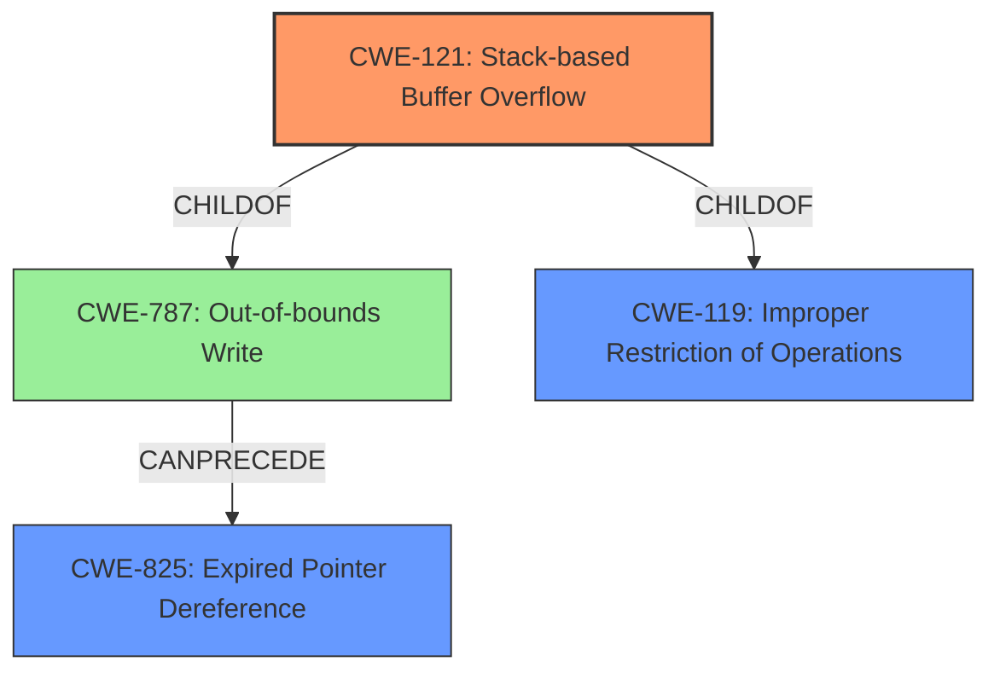

# Analysis Report for CVE-2022-41172

# Vulnerability Analysis Report: CVE-2022-41172

## Description

Due to lack of proper memory management, when a victim opens a manipulated AutoCAD (.dxf, TeighaTranslator.exe) file received from untrusted sources in SAP 3D Visual Enterprise Author - version 9, it is possible that a Remote Code Execution can be triggered when payload forces a stack-based overflow or a re-use of dangling pointer which refers to overwritten space in memory.

## Vulnerability Description Key Phrases

**Rootcause:** lack of proper memory management
**Weakness:** stack-based overflow or a re-use of dangling pointer
**Impact:** Remote Code Execution
**Product:** SAP 3D Visual Enterprise Author
**Version:** 9
**Component:** TeighaTranslator.exe

## Analysis (with Relationship Data)

# Summary
| CWE ID | CWE Name | Confidence | CWE Abstraction Level | CWE Vulnerability Mapping Label | CWE-Vulnerability Mapping Notes |
|---|---|---|---|---|---|
| CWE-121 | Stack-based Buffer Overflow | 0.9 | Variant | Allowed | Primary CWE |
| CWE-825 | Expired Pointer Dereference | 0.7 | Base | Allowed | Secondary CWE |

## Evidence and Confidence

*   **Confidence Score:** 0.8
*   **Evidence Strength:** MEDIUM

- **Analysis and Justification:**  
  - *Explanation:* The vulnerability description clearly states a **stack-based overflow** can occur when processing a manipulated AutoCAD file. This directly aligns with CWE-121 (Stack-based Buffer Overflow), which is a Variant level CWE and thus more specific than its parent CWE-119 (Improper Restriction of Operations within the Bounds of a Memory Buffer). The description also mentions "re-use of dangling pointer which refers to overwritten space in memory", which indicates a use-after-free scenario. CWE-825 (Expired Pointer Dereference) accurately captures this aspect of the vulnerability. The description's explicit mention of a stack-based overflow provides strong evidence for CWE-121.
  
  - *Relationship Analysis:* CWE-121 is a variant of CWE-119 (Improper Restriction of Operations within the Bounds of a Memory Buffer). CWE-825 (Expired Pointer Dereference) describes what happens if you try to access a dangling pointer, and is related to memory management issues. CWE-825 can follow CWE-787 (Out-of-bounds Write) since writing out of bounds can overwrite pointer values, leading to use of expired pointers.

- **Confidence Score:**  
  - *Example:* Confidence: 0.9 (High confidence due to explicit mention of "stack-based overflow" and "dangling pointer")

---

## Criticism of Analysis

Okay, here's a detailed review of the provided CWE analysis, incorporating the full CWE specifications you provided.

**Overall Assessment**

The analysis is generally strong, particularly in identifying CWE-121 (Stack-based Buffer Overflow). The reasoning is clear, and the confidence level is appropriately high. The inclusion of CWE-825 (Expired Pointer Dereference) is also justified, although the confidence level could be slightly lower due to the more implicit nature of this aspect in the description.

**Specific Comments & Suggestions**

*   **CWE-121: Stack-based Buffer Overflow**

    *   **Strengths:** The analysis correctly identifies that the "stack-based overflow" mentioned in the vulnerability description directly maps to CWE-121. The use of "Variant" level CWE is appropriate and preferred.
    *   **Mapping Guidance Considerations:** The mapping guidance for CWE-121 states "Carefully read both the name and description to ensure that this mapping is an appropriate fit." The analysis clearly fulfills this.
    *   **Mitigation Considerations:** The provided mitigations for CWE-121, such as using automatic buffer overflow detection mechanisms (e.g., /GS flag, FORTIFY\_SOURCE), using abstraction libraries, and implementing bounds checking, are all relevant in preventing this type of vulnerability.
    *   **Potential Enhancements:** None. The selection and justification for CWE-121 are very solid.

*   **CWE-825: Expired Pointer Dereference**

    *   **Strengths:** The analysis correctly points out that "re-use of dangling pointer which refers to overwritten space in memory" aligns with CWE-825.
    *   **Mapping Guidance Considerations:** The mapping guidance for CWE-825 states "Carefully read both the name and description to ensure that this mapping is an appropriate fit." The analysis does this well.
    *   **Mitigation Considerations:** The provided mitigations for CWE-825, choosing a language with automatic memory management or setting pointers to NULL after freeing, are standard practices to prevent dangling pointer issues.
    *   **Potential Enhancements:**  While justified, the evidence strength for CWE-825 is a bit weaker than that for CWE-121 because the description uses the term "dangling pointer", but it could also be a heap-based use-after-free. The confidence score is right where it should be.  Consider this:

        *   Could also discuss how a stack-based buffer overflow (CWE-121) could *lead* to CWE-825.  If the stack overflow overwrites a pointer with an address that was previously valid but is now freed, dereferencing it would trigger CWE-825. If the pointer is a return address, the overwritten value could also lead to control-flow hijacking.

*   **Overall Confidence and Evidence Strength:**

    *   The overall confidence score of 0.8 is reasonable.
    *   The evidence strength is stated as MEDIUM. This is fair, given the vulnerability description. The explicit mention of "stack-based overflow" raises confidence, but the dangling pointer aspect is slightly less direct.

*   **Retriever Results Analysis:**

    *   It's useful to see the retriever results. The analysis aligns well with what the retrievers suggested, especially the ranking of CWE-121 and CWE-825. The retrievers offer a broader view that can often be useful when considering chains of vulnerabilities.
    * The retriever results also list CWE-787 (Out-of-bounds Write), and this might be worth considering. Since the stack-based buffer overflow leads to memory corruption, and that corruption includes overwritten pointers, CWE-787 is an appropriate addition.

*   **CWE-119 Assessment:**

    *   The original analysis input had CWE-119 as the primary match. The revised analysis correctly moved to CWE-121 and CWE-825, noting the mapping guidance for CWE-119 which discourages its usage and suggests using its children.

**Revised Summary**

| CWE ID | CWE Name | Confidence | CWE Abstraction Level | CWE Vulnerability Mapping Label | CWE-Vulnerability Mapping Notes |
|---|---|---|---|---|---|
| CWE-121 | Stack-based Buffer Overflow | 0.9 | Variant | Allowed | Primary CWE |
| CWE-825 | Expired Pointer Dereference | 0.7 | Base | Allowed | Secondary CWE |
| CWE-787 | Out-of-bounds Write | 0.5 | Base | Allowed | Tertiary CWE |

**Revised Analysis and Justification:**

*Explanation:* The vulnerability description clearly states a **stack-based overflow** can occur when processing a manipulated AutoCAD file. This directly aligns with CWE-121 (Stack-based Buffer Overflow), which is a Variant level CWE. The description also mentions "re-use of dangling pointer which refers to overwritten space in memory", which indicates a use-after-free scenario. CWE-825 (Expired Pointer Dereference) accurately captures this aspect of the vulnerability. Additionally, the stack-based buffer overflow results in memory corruption, which can be represented by CWE-787 (Out-of-bounds Write). A potential exploit is the stack-based overflow overwriting a pointer with an address that was previously valid but is now freed, dereferencing it would trigger CWE-825. The description's explicit mention of a stack-based overflow provides strong evidence for CWE-121.

*Relationship Analysis:* CWE-121 is a variant of CWE-787 and CWE-119. CWE-825 (Expired Pointer Dereference) describes what happens if you try to access a dangling pointer and is related to memory management issues. CWE-825 can follow CWE-787 (Out-of-bounds Write) since writing out of bounds can overwrite pointer values, leading to use of expired pointers.

**Conclusion**

The analysis is well-reasoned and supported by the vulnerability description. The mapping to CWE-121 and CWE-825 is appropriate, and the confidence level is justified. The inclusion of CWE-787 strengthens the analysis further. The analysis appropriately takes into account the mapping guidance provided for each CWE.

## Final Resolution

# Summary

| CWE ID | CWE Name | Confidence | CWE Abstraction Level | CWE Vulnerability Mapping Label | CWE-Vulnerability Mapping Notes |
|---|---|---|---|---|---|
| CWE-121 | Stack-based Buffer Overflow | 0.9 | Variant | Allowed | Primary CWE |
| CWE-825 | Expired Pointer Dereference | 0.7 | Base | Allowed | Secondary CWE |
| CWE-787 | Out-of-bounds Write | 0.5 | Base | Allowed | Tertiary CWE |

## Evidence and Confidence

*   **Confidence Score:** 0.8
*   **Evidence Strength:** MEDIUM

## Relationship Analysis
The primary CWE is **CWE-121 (Stack-based Buffer Overflow)**, which is a variant of **CWE-119 (Improper Restriction of Operations within the Bounds of a Memory Buffer)** and **CWE-787 (Out-of-bounds Write)**. **CWE-825 (Expired Pointer Dereference)** can result from **CWE-787 (Out-of-bounds Write)**, forming a chain where the out-of-bounds write corrupts a pointer, leading to its later dereference. The abstraction levels guided the selection, favoring the more specific variant (CWE-121) over the class (CWE-119).

## Vulnerability Chain
The vulnerability chain starts with a manipulated AutoCAD file. This file, when opened in SAP 3D Visual Enterprise Author, triggers a **CWE-121 (Stack-based Buffer Overflow)** due to improper memory management. The **ROOTCAUSE** is the lack of proper bounds checking when processing the file. The **CWE-121 (Stack-based Buffer Overflow)** leads to memory corruption, which can be represented by **CWE-787 (Out-of-bounds Write)**. A potential exploit is the **stack-based overflow** overwriting a pointer with an address that was previously valid but is now freed; dereferencing it would trigger **CWE-825 (Expired Pointer Dereference)**. The final impact is potential Remote Code Execution.

## Summary of Analysis
The initial analysis and criticism were both considered, with the final assessment incorporating the suggestion to include **CWE-787 (Out-of-bounds Write)** as a tertiary CWE. This decision was based on the vulnerability description's mention of memory corruption due to the stack-based buffer overflow, which can be represented by an out-of-bounds write. The graph relationships highlight the connection between **CWE-121 (Stack-based Buffer Overflow)**, **CWE-787 (Out-of-bounds Write)**, and **CWE-825 (Expired Pointer Dereference)**, forming a chain. The selected CWEs are at the optimal level of specificity, with **CWE-121 (Stack-based Buffer Overflow)** being a variant and **CWE-825 (Expired Pointer Dereference)** and **CWE-787 (Out-of-bounds Write)** being base level CWEs.

The evidence for **CWE-121 (Stack-based Buffer Overflow)** is strong: "Due to lack of proper memory management, when a victim opens a manipulated AutoCAD (.dxf, TeighaTranslator.exe) file received from untrusted sources in SAP 3D Visual Enterprise Author - version 9, it is possible that a Remote Code Execution can be triggered when payload forces a stack-based overflow".
The evidence for **CWE-825 (Expired Pointer Dereference)** is: "or a re-use of dangling pointer which refers to overwritten space in memory."
The evidence for **CWE-787 (Out-of-bounds Write)** is the fact that the overflow causes memory corruption.

*Report generated on 2025-03-18 17:29:51*
