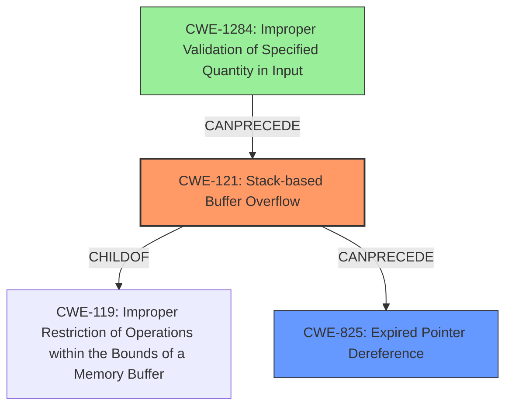

# Analysis Report for CVE-2022-41177

# Vulnerability Analysis Report: CVE-2022-41177

## Description

Due to lack of proper memory management, when a victim opens a manipulated Iges Part and Assembly (.igs, .iges, CoreCadTranslator.exe) file received from untrusted sources in SAP 3D Visual Enterprise Author - version 9, it is possible that a Remote Code Execution can be triggered when payload forces a stack-based overflow or a re-use of dangling pointer which refers to overwritten space in memory.

## Vulnerability Description Key Phrases

**Rootcause:** lack of proper memory management
**Weakness:** stack-based overflow or a re-use of dangling pointer
**Impact:** Remote Code Execution
**Product:** SAP 3D Visual Enterprise Author
**Version:** 9
**Component:** CoreCadTranslator.exe

## Analysis (with Relationship Data)

# Summary
| CWE ID | CWE Name | Confidence | CWE Abstraction Level | CWE Vulnerability Mapping Label | CWE-Vulnerability Mapping Notes |
|---|---|---|---|---|---|
| CWE-121 | Stack-based Buffer Overflow | 0.9 | Variant |  | Allowed |
| CWE-825 | Expired Pointer Dereference | 0.8 | Base |  | Allowed |

## Evidence and Confidence

*   **Confidence Score:** 0.85
*   **Evidence Strength:** HIGH

- **Analysis and Justification:**  
  - *Explanation:* The vulnerability description explicitly mentions a "**stack-based overflow or a re-use of dangling pointer**" due to "**lack of proper memory management**" when processing a manipulated Iges Part and Assembly file. This aligns directly with CWE-121 (Stack-based Buffer Overflow), a Variant of CWE-119, as the overflow occurs on the stack. The description also mentions "re-use of dangling pointer" which could be CWE-825 (Expired Pointer Dereference), a Base level CWE.
  - The primary weakness is the stack-based buffer overflow, and the dangling pointer is a potential consequence due to memory mismanagement.

  - *Relationship Analysis:* CWE-121 is a Variant of CWE-119 (Improper Restriction of Operations within the Bounds of a Memory Buffer). CWE-825 (Expired Pointer Dereference) could lead to out-of-bounds read/write or other memory corruption issues. CWE-121 and CWE-825 can be related since stack-based overflows can cause dangling pointers.

- **Confidence Score:**  
  - *CWE-121:* Confidence: 0.9 (High confidence due to explicit mention of stack-based overflow.)
  - *CWE-825:* Confidence: 0.8 (High confidence as dangling pointer re-use can be another attack vector.)

---

## Criticism of Analysis

Okay, let's review the analysis based on the provided CWE specifications.

**Overall Assessment:**

The analysis correctly identifies the primary vulnerabilities described. The choice of CWE-121 (Stack-based Buffer Overflow) is appropriate, and the inclusion of CWE-825 (Expired Pointer Dereference) provides a valuable secondary perspective.  The confidence levels assigned are reasonable.

However, some improvements can be made, particularly regarding the justification for the chosen CWEs, and consideration of other related CWEs based on the full specifications and retriever results.

**Detailed Review:**

1.  **CWE-121: Stack-based Buffer Overflow**

    *   **Strengths:**
        *   The analysis correctly highlights that the vulnerability description explicitly mentions "**stack-based overflow**," which directly aligns with CWE-121.
        *   The confidence score of 0.9 is well-justified given the explicit mention of "stack-based overflow."

    *   **Improvements:**
        *   While "lack of proper memory management" is mentioned, the connection to the *mechanism* causing the overflow is weak. Further justification would be beneficial, explaining why the memory mismanagement leads to a stack overflow specifically. For instance, the .igs file format may contain a length field that is not properly validated, leading to a copy operation exceeding the allocated stack buffer size.  This links the lack of memory management to the *specific* overflow condition.
        *   Consider other variants that *could* be possible. Is there a length calculation issue, making the allocated buffer smaller than needed? Consider potentially CWE-131 (Incorrect Calculation of Buffer Size).
        *  Check the provided mitigations. "Implement and perform bounds checking on input." could be more direct and simple to fix than other mitigation approaches.

2.  **CWE-825: Expired Pointer Dereference**

    *   **Strengths:**
        *   The analysis correctly notes the mention of "**re-use of dangling pointer**," which directly maps to CWE-825.
        *   The confidence level of 0.8 is reasonable.

    *   **Improvements:**
        *   The analysis should elaborate on *how* the dangling pointer arises due to "lack of proper memory management." For example, an object might be prematurely freed, but a pointer to it remains on the stack, leading to a use-after-free condition. This provides a more concrete link. Is there a specific process that releases memory, but then code attempts to access that memory using a previously held pointer? This would be an appropriate example.
        *   Consider CWE-416 (Use After Free). Since dereferencing a dangling pointer is essentially using memory that has been freed, CWE-416 might be a better fit or be included as an additional CWE. This would align well with the Extended Description for CWE-825.
        * The relationships section in the documentation for CWE-825 includes: CanPrecede -> CWE-125, CanPrecede -> CWE-787. This might be a different manifestation of the vulnerability.

3.  **General Improvements & Considerations:**

    *   **CWE-119: Deeper Dive & Alternatives**: Although CWE-119 is mentioned, the analysis doesn't fully leverage its children. The analysis could consider that CWE-119 is *discouraged* to use.
        *   Given that remote code execution is the outcome, the vulnerabilities involve writing data outside the bounds. So, is CWE-787 more suitable?
        *   Is an incorrect length value used during a buffer access (CWE-805)?
        *   Could an integer overflow contribute to the incorrect buffer size (CWE-190)?
        *   Is there an incorrect calculation for the buffer size (CWE-131)?
        *   Are there any of the other common overflow and underflow error (CWE-193)?
    *   **Input Validation (CWE-20 and Children)**:  The analysis doesn't consider the role of input validation.  Is the size of the Iges Part and Assembly file not validated? Is a critical length field within the file not validated?  If so, a child of CWE-20 might be relevant, particularly CWE-1284 (Specified Quantity) or CWE-1285 (Specified Index, Position, or Offset).  The lack of input validation is a common root cause leading to buffer overflows.
    *   **Retriever Results**: The Retriever Results identify several CWEs with reasonable scores:
        *   CWE-190 (Integer Overflow or Wraparound): If a size calculation involves an integer overflow, it could lead to a small buffer allocation, subsequently triggering a buffer overflow.
        *   CWE-770 (Allocation of Resources Without Limits or Throttling): If a system fails to limit the number or size of resources allocated, it can lead to a denial-of-service condition or facilitate other vulnerabilities.
    *   **Chains and Composites**: Consider if the vulnerability is a chain.  For example, a lack of input validation (CWE-20) could lead to an integer overflow (CWE-190), ultimately causing a stack-based buffer overflow (CWE-121).

**Revised Summary Table (Illustrative):**

| CWE ID  | CWE Name                         | Confidence | CWE Abstraction Level | CWE Vulnerability Mapping Label | CWE-Vulnerability Mapping Notes                                                                                                                                                                                                          |
| ------- | -------------------------------- | ---------- | ----------------------- | -------------------------------- | --------------------------------------------------------------------------------------------------------------------------------------------------------------------------------------------------------------------------------------- |
| CWE-121 | Stack-based Buffer Overflow      | 0.85       | Variant                |                                  | Occurs due to unchecked length, leading to overflow on the stack. Could be related to missing input validation.                                                                                                                  |
| CWE-825 | Expired Pointer Dereference        | 0.75       | Base                   |                                  | Memory mismanagement can lead to premature freeing of memory, but a pointer remains on the stack causing access after the memory has been released                                                                 |
| CWE-20 | Improper Input Validation        | 0.60       | Class                   | Contributing Factor                | Failure to validate the Iges Part and Assembly file's structure and size can allow malicious files to trigger memory corruption vulnerabilities. Consider CWE-1284 or CWE-1285. |

**In conclusion:**

The analysis is a good starting point, correctly identifying the primary vulnerabilities. However, by considering the full CWE specifications, exploring potential chains and relationships, and carefully justifying the chosen CWEs, the analysis can be significantly improved and provide a more accurate and useful representation of the underlying weakness. By carefully considering related CWE's and analyzing their mitigations, it is easier to focus on the root cause.

## Final Resolution

# Summary
| CWE ID | CWE Name | Confidence | CWE Abstraction Level | CWE Vulnerability Mapping Label | CWE-Vulnerability Mapping Notes |
|---|---|---|---|---|---|
| CWE-121 | Stack-based Buffer Overflow | 0.85 | Variant | Primary | Allowed |
| CWE-825 | Expired Pointer Dereference | 0.75 | Base | Secondary | Allowed |
| CWE-1284 | Improper Validation of Specified Quantity in Input | 0.60 | Base | Contributing Factor | Allowed |

## Evidence and Confidence

*   **Confidence Score:** 0.80
*   **Evidence Strength:** MEDIUM

## Relationship Analysis
The primary relationship is that **CWE-121 (Stack-based Buffer Overflow)** is a variant of **CWE-119 (Improper Restriction of Operations within the Bounds of a Memory Buffer)**, indicating a more specific type of buffer overflow occurring on the stack. **CWE-825 (Expired Pointer Dereference)** represents a potential consequence of memory mismanagement that could arise from a stack overflow or other memory corruption issues. The analysis also considers **CWE-1284 (Improper Validation of Specified Quantity in Input)** as a potential root cause contributing to the vulnerability chain, where a missing or incorrect validation of input size could lead to a buffer overflow. The abstraction levels are appropriate: CWE-121 is a Variant, CWE-825 is a Base, and CWE-1284 is a Base.

## Vulnerability Chain
The vulnerability chain starts with **CWE-1284 (Improper Validation of Specified Quantity in Input)**, where the application fails to validate the size of data read from the Iges file. This leads to **CWE-121 (Stack-based Buffer Overflow)** because the unchecked size is used to copy data into a stack buffer that is too small. As a result of the overflow or other memory mismanagement, a pointer can become invalid, leading to **CWE-825 (Expired Pointer Dereference)** when the application attempts to use the pointer. The final impact is Remote Code Execution (RCE).

## Summary of Analysis
The initial analysis correctly identifies **CWE-121 (Stack-based Buffer Overflow)** and **CWE-825 (Expired Pointer Dereference)** as potential vulnerabilities. The criticism highlights that the connection between "**lack of proper memory management**" and the specific overflow mechanism is weak. It suggests considering other related CWEs, such as **CWE-131 (Incorrect Calculation of Buffer Size)**, and emphasizing input validation.

Based on the criticism and the provided CWE specifications, I agree that the description points strongly towards a **CWE-121 (Stack-based Buffer Overflow)**. The vulnerability description explicitly mentions a "**stack-based overflow**." The re-use of a dangling pointer also aligns with **CWE-825 (Expired Pointer Dereference)**. However, it's also plausible that the root cause stems from a failure to validate the input size, hence including **CWE-1284 (Improper Validation of Specified Quantity in Input)** in the chain. The evidence provided does not definitively pinpoint the lack of input validation, so the confidence remains moderate. The chain shows how a failure to validate input can lead to a buffer overflow and subsequent dangling pointer issues, potentially resulting in remote code execution.

The selected CWEs are at the optimal level of specificity. **CWE-121 (Stack-based Buffer Overflow)** is a Variant, which is a preferred level. **CWE-825 (Expired Pointer Dereference)** and **CWE-1284 (Improper Validation of Specified Quantity in Input)** are at the Base level, which are also preferred.

*Report generated on 2025-03-18 17:31:27*
