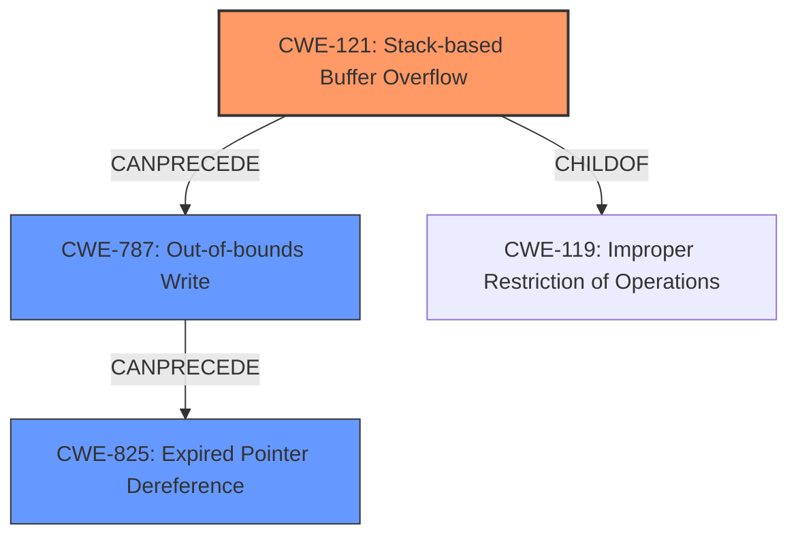

# Final Resolution for CVE-2022-41180

# Summary
| CWE ID | CWE Name | Confidence | CWE Abstraction Level | CWE Vulnerability Mapping Label | CWE-Vulnerability Mapping Notes |
|---|---|---|---|---|---|
| CWE-121 | Stack-based Buffer Overflow | 0.8 | Variant | Allowed | Primary CWE |
| CWE-787 | Out-of-bounds Write | 0.6 | Base | Allowed | Secondary Candidate |
| CWE-825 | Expired Pointer Dereference | 0.6 | Base | Allowed | Secondary Candidate |

## Evidence and Confidence

*   **Confidence Score:** 0.7
*   **Evidence Strength:** MEDIUM

## Relationship Analysis
The primary weakness is CWE-121 (Stack-based Buffer Overflow), a variant of CWE-119 (Improper Restriction of Operations within the Bounds of a Memory Buffer). The analysis also considers CWE-787 (Out-of-bounds Write), as stack overflows result in out-of-bounds writes. Additionally, CWE-825 (Expired Pointer Dereference) is considered due to the possibility of use-after-free caused by dangling pointers. The relationships show how a stack buffer overflow (CWE-121) can lead to an out-of-bounds write (CWE-787) and potentially a use-after-free condition (CWE-825). These are all base or variant level CWEs that provides optimal specificity.

## Vulnerability Chain
The vulnerability chain starts with a lack of proper memory management, which leads to a stack-based buffer overflow (CWE-121) when a manipulated PDF file is opened. This overflow results in an out-of-bounds write (CWE-787) that overwrites memory. A dangling pointer is then re-used, leading to an expired pointer dereference (CWE-825). The final impact is remote code execution.

## Summary of Analysis
The initial analysis identified CWE-121 and CWE-825. The criticism suggested lowering confidence scores, adding CWE-787 and being more precise.

The vulnerability description states: "Due to lack of proper memory management, when a victim opens a manipulated Portable Document Format (.pdf, PDFPublishing.dll) file received from untrusted sources in SAP 3D Visual Enterprise Author - version 9, it is possible that a Remote Code Execution can be triggered when payload forces a stack-based overflow or a re-use of dangling pointer which refers to overwritten space in memory."

Based on this description, the analysis now includes:
*   CWE-121 (Stack-based Buffer Overflow) as the primary **WEAKNESS** since it is explicitly mentioned: **"stack-based overflow"**.
*   CWE-787 (Out-of-bounds Write) as a secondary **WEAKNESS** because stack overflows lead to out-of-bounds writes. The retriever result gives this a relatively high score. While CWE-121 is a *variant* of out-of-bounds write, it is not the only way that the vulnerability can be triggered.
*   CWE-825 (Expired Pointer Dereference) as a secondary **WEAKNESS** because the re-use of a dangling pointer implies a dereference.

The confidence scores have been adjusted to reflect the uncertainty introduced by the general "lack of proper memory management". CWE-121 is at 0.8 because it's explicitly mentioned, while CWE-787 and CWE-825 are at 0.6 because they are inferred. These CWEs are at the optimal level of specificity, avoiding the more general CWE-119 while still accurately reflecting the **ROOTCAUSE** and consequences of the vulnerability.