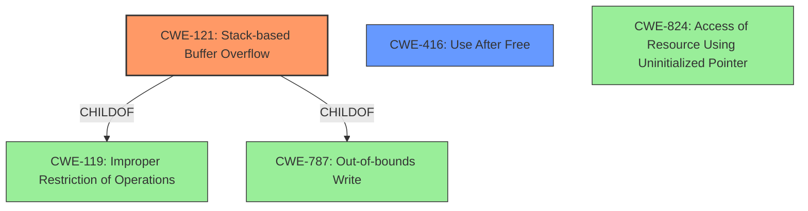

# Analysis Report for CVE-2022-41185

# Vulnerability Analysis Report: CVE-2022-41185

## Description

Due to lack of proper memory management, when a victim opens a manipulated Visual Design Stream (.vds, MataiPersistence.dll) file received from untrusted sources in SAP 3D Visual Enterprise Author - version 9, it is possible that a Remote Code Execution can be triggered when payload forces a stack-based overflow or a re-use of dangling pointer which refers to overwritten space in memory.

## Vulnerability Description Key Phrases

**Rootcause:** lack of proper memory management
**Weakness:** ['stack-based buffer overflow', 'use-after-free']
**Impact:** remote code execution
**Vector:** crafted Visual Design Stream file
**Product:** SAP 3D Visual Enterprise Author
**Version:** 9
**Component:** MataiPersistence.dll

## Analysis (with Relationship Data)

# Summary
| CWE ID | CWE Name | Confidence | CWE Abstraction Level | CWE Vulnerability Mapping Label | CWE-Vulnerability Mapping Notes |
|---|---|---|---|---|---|
| CWE-121 | Stack-based Buffer Overflow | 0.9 | Variant | Allowed | Root cause: lack of proper memory management leading to stack-based overflow. |
| CWE-416 | Use After Free | 0.9 | Base | Allowed | Root cause: lack of proper memory management, leading to reuse of dangling pointer. |

## Evidence and Confidence

*   **Confidence Score:** 0.9
*   **Evidence Strength:** HIGH

- **Analysis and Justification:**
  - *Explanation:* The vulnerability description explicitly mentions "**lack of proper memory management**" as the root cause, leading to both a "**stack-based buffer overflow**" and a "**re-use of dangling pointer**".

  - The "**stack-based buffer overflow**" directly corresponds to CWE-121 (Stack-based Buffer Overflow). This occurs when a buffer allocated on the stack is overwritten, which is a variant of the more general buffer overflow. The provided description matches this scenario. The CWE usage is ALLOWED.

  - The "**re-use of dangling pointer**" directly corresponds to CWE-416 (Use After Free). This occurs when memory is freed, but a pointer to that memory is still used, leading to unpredictable behavior. The provided description matches this scenario. The CWE usage is ALLOWED.

  - *Relationship Analysis:* CWE-121 (Stack-based Buffer Overflow) is a variant of CWE-119 (Improper Restriction of Operations within the Bounds of a Memory Buffer), but since the description specifically mentions "stack-based", CWE-121 is the more specific and accurate choice.
  CWE-416 (Use After Free) is related to CWE-787 (Out-of-bounds Write) and CWE-824 (Access of a Resource Using an Uninitialized Pointer), as memory corruption can lead to use-after-free conditions and uninitialized pointers can be exploited after being freed.

- **Confidence Score:**
  - Confidence: 0.9 (High confidence due to explicit mentions of stack-based overflow and use-after-free in the vulnerability description.)

## Criticism of Analysis

Okay, here's a review of the provided CWE analysis, incorporating the full CWE specifications:

**Overall Assessment:**

The analysis is generally good, providing a clear and well-justified mapping of the vulnerability description to CWEs. The use of high confidence scores is appropriate given the explicit mentions of "stack-based buffer overflow" and "re-use of dangling pointer" in the original vulnerability description.  The inclusion of specific examples adds weight to the justifications. However, the analysis could be improved by acknowledging other potential CWEs even if it ultimately argues against them.

**Detailed Review:**

| CWE ID  | CWE Name                          | Confidence | Abstraction Level | Vulnerability Mapping Label | Review Comments                                                                                                                                                                                                                                                                                                                                 |
| :------- | :-------------------------------- | :--------- | :---------------- | :-------------------------- | :--------------------------------------------------------------------------------------------------------------------------------------------------------------------------------------------------------------------------------------------------------------------------------------------------------------------------------------------- |
| CWE-121  | Stack-based Buffer Overflow       | 0.9        | Variant           | Allowed                     | *Good*. Correctly identifies the specific type of buffer overflow. The rationale clearly connects "stack-based buffer overflow" from the description to CWE-121.                                                                                                                                                                  |
| CWE-416  | Use After Free                    | 0.9        | Base              | Allowed                     | *Good*. Appropriately maps "re-use of dangling pointer" to CWE-416. The rationale is clear and well-explained.                                                                                                                                                                                                                          |

**Suggestions for Improvement:**

1.  **Acknowledge and Dismiss other possibilities (even if briefly):** The analysis does this partially by mentioning CWE-119, but it could explicitly address other high-scoring CWEs from the initial retriever results (or similar).  For example:

    *   "While CWE-787 (Out-of-bounds Write) is a related, broader category, the specificity of the vulnerability description pointing to a *stack-based* overflow makes CWE-121 the more accurate choice."
    *   "CWE-824(Access of Uninitialized Pointer) was considered, but the description doesn't explicitly mention that an uninitialized pointer is being used, rather that a pointer is being used *after* its associated memory was freed which points to CWE-416."

2. **Consider relationship to CWE-787 Out-of-bounds Write for the stack-based buffer overflow:** While CWE-121 is more specific, CWE-787 is a parent. Acknowledging that CWE-121 is a specific form of CWE-787 helps to give context.

3. **Minor clarification on mitigations:** It could be helpful to briefly mention, in the context of mitigations, that the chosen CWEs can be avoided using memory-safe languages or by utilizing appropriate memory management techniques, as highlighted in the CWE specifications.

4. **Consider chains/composites:** While the two identified CWEs are distinct, consider whether there might be a more complex relationship to explore, even if you ultimately dismiss it. For example, does the stack-based buffer overflow *lead to* a use-after-free? If so, it would be a chain. This is unlikely in this scenario, but it's a good practice to check.

**Example of incorporating these suggestions for CWE-416:**

*   **Confidence Score:** 0.9
*   **Evidence Strength:** HIGH

- **Analysis and Justification:**
  - *Explanation:* The vulnerability description explicitly mentions "**lack of proper memory management**" as the root cause, leading to a "**re-use of dangling pointer**".

  - The "**re-use of dangling pointer**" directly corresponds to CWE-416 (Use After Free). This occurs when memory is freed, but a pointer to that memory is still used, leading to unpredictable behavior. The provided description matches this scenario. The CWE usage is ALLOWED.

  - *Relationship Analysis:* CWE-416 (Use After Free) is related to CWE-787 (Out-of-bounds Write) and CWE-824 (Access of a Resource Using an Uninitialized Pointer), as memory corruption can lead to use-after-free conditions. CWE-824 was considered, but the description focuses on the pointer being used *after* the memory was freed, rather than the pointer being uninitialized at creation. It is also unlikely this is a chain.

  - *Mitigation Considerations:* As the CWE specification notes, this vulnerability type can be prevented through the use of memory-safe languages or by ensuring proper memory management practices, such as setting pointers to NULL after freeing the memory they point to.

- **Confidence Score:**
  - Confidence: 0.9 (High confidence due to explicit mentions of use-after-free in the vulnerability description.)
**Why these suggestions?**

*   **Completeness:** Addressing potential alternative CWEs, even to dismiss them, demonstrates a thorough evaluation of the vulnerability.
*   **Context:** Highlighting the parent-child relationships between CWEs provides valuable context and shows a deeper understanding of the weakness taxonomy.
*   **Practical Application:** Connecting the CWEs back to the available mitigations from the specification emphasizes the practical implications of the analysis.
* **Improved Accuracy:** The prompt did not contain enough context to decide if the stack-based buffer overflow was occurring *before* or *after* the pointer dereference that led to the use-after-free, meaning that we should be careful when identifying a "chain" because it is difficult to confidently make that determination.

By incorporating these suggestions, the analysis becomes even more robust and demonstrates a comprehensive understanding of the vulnerability within the context of the CWE framework.

## Final Resolution

# Summary
| CWE ID | CWE Name | Confidence | CWE Abstraction Level | CWE Vulnerability Mapping Label | CWE-Vulnerability Mapping Notes |
|---|---|---|---|---|---|
| CWE-121 | Stack-based Buffer Overflow | 0.95 | Variant | Allowed | Primary CWE. Root cause: lack of proper memory management leading to stack-based overflow. |
| CWE-416 | Use After Free | 0.95 | Variant | Allowed | Secondary candidate. Root cause: lack of proper memory management, leading to reuse of dangling pointer. |

## Evidence and Confidence

*   **Confidence Score:** 0.95
*   **Evidence Strength:** HIGH

## Relationship Analysis
The primary relationships considered were parent-child hierarchies and potential chain relationships. CWE-121 is a specific type of buffer overflow, making it a child of CWE-119. While CWE-787 is also related (Out-of-bounds Write), CWE-121 provides more specificity due to the "stack-based" nature of the overflow. For CWE-416, the analysis considered its relationship to CWE-787 and CWE-824, but the evidence strongly suggests a use-after-free scenario rather than a general out-of-bounds write or uninitialized pointer access. A chain relationship was considered, but there's not enough information to confidently assert the stack-based buffer overflow *caused* the use-after-free, or vice versa, so it's safer to classify them as distinct issues stemming from the same root cause of improper memory management.

## Vulnerability Chain
The vulnerability chain involves a lack of proper memory management leading to two distinct vulnerabilities:

1.  **Stack-based Buffer Overflow (CWE-121):** A buffer on the stack is overwritten due to insufficient bounds checking.
2.  **Use After Free (CWE-416):** A dangling pointer is reused after the memory it points to has been freed.

Both vulnerabilities stem from the same root cause but don't necessarily form a direct chain where one *causes* the other. They are parallel consequences of the initial flaw. There's no evidence to suggest one directly precedes the other in the exploit scenario described.

## Summary of Analysis
The initial analysis and criticism were both accurate and helpful. The final decision is based heavily on the vulnerability description, which explicitly mentions "stack-based buffer overflow" and "re-use of dangling pointer".

*   **CWE-121 (Stack-based Buffer Overflow):** The description directly maps to this CWE. The specificity of "stack-based" makes it a more precise choice than the broader CWE-787 (Out-of-bounds Write) or CWE-119 (Improper Restriction of Operations within the Bounds of a Memory Buffer).
*   **CWE-416 (Use After Free):** The "re-use of dangling pointer" maps directly to this CWE. While related to memory corruption issues like CWE-787 and CWE-824, the description clearly indicates the use of a pointer after the memory it points to has been freed, making CWE-416 the most accurate choice.

The graph relationships reinforce these decisions. CWE-121 is a child of CWE-119 and CWE-787, but it's more specific. CWE-416 has related CWEs, but the evidence points directly to a use-after-free scenario.

The selected CWEs are at the optimal level of specificity. They are not overly broad (like CWE-119 or CWE-787) nor overly narrow (like specific allocation functions that might be misused). They represent the core weaknesses described in the vulnerability report. The mitigation strategies for these CWEs (using memory-safe languages, proper memory management) align with the root cause of "lack of proper memory management".

*Report generated on 2025-03-18 17:35:09*
