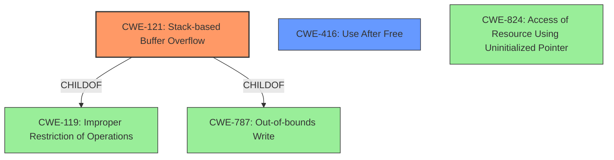

# Final Resolution for CVE-2022-41185

# Summary
| CWE ID | CWE Name | Confidence | CWE Abstraction Level | CWE Vulnerability Mapping Label | CWE-Vulnerability Mapping Notes |
|---|---|---|---|---|---|
| CWE-121 | Stack-based Buffer Overflow | 0.95 | Variant | Allowed | Primary CWE. Root cause: lack of proper memory management leading to stack-based overflow. |
| CWE-416 | Use After Free | 0.95 | Variant | Allowed | Secondary candidate. Root cause: lack of proper memory management, leading to reuse of dangling pointer. |

## Evidence and Confidence

*   **Confidence Score:** 0.95
*   **Evidence Strength:** HIGH

## Relationship Analysis
The primary relationships considered were parent-child hierarchies and potential chain relationships. CWE-121 is a specific type of buffer overflow, making it a child of CWE-119. While CWE-787 is also related (Out-of-bounds Write), CWE-121 provides more specificity due to the "stack-based" nature of the overflow. For CWE-416, the analysis considered its relationship to CWE-787 and CWE-824, but the evidence strongly suggests a use-after-free scenario rather than a general out-of-bounds write or uninitialized pointer access. A chain relationship was considered, but there's not enough information to confidently assert the stack-based buffer overflow *caused* the use-after-free, or vice versa, so it's safer to classify them as distinct issues stemming from the same root cause of improper memory management.

## Vulnerability Chain
The vulnerability chain involves a lack of proper memory management leading to two distinct vulnerabilities:

1.  **Stack-based Buffer Overflow (CWE-121):** A buffer on the stack is overwritten due to insufficient bounds checking.
2.  **Use After Free (CWE-416):** A dangling pointer is reused after the memory it points to has been freed.

Both vulnerabilities stem from the same root cause but don't necessarily form a direct chain where one *causes* the other. They are parallel consequences of the initial flaw. There's no evidence to suggest one directly precedes the other in the exploit scenario described.

## Summary of Analysis
The initial analysis and criticism were both accurate and helpful. The final decision is based heavily on the vulnerability description, which explicitly mentions "stack-based buffer overflow" and "re-use of dangling pointer".

*   **CWE-121 (Stack-based Buffer Overflow):** The description directly maps to this CWE. The specificity of "stack-based" makes it a more precise choice than the broader CWE-787 (Out-of-bounds Write) or CWE-119 (Improper Restriction of Operations within the Bounds of a Memory Buffer).
*   **CWE-416 (Use After Free):** The "re-use of dangling pointer" maps directly to this CWE. While related to memory corruption issues like CWE-787 and CWE-824, the description clearly indicates the use of a pointer after the memory it points to has been freed, making CWE-416 the most accurate choice.

The graph relationships reinforce these decisions. CWE-121 is a child of CWE-119 and CWE-787, but it's more specific. CWE-416 has related CWEs, but the evidence points directly to a use-after-free scenario.

The selected CWEs are at the optimal level of specificity. They are not overly broad (like CWE-119 or CWE-787) nor overly narrow (like specific allocation functions that might be misused). They represent the core weaknesses described in the vulnerability report. The mitigation strategies for these CWEs (using memory-safe languages, proper memory management) align with the root cause of "lack of proper memory management".