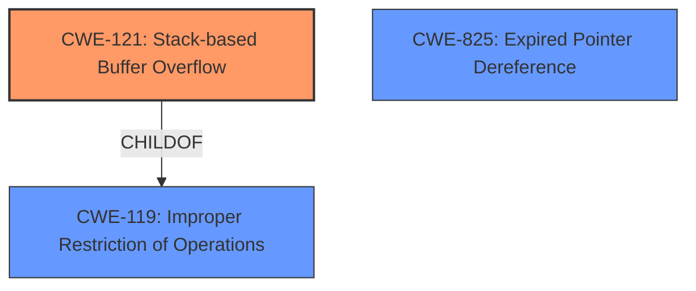

# Analysis Report for CVE-2022-41187

# Vulnerability Analysis Report: CVE-2022-41187

## Description

Due to lack of proper memory management, when a victim opens a manipulated Wavefront Object (.obj, ObjTranslator.exe) file received from untrusted sources in SAP 3D Visual Enterprise Viewer - version 9, it is possible that a Remote Code Execution can be triggered when payload forces a stack-based overflow or a re-use of dangling pointer which refers to overwritten space in memory.

## Vulnerability Description Key Phrases

**Rootcause:** lack of proper memory management
**Weakness:** stack-based overflow or a re-use of dangling pointer
**Impact:** Remote Code Execution
**Vector:** manipulated Wavefront Object file
**Product:** SAP 3D Visual Enterprise Viewer
**Version:** 9
**Component:** ObjTranslator.exe

## Analysis (with Relationship Data)

# Summary
| CWE ID | CWE Name | Confidence | CWE Abstraction Level | CWE Vulnerability Mapping Label | CWE-Vulnerability Mapping Notes |
|---|---|---|---|---|---|
| CWE-121 | Stack-based Buffer Overflow | 0.9 | Variant | Allowed | Primary CWE: The vulnerability description explicitly mentions a "stack-based overflow" which directly corresponds to CWE-121. |
| CWE-825 | Expired Pointer Dereference | 0.7 | Base | Allowed | Secondary CWE: The description mentions "re-use of dangling pointer" which relates to use-after-free and expired pointers.|
| CWE-119 | Improper Restriction of Operations within the Bounds of a Memory Buffer | 0.5 | Class | Discouraged | Secondary CWE: CWE-119 is a parent class of CWE-121. The description indicates **lack of proper memory management** which is too broad and can be related to memory corruption due to buffer overflows.|

## Evidence and Confidence

*   **Confidence Score:** 0.8
*   **Evidence Strength:** MEDIUM

- **Analysis and Justification:**  
  - *Explanation:* "The vulnerability description clearly states that a **stack-based overflow** can be triggered, which aligns directly with CWE-121 (Stack-based Buffer Overflow). The phrase "re-use of dangling pointer" suggests a use-after-free vulnerability, which can be mapped to CWE-825 (Expired Pointer Dereference). The root cause is **lack of proper memory management**, which is a broad statement. The initial analysis indicates that the primary weakness is a stack-based buffer overflow (CWE-121) leading to potential remote code execution."

  - *Relationship Analysis:* "CWE-121 is a variant of CWE-119 (Improper Restriction of Operations within the Bounds of a Memory Buffer). While CWE-119 is a more general class, the description specifically mentions a stack-based overflow, making CWE-121 a more precise and appropriate mapping. CWE-825 is related to memory management issues and can occur when dangling pointers are re-used after the memory they point to has been freed. CWE-121 CanPrecede vulnerabilities such as CWE-269 (Privilege Management) as a buffer overflow can allow an attacker to escalate privileges."

- **Confidence Score:**  
  - Confidence: 0.9 (High confidence due to explicit mention of stack-based overflow)

---

## Criticism of Analysis

Okay, I've reviewed the provided analysis against the full CWE specifications. Here's a detailed critique:

**Overall Assessment:**

The analysis is reasonably good, particularly in identifying CWE-121. The inclusion of CWE-825 as a secondary CWE is also justified. However, the confidence score for CWE-119 could be improved. The primary CWE mapping is on-point because the description has the phrase 'stack-based overflow'. The use of CWE-119 can be improved by using better root causes.

**Detailed Breakdown:**

**1. CWE-121: Stack-based Buffer Overflow**

*   **Confidence:** 0.9 (Excellent)
*   **Justification:** The analysis is strongly supported by the explicit mention of "stack-based overflow" in the vulnerability description. This aligns perfectly with the definition of CWE-121. The reasoning is clear and concise.
*   **CWE Specification Alignment:** The usage is "Allowed" according to CWE specifications, making it a suitable choice.
*   **Potential Mitigations:**
    *   The analysis does not explicitly discuss the mitigations in relationship to the .obj processing. However, the included examples for mitigation 1 are relevant for stack based overflows, which involve compiler extensions, compiler flags such as Microsoft Visual Studio /GS flag, Fedora/Red Hat FORTIFY_SOURCE GCC flag, StackGuard, and ProPolice, which provide various mechanisms including canary-based detection and range/index checking.
*   **Suggestion:** None. This is the best match.

**2. CWE-825: Expired Pointer Dereference**

*   **Confidence:** 0.7 (Good)
*   **Justification:** The analysis correctly identifies that "re-use of dangling pointer" aligns with CWE-825 (Expired Pointer Dereference). This suggests a use-after-free scenario, a common cause of memory corruption.
*   **CWE Specification Alignment:**  The usage is "Allowed."
*   **Potential Mitigations:**
    *   The analysis does not explicitly discuss the mitigations in relationship to the .obj processing. However, it is important to choose a language that provides automatic memory management. This is a Base level description which is preferable.
*   **Suggestion:** Consider if a more specific "use after free" variant exists. Although CWE-825 is a good starting point.

**3. CWE-119: Improper Restriction of Operations within the Bounds of a Memory Buffer**

*   **Confidence:** 0.5 (Fair)
*   **Justification:**  The analysis acknowledges that CWE-119 is a parent class and is too broad. It's included because of the "lack of proper memory management" statement. This is weak evidence. The mapping guidance for CWE-119 explicitly *discourages* its use when more specific CWEs are applicable.
*   **CWE Specification Alignment:** The usage is "Discouraged." The rationale for discouragement is that CWE-119 is commonly misused in low-information vulnerability reports when lower-level CWEs could be used instead.
*   **Potential Mitigations:**
    *   Mitigation would be better suited for the specific type of memory error.
*   **Suggestion:** *Remove CWE-119*. Its inclusion weakens the analysis. Since there is already identified CWE-121 the weakness is already narrowed down.

**General Recommendations:**

*   **Focus on Root Cause:** While the immediate symptom is a stack-based overflow or dangling pointer dereference, consider digging deeper into the root cause.  For example:
    *   **Integer Handling:** Are any integer overflows (CWE-190) or truncation errors (CWE-197) leading to undersized buffer allocations?
    *   **Input Validation:** Is a size or length value in the Wavefront Object file not properly validated (CWE-20, specifically CWE-1284 or CWE-1285), allowing for a buffer overflow?
    *   **Off-by-One Errors:** Could a calculation error cause an off-by-one error (CWE-193) in buffer allocation or access?
*   **Chain Analysis:** Explore potential CWE chains.  For example: `CWE-20 -> CWE-121` (Improper Input Validation leading to Stack-based Buffer Overflow). Or: `CWE-190 -> CWE-131 -> CWE-787` (Integer Overflow leading to Incorrect Buffer Size Calculation leading to Out-of-bounds Write).
*   **Leverage Retriever Results:** The retriever results list other potential CWEs. While many might not be direct matches, they can provide clues for further investigation. For example, CWE-770, CWE-789, and CWE-1284 suggest looking into resource allocation issues tied to input sizes.
*   **Consider Data Flow:** Trace the flow of data from the input file through the ObjTranslator.exe component. Identify where buffers are allocated, how their sizes are determined, and how data is copied into them. This can help pinpoint the exact location of the vulnerability and its root cause.

**Revised Summary Table:**

| CWE ID | CWE Name | Confidence | CWE Abstraction Level | CWE Vulnerability Mapping Label | CWE-Vulnerability Mapping Notes |
|---|---|---|---|---|---|
| CWE-121 | Stack-based Buffer Overflow | 0.9 | Variant | Allowed | Primary CWE: The vulnerability description explicitly mentions a "stack-based overflow" which directly corresponds to CWE-121. |
| CWE-825 | Expired Pointer Dereference | 0.7 | Base | Allowed | Secondary CWE: The description mentions "re-use of dangling pointer" which relates to use-after-free and expired pointers.|
| (Remove) CWE-119 | Improper Restriction of Operations within the Bounds of a Memory Buffer | 0.5 | Class | Discouraged |  CWE-119 is a parent class of CWE-121 and is too broad. |

By focusing on the root causes, examining potential chains, and leveraging the information from the retriever results, the analysis can be made more precise and helpful for remediation efforts.

## Final Resolution

# Summary
| CWE ID | CWE Name | Confidence | CWE Abstraction Level | CWE Vulnerability Mapping Label | CWE-Vulnerability Mapping Notes |
|---|---|---|---|---|---|
| CWE-121 | Stack-based Buffer Overflow | 0.9 | Variant | Allowed | Primary CWE: The vulnerability description explicitly mentions a "**stack-based overflow**" which directly corresponds to CWE-121. |
| CWE-825 | Expired Pointer Dereference | 0.7 | Base | Allowed | Secondary CWE: The description mentions "**re-use of dangling pointer**" which relates to use-after-free and expired pointers. |

## Evidence and Confidence

*   **Confidence Score:** 0.9
*   **Evidence Strength:** MEDIUM

## Relationship Analysis
The primary relationship is that CWE-121 is a variant of the more general CWE-119 (**Improper Restriction of Operations within the Bounds of a Memory Buffer**). However, because the vulnerability description explicitly mentions "stack-based overflow", CWE-121 is the more specific and appropriate choice. CWE-825 (**Expired Pointer Dereference**) stands alone but captures the secondary issue of reusing a dangling pointer, indicating a potential use-after-free scenario.

## Vulnerability Chain
The vulnerability chain starts with a manipulated Wavefront Object (.obj) file. This file, when opened in SAP 3D Visual Enterprise Viewer, triggers either:
1.  A **stack-based overflow** (**CWE-121**) due to **lack of proper memory management**.
2.  A re-use of a dangling pointer (**CWE-825**) referring to overwritten memory.

Both scenarios can lead to Remote Code Execution. The root cause is **lack of proper memory management**, which leads to memory corruption.

## Summary of Analysis
The initial analysis correctly identified CWE-121 as the primary issue due to the explicit mention of a "stack-based overflow" in the vulnerability description. The inclusion of CWE-825 is also justified by the "re-use of dangling pointer" statement. The criticism correctly suggests removing CWE-119 as it is a broader category and less specific than CWE-121.

The decision to keep CWE-121 and CWE-825 is strongly supported by the evidence in the vulnerability description. CWE-121 directly addresses the stack-based overflow, while CWE-825 covers the use-after-free aspect. These CWEs are at an appropriate level of specificity (Variant and Base, respectively) and provide a clear understanding of the vulnerability.

*Report generated on 2025-03-18 17:37:01*
