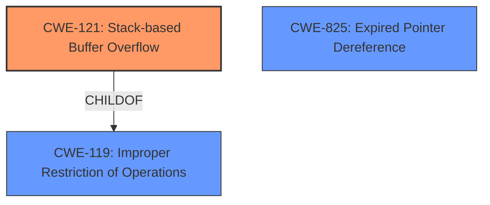

# Final Resolution for CVE-2022-41187

# Summary
| CWE ID | CWE Name | Confidence | CWE Abstraction Level | CWE Vulnerability Mapping Label | CWE-Vulnerability Mapping Notes |
|---|---|---|---|---|---|
| CWE-121 | Stack-based Buffer Overflow | 0.9 | Variant | Allowed | Primary CWE: The vulnerability description explicitly mentions a "**stack-based overflow**" which directly corresponds to CWE-121. |
| CWE-825 | Expired Pointer Dereference | 0.7 | Base | Allowed | Secondary CWE: The description mentions "**re-use of dangling pointer**" which relates to use-after-free and expired pointers. |

## Evidence and Confidence

*   **Confidence Score:** 0.9
*   **Evidence Strength:** MEDIUM

## Relationship Analysis
The primary relationship is that CWE-121 is a variant of the more general CWE-119 (**Improper Restriction of Operations within the Bounds of a Memory Buffer**). However, because the vulnerability description explicitly mentions "stack-based overflow", CWE-121 is the more specific and appropriate choice. CWE-825 (**Expired Pointer Dereference**) stands alone but captures the secondary issue of reusing a dangling pointer, indicating a potential use-after-free scenario.

## Vulnerability Chain
The vulnerability chain starts with a manipulated Wavefront Object (.obj) file. This file, when opened in SAP 3D Visual Enterprise Viewer, triggers either:
1.  A **stack-based overflow** (**CWE-121**) due to **lack of proper memory management**.
2.  A re-use of a dangling pointer (**CWE-825**) referring to overwritten memory.

Both scenarios can lead to Remote Code Execution. The root cause is **lack of proper memory management**, which leads to memory corruption.

## Summary of Analysis
The initial analysis correctly identified CWE-121 as the primary issue due to the explicit mention of a "stack-based overflow" in the vulnerability description. The inclusion of CWE-825 is also justified by the "re-use of dangling pointer" statement. The criticism correctly suggests removing CWE-119 as it is a broader category and less specific than CWE-121.

The decision to keep CWE-121 and CWE-825 is strongly supported by the evidence in the vulnerability description. CWE-121 directly addresses the stack-based overflow, while CWE-825 covers the use-after-free aspect. These CWEs are at an appropriate level of specificity (Variant and Base, respectively) and provide a clear understanding of the vulnerability.