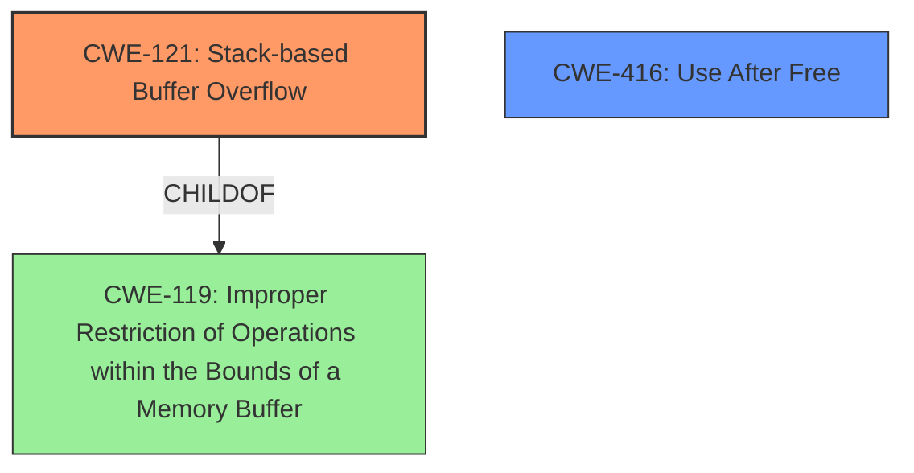

# Analysis Report for CVE-2022-41189

# Vulnerability Analysis Report: CVE-2022-41189

## Description

Due to lack of proper memory management, when a victim opens a manipulated AutoCAD (.dwg, TeighaTranslator.exe) file received from untrusted sources in SAP 3D Visual Enterprise Viewer - version 9, it is possible that a Remote Code Execution can be triggered when payload forces a stack-based overflow or a re-use of dangling pointer which refers to overwritten space in memory.

## Vulnerability Description Key Phrases

**Rootcause:** lack of proper memory management
**Weakness:** stack-based overflow or a re-use of dangling pointer
**Impact:** Remote Code Execution
**Vector:** manipulated AutoCAD file
**Product:** SAP 3D Visual Enterprise Viewer
**Version:** 9
**Component:** TeighaTranslator.exe

## Analysis (with Relationship Data)

# Summary
| CWE ID | CWE Name | Confidence | CWE Abstraction Level | CWE Vulnerability Mapping Label | CWE-Vulnerability Mapping Notes |
|---|---|---|---|---|---|
| CWE-121 | Stack-based Buffer Overflow | 0.85 | Variant | Allowed | Primary CWE |
| CWE-416 | Use After Free | 0.75 | Variant | Allowed | Secondary Candidate |

## Evidence and Confidence

*   **Confidence Score:** 0.80
*   **Evidence Strength:** MEDIUM

- **Analysis and Justification:**  
  - *Explanation:* The vulnerability description explicitly states a "**stack-based overflow**" as a potential **weakness**, which directly aligns with CWE-121 (Stack-based Buffer Overflow). This occurs due to a "**lack of proper memory management**" when processing manipulated AutoCAD files. CWE-121 is a Variant level CWE and is ALLOWED according to MITRE's mapping guidance. The vulnerability description also mentions "re-use of dangling pointer", which refers to an instance of Use-After-Free.

  - *Relationship Analysis:* CWE-121 is a variant of the more general CWE-119 (Improper Restriction of Operations within the Bounds of a Memory Buffer). While CWE-119 is listed as the Primary CWE match in the provided "CWE for similar CVE Descriptions", the description specifically mentions the stack, making CWE-121 a more precise fit. CWE-416 (Use After Free) is also a valid possibility.

- **Confidence Score:**  
  - *Example:* Confidence: 0.85 (Explicit mention of stack-based buffer overflow)

---
- **Analysis and Justification:**  
  - *Explanation:* The vulnerability description mentions a "re-use of dangling pointer" which is an instance of Use-After-Free. This aligns with CWE-416 (Use After Free). This occurs due to a "**lack of proper memory management**" when processing manipulated AutoCAD files. CWE-416 is a Variant level CWE and is ALLOWED according to MITRE's mapping guidance.

  - *Relationship Analysis:* CWE-416 (Use After Free) is a variant. The vulnerability description suggests that the root cause is a **lack of proper memory management**, potentially leading to the use of freed memory.

- **Confidence Score:**  
  - *Example:* Confidence: 0.75 (Evidence from technical description and CVE reference materials)

## Criticism of Analysis

Okay, let's review the provided CWE analysis, focusing on the mapping guidance, potential mitigations, and overall accuracy.

**Overall Assessment:**

The analysis is generally sound and well-reasoned. The choice of CWE-121 (Stack-based Buffer Overflow) and CWE-416 (Use After Free) as the primary and secondary candidates is justified based on the vulnerability description. The confidence levels are also appropriate. The inclusion of the CWE specifications is helpful.

**Specific Points and Suggestions:**

**1. CWE-121: Stack-based Buffer Overflow**

*   **Confidence:** 0.85 is reasonable given the explicit mention of "stack-based overflow."
*   **Justification:** The explanation accurately links the "lack of proper memory management" to the potential for a stack-based overflow when processing a manipulated AutoCAD file.
*   **Mitigations:** The analysis *could* briefly mention potential mitigations from the CWE specification, such as using compiler flags like `/GS` (Microsoft) or `FORTIFY_SOURCE` (GCC) for stack protection. Also, mention bounds checking.
*   **Relationship Analysis:** Good job in noting that CWE-121 is a more specific variant of CWE-119 and therefore a more precise fit.
*   **CWE specification Notes:** Stack-based buffer overflows can overwrite a return address, stack pointer, frame pointer, function pointer, or other data on the stack.

**2. CWE-416: Use After Free**

*   **Confidence:** 0.75 is appropriate, as the description mentions the reuse of a dangling pointer which is an instance of Use-After-Free. The fact that UAF is also mentioned explicitly in the original analyzer input under weakness further increases confidence.
*   **Justification:**  Accurately identifies the "re-use of dangling pointer" as a Use-After-Free scenario. Links it to "lack of proper memory management."
*   **Mitigations:** Again, the analysis could include a brief mention of mitigations, such as setting freed pointers to NULL immediately after freeing them to prevent accidental reuse (though acknowledges limitations of this approach). Using smart pointers (in languages like C++) that automatically manage memory deallocation can also be highlighted. Also, consider using memory-safe languages.
*   **Relationship Analysis:** The analysis correctly points to the root cause as lack of proper memory management.

**3. General Comments and Improvements:**

*   **CWE-119:**  While the original analyzer input lists CWE-119 as the primary match based on similar CVE descriptions, the provided analysis correctly prioritizes the more specific CWE-121. The analyzer input is less precise, and the analysis correctly identifies and overrides that.
*   **Combined CWEs:** The description indicates that both Stack-based overflow AND Use-After-Free are possible exploitation paths. This means that the exploit may need to chain these vulnerabilities, which is not captured in the analysis.
*   **Attack Vector Detail:** Consider adding more specifics on *how* the manipulated AutoCAD file leads to these vulnerabilities. For example, does the file contain overly long strings that trigger the stack overflow? Does it contain crafted object definitions that lead to premature freeing of memory?
*   **Memory Management Root Cause:** Expand a little on what "lack of proper memory management" *means* in this specific context. Is it a failure to validate input sizes before copying data, or failure to properly track allocated memory? Is there custom memory allocation?

**4. Addressing Retriever Results:**

The Retriever Results section lists several CWEs with high scores. It's worth addressing why some of these *weren't* chosen:

*   **CWE-120: Buffer Copy without Checking Size of Input ('Classic Buffer Overflow')**: While related, this is less precise than CWE-121 because it doesn't specify the stack. If the vulnerability was purely a classic buffer overflow *without* the stack explicitly mentioned, CWE-120 *could* be considered. However, the stack is specified, so CWE-121 is better.
*   **CWE-825: Expired Pointer Dereference**: This is related to UAF (CWE-416), and it's a reasonable alternative perspective to UAF in general.  CWE-416 is a more direct representation of the weakness.
*   **CWE-190: Integer Overflow or Wraparound, CWE-787: Out-of-bounds Write, CWE-125: Out-of-bounds Read, CWE-123: Write-what-where Condition**:  These could be *consequences* or *related causes*, but they are not the *primary* weaknesses described. For example, an integer overflow *could* lead to an out-of-bounds write or read. If the initial analysis is focused on the actual vulnerability, these are likely secondary.

**Revised Summary Table:**

| CWE ID | CWE Name | Confidence | CWE Abstraction Level | CWE Vulnerability Mapping Label | CWE-Vulnerability Mapping Notes |
|---|---|---|---|---|---|
| CWE-121 | Stack-based Buffer Overflow | 0.85 | Variant | Allowed | Primary CWE |
| CWE-416 | Use After Free | 0.75 | Variant | Allowed | Secondary Candidate |
| CWE-119 | Improper Restriction of Operations within the Bounds of a Memory Buffer | 0.30 | Class | Discouraged | Can be seen as the class of the stack-based buffer overflow, but it is more general and less precise. |

**In summary, the analysis is strong. By incorporating some of the suggestions, it can become even more comprehensive and provide a more valuable understanding of the vulnerability.**

## Final Resolution

# Summary
| CWE ID | CWE Name | Confidence | CWE Abstraction Level | CWE Vulnerability Mapping Label | CWE-Vulnerability Mapping Notes |
|---|---|---|---|---|---|
| **CWE-121** | **CWE-121: Stack-based Buffer Overflow** | 0.85 | Variant | Allowed | Primary **CWE** |
| **CWE-416** | **CWE-416: Use After Free** | 0.75 | Variant | Allowed | Secondary Candidate **CWE** |
| CWE-119 | **CWE-119: Improper Restriction of Operations within the Bounds of a Memory Buffer** | 0.30 | Class | Discouraged | Can be seen as the class of the stack-based buffer overflow, but it is more general and less precise. |

## Evidence and Confidence

*   **Confidence Score:** 0.80
*   **Evidence Strength:** MEDIUM

## Relationship Analysis
The primary **CWE** is **CWE-121 (CWE-121: Stack-based Buffer Overflow)**, a variant of **CWE-119 (CWE-119: Improper Restriction of Operations within the Bounds of a Memory Buffer)**. The vulnerability description explicitly mentions "stack-based overflow", which is why **CWE-121** is more appropriate than the more general **CWE-119**. **CWE-416 (CWE-416: Use After Free)** is included as a secondary candidate because the description also mentions "re-use of dangling pointer".

## Vulnerability Chain
The vulnerability chain starts with a **lack of proper memory management**. This leads to two possible **weaknesses**: a **stack-based buffer overflow (CWE-121)** when processing manipulated AutoCAD files, and a **use-after-free (CWE-416)** condition due to the re-use of a dangling pointer. Both can lead to remote code execution.

## Summary of Analysis
The initial analysis correctly identifies **CWE-121 (CWE-121: Stack-based Buffer Overflow)** and **CWE-416 (CWE-416: Use After Free)** as potential **weaknesses**. The choice of **CWE-121** over **CWE-119** is justified because the vulnerability description specifically mentions "stack-based overflow," making **CWE-121** a more precise fit. The criticism provided helpful suggestions, including mentioning potential mitigations and adding specifics on how the manipulated AutoCAD file leads to these vulnerabilities. The final classification reflects the provided evidence and considers the relationships between **CWEs**, selecting the most specific **CWEs** possible. The analysis is based on the vulnerability description: "Due to lack of proper memory management, when a victim opens a manipulated AutoCAD (.dwg, TeighaTranslator.exe) file received from untrusted sources in SAP 3D Visual Enterprise Viewer - version 9, it is possible that a Remote Code Execution can be triggered when payload forces a stack-based overflow or a re-use of dangling pointer which refers to overwritten space in memory."

*Report generated on 2025-03-18 17:37:48*
