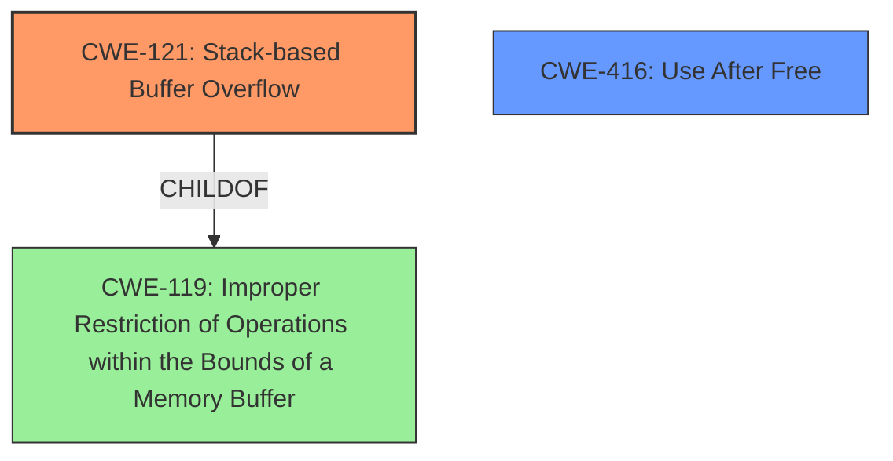

# Final Resolution for CVE-2022-41189

# Summary
| CWE ID | CWE Name | Confidence | CWE Abstraction Level | CWE Vulnerability Mapping Label | CWE-Vulnerability Mapping Notes |
|---|---|---|---|---|---|
| **CWE-121** | **CWE-121: Stack-based Buffer Overflow** | 0.85 | Variant | Allowed | Primary **CWE** |
| **CWE-416** | **CWE-416: Use After Free** | 0.75 | Variant | Allowed | Secondary Candidate **CWE** |
| CWE-119 | **CWE-119: Improper Restriction of Operations within the Bounds of a Memory Buffer** | 0.30 | Class | Discouraged | Can be seen as the class of the stack-based buffer overflow, but it is more general and less precise. |

## Evidence and Confidence

*   **Confidence Score:** 0.80
*   **Evidence Strength:** MEDIUM

## Relationship Analysis
The primary **CWE** is **CWE-121 (CWE-121: Stack-based Buffer Overflow)**, a variant of **CWE-119 (CWE-119: Improper Restriction of Operations within the Bounds of a Memory Buffer)**. The vulnerability description explicitly mentions "stack-based overflow", which is why **CWE-121** is more appropriate than the more general **CWE-119**. **CWE-416 (CWE-416: Use After Free)** is included as a secondary candidate because the description also mentions "re-use of dangling pointer".

## Vulnerability Chain
The vulnerability chain starts with a **lack of proper memory management**. This leads to two possible **weaknesses**: a **stack-based buffer overflow (CWE-121)** when processing manipulated AutoCAD files, and a **use-after-free (CWE-416)** condition due to the re-use of a dangling pointer. Both can lead to remote code execution.

## Summary of Analysis
The initial analysis correctly identifies **CWE-121 (CWE-121: Stack-based Buffer Overflow)** and **CWE-416 (CWE-416: Use After Free)** as potential **weaknesses**. The choice of **CWE-121** over **CWE-119** is justified because the vulnerability description specifically mentions "stack-based overflow," making **CWE-121** a more precise fit. The criticism provided helpful suggestions, including mentioning potential mitigations and adding specifics on how the manipulated AutoCAD file leads to these vulnerabilities. The final classification reflects the provided evidence and considers the relationships between **CWEs**, selecting the most specific **CWEs** possible. The analysis is based on the vulnerability description: "Due to lack of proper memory management, when a victim opens a manipulated AutoCAD (.dwg, TeighaTranslator.exe) file received from untrusted sources in SAP 3D Visual Enterprise Viewer - version 9, it is possible that a Remote Code Execution can be triggered when payload forces a stack-based overflow or a re-use of dangling pointer which refers to overwritten space in memory."