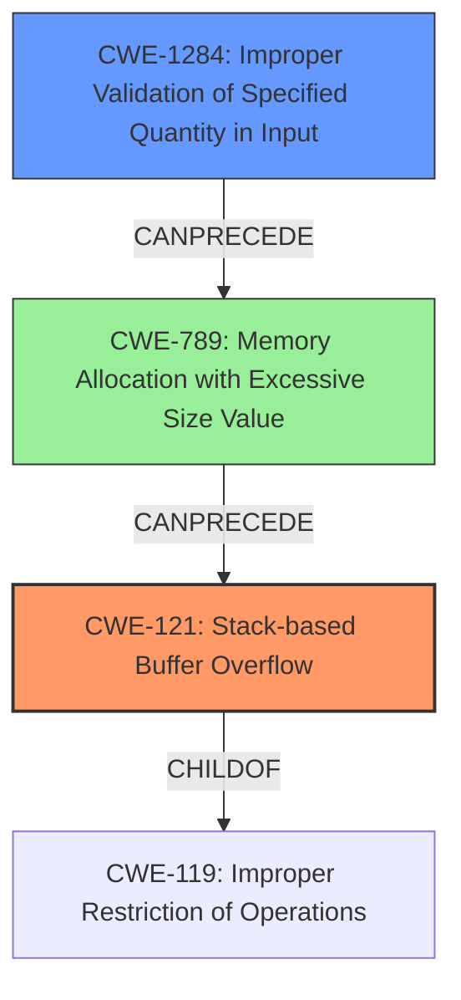

# Final Resolution for CVE-2022-41191

# Summary
| CWE ID | CWE Name | Confidence | CWE Abstraction Level | CWE Vulnerability Mapping Label | CWE-Vulnerability Mapping Notes |
|---|---|---|---|---|---|
| CWE-121 | Stack-based Buffer Overflow | 0.9 | Variant | Allowed | Primary CWE |
| CWE-1284 | Improper Validation of Specified Quantity in Input | 0.7 | Base | Allowed | Secondary Candidate |

## Evidence and Confidence

*   **Confidence Score:** 0.85
*   **Evidence Strength:** MEDIUM

## Relationship Analysis
The primary weakness is **CWE-121 (Stack-based Buffer Overflow)**, a variant of **CWE-119 (Improper Restriction of Operations within the Bounds of a Memory Buffer)**. The secondary weakness, **CWE-1284 (Improper Validation of Specified Quantity in Input)**, can precede **CWE-789 (Memory Allocation with Excessive Size Value)**, potentially leading to **CWE-121**. The choice of **CWE-1284** over **CWE-770** is based on the assumption that the size of the buffer is derived from user-controlled input without proper validation, which is a more direct relationship than a general lack of resource limits.

## Vulnerability Chain
The vulnerability chain begins with **CWE-1284 (Improper Validation of Specified Quantity in Input)**, where the size of the buffer or data structure is read from the malicious `.jt` file without proper validation. This leads to a large, untrusted size value being used in a memory allocation, potentially triggering **CWE-789 (Memory Allocation with Excessive Size Value)**. Finally, this excessive allocation results in **CWE-121 (Stack-based Buffer Overflow)** when data is written to the overly large buffer on the stack, exceeding its boundaries.

## Summary of Analysis
The initial analysis correctly identified **CWE-121 (Stack-based Buffer Overflow)** as the primary **WEAKNESS**, which aligns with the vulnerability description explicitly mentioning "stack-based overflow." However, the criticism pointed out that the secondary candidates were less directly related to the root cause. Specifically, **CWE-770 (Allocation of Resources Without Limits or Throttling)** was deemed too general.

Based on the Retriever results and the analysis of potential vulnerability chains, **CWE-1284 (Improper Validation of Specified Quantity in Input)** was chosen as a more appropriate secondary CWE. This is because the vulnerability involves parsing a `.jt` file, which likely contains size parameters for data structures. If these size parameters are not validated, it can lead to a large memory allocation and subsequently a stack-based buffer overflow. This aligns with the description: "Due to lack of proper memory management, when a victim opens a manipulated Jupiter Tesselation (.jt, JTReader.x3d) file received from untrusted sources in SAP 3D Visual Enterprise Viewer - version 9, it is possible that a Remote Code Execution can be triggered when payload forces a stack-based overflow or a re-use of dangling pointer which refers to overwritten space in memory."

The graph relationships influenced the selection by highlighting the potential chain of weaknesses: **CWE-1284** -> **CWE-789** -> **CWE-121**. This chain provides a clearer picture of how the vulnerability occurs, starting from the initial flaw of improper input validation.

The selected CWEs are at the optimal level of specificity. **CWE-121** is a variant that accurately describes the type of buffer overflow (stack-based). **CWE-1284** is a base CWE that identifies the root cause: the lack of proper validation of input quantities.

The evidence primarily comes from the vulnerability description, which mentions "stack-based overflow" and "manipulated Jupiter Tesselation (.jt, JTReader.x3d) file received from untrusted sources." The assumption is that the `.jt` file contains size parameters that are not validated, leading to the overflow.