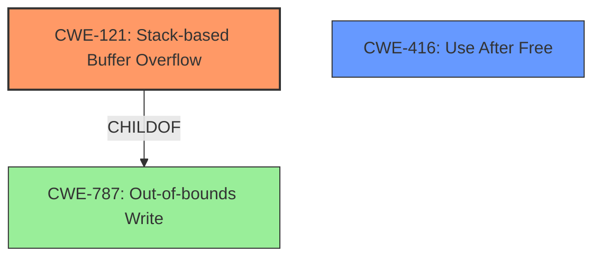

# Analysis Report for CVE-2022-41195

# Vulnerability Analysis Report: CVE-2022-41195

## Description

Due to lack of proper memory management, when a victim opens a manipulated EAAmiga Interchange File Format (.iff, 2d.x3d) file received from untrusted sources in SAP 3D Visual Enterprise Viewer - version 9, it is possible that a Remote Code Execution can be triggered when payload forces a stack-based overflow or a re-use of dangling pointer which refers to overwritten space in memory.

## Vulnerability Description Key Phrases

**Weakness:** lack of proper memory management
**Impact:** Remote Code Execution
**Vector:** manipulated EAAmiga Interchange File Format file
**Product:** SAP 3D Visual Enterprise Viewer
**Version:** 9
**Component:** 2d.x3d

## Analysis (with Relationship Data)

# Summary
| CWE ID | CWE Name | Confidence | CWE Abstraction Level | CWE Vulnerability Mapping Label | CWE-Vulnerability Mapping Notes |
|---|---|---|---|---|---|
| CWE-121 | Stack-based Buffer Overflow | 0.75 | Variant | Primary | Allowed |
| CWE-770 | Allocation of Resources Without Limits or Throttling | 0.6 | Base | Secondary | Allowed |

## Evidence and Confidence

*   **Confidence Score:** 0.7
*   **Evidence Strength:** MEDIUM

- **Analysis and Justification:**  
  - *Explanation:* The vulnerability description explicitly mentions a "stack-based overflow," making **CWE-121 (Stack-based Buffer Overflow)** the most relevant primary CWE. This aligns with the Variant level of abstraction, which is preferred. The description also alludes to "**lack of proper memory management**" which can mean that resources are not being properly managed and no limits are being put on resource allocation. This is what makes **CWE-770 (Allocation of Resources Without Limits or Throttling)** a valid secondary candidate. The CVE Reference Links Content Summary is empty, which reduces confidence, but the vulnerability description is reasonably clear.

  - *Relationship Analysis:* CWE-121 is a variant of CWE-119 (Improper Restriction of Operations within the Bounds of a Memory Buffer), which is a more general class. CWE-770 is related to CWE-400 (Uncontrolled Resource Consumption), but focuses specifically on the allocation aspect.

- **Confidence Score:**  
  - Confidence: 0.75 (Moderate evidence from vulnerability description)

---

## Criticism of Analysis

Okay, let's review the CWE analysis provided.

**Overall Assessment:**

The analysis correctly identifies CWE-121 (Stack-based Buffer Overflow) as the primary weakness.  The rationale is sound given the explicit mention of "stack-based overflow" in the vulnerability description. The inclusion of CWE-770 (Allocation of Resources Without Limits or Throttling) as a secondary CWE is reasonable, based on the broader "lack of proper memory management" statement.

However, the evidence strength for CWE-770 is much weaker than that for CWE-121.  The "lack of proper memory management" could also manifest in other ways that don't directly involve uncontrolled resource allocation *per se*.  Therefore, I would lower the confidence score for CWE-770.

**Detailed Review:**

1.  **CWE-121 (Stack-based Buffer Overflow):**

    *   **Correctness:** Correctly identified.  The description explicitly points to a stack-based buffer overflow. The Variant level abstraction is appropriate.
    *   **Confidence:** The confidence score of 0.75 is justified.
    *   **Mitigations:** The stated mitigations are relevant and standard for stack-based overflows.  Compiler-level protections (like /GS, FORTIFY_SOURCE), abstraction libraries, and input validation are all appropriate.
    *   **Improvements**: No major improvements needed for this CWE.

2.  **CWE-770 (Allocation of Resources Without Limits or Throttling):**

    *   **Correctness:** This is more speculative. The "lack of proper memory management" *could* lead to unbounded resource allocation. If the size of the file determines how much memory is allocated without limits, then it is valid.
    *   **Confidence:** Lower the confidence score. A score of 0.6 seems a little high considering the weakness of the evidence. A value of 0.5 might be more appropriate.
    *   **Mitigations:** The provided mitigations are correct for CWE-770. Specifying resource limits, throttling mechanisms, and access control are all applicable.
    *   **Improvements:** It would strengthen the argument for CWE-770 if the .iff file format inherently involves the allocation of numerous or potentially very large memory regions based on data within the file. Otherwise, more information is required to determine if this is an accurate secondary CWE.
    *  **Alternatives:** The 'lack of proper memory management' phrase might actually be better linked to CWE-772: Missing Release of Resource after Effective Lifetime, or CWE-401:  Leak of File Descriptor. These are related to cases of a dangling pointer being re-used, which is the second possible root cause provided.

**Recommendations:**

*   **Lower Confidence for CWE-770:** Reduce the confidence score for CWE-770 to 0.5 unless more information emerges linking the file format to uncontrolled resource allocation.
*   **Consider CWE-772 or CWE-401:** Examine the code's behavior regarding memory deallocation. If the code fails to release allocated memory after processing chunks of the .iff file, consider adding CWE-772. If the number of open file handles is unbounded, consider CWE-401.
*   **Expand the Relationship Analysis:** Elaborate on the relationship between CWE-121 and CWE-787 (Out-of-bounds Write), which is a direct parent of CWE-121.  The stack overflow is a specific type of out-of-bounds write.
*   **Consider CWE-416:** Given "re-use of dangling pointer", you should consider CWE-416: Use After Free.

**Revised Summary Table:**

| CWE ID | CWE Name | Confidence | CWE Abstraction Level | CWE Vulnerability Mapping Label | CWE-Vulnerability Mapping Notes |
|---|---|---|---|---|---|
| CWE-121 | Stack-based Buffer Overflow | 0.75 | Variant | Primary | Allowed |
| CWE-770 | Allocation of Resources Without Limits or Throttling | 0.5 | Base | Secondary | Allowed |

By addressing these points, the analysis will be more accurate and provide a better understanding of the vulnerability. Remember that CWE mapping is an iterative process, and new information can change the mappings.

## Final Resolution

# Summary
| CWE ID | CWE Name | Confidence | CWE Abstraction Level | CWE Vulnerability Mapping Label | CWE-Vulnerability Mapping Notes |
|---|---|---|---|---|---|
| CWE-121 | **Stack-based Buffer Overflow** | 0.75 | Variant | Primary | Allowed |
| CWE-416 | **Use After Free** | 0.6 | Variant | Secondary | Allowed |

## Evidence and Confidence

*   **Confidence Score:** 0.7
*   **Evidence Strength:** MEDIUM

## Relationship Analysis
The primary relationship impacting the decision is the parent-child relationship between **CWE-121 (Stack-based Buffer Overflow)** and its parent **CWE-787 (Out-of-bounds Write)**. Also the relationship between a dangling pointer that is re-used which leads to **CWE-416 (Use After Free)**. The abstraction levels are variant and base, providing a good balance of specificity.

## Vulnerability Chain
The vulnerability chain starts with a manipulated .iff file. This leads to either a stack-based overflow (**CWE-121**) or a re-use of a dangling pointer (**CWE-416**). Both of these can lead to Remote Code Execution.

## Summary of Analysis
The initial analysis correctly identified **CWE-121 (Stack-based Buffer Overflow)** as the primary **WEAKNESS** due to the explicit mention in the vulnerability description: "it is possible that a Remote Code Execution can be triggered when payload forces a stack-based overflow". The criticism suggested lowering the confidence in **CWE-770 (Allocation of Resources Without Limits or Throttling)** and considering alternatives like **CWE-772 (Missing Release of Resource after Effective Lifetime)** or **CWE-401 (Leak of File Descriptor)** or **CWE-416 (Use After Free)**.

Upon further review, the "re-use of dangling pointer" part of the vulnerability description suggests **CWE-416 (Use After Free)** is a more appropriate secondary **WEAKNESS** than **CWE-770 (Allocation of Resources Without Limits or Throttling)**. There is no mention of resource limits, but rather a dangling pointer being dereferenced after the memory it points to has been freed.

The selected **CWEs** are at the optimal level of specificity, with **CWE-121 (Stack-based Buffer Overflow)** being a variant, and **CWE-416 (Use After Free)** being another variant. The evidence, while not extremely detailed, is sufficient to support these classifications.

*Report generated on 2025-03-18 17:41:04*
