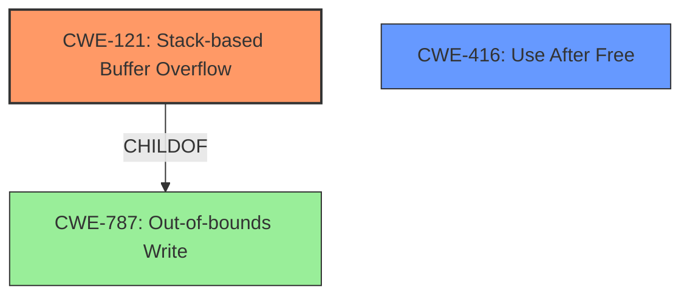

# Final Resolution for CVE-2022-41195

# Summary
| CWE ID | CWE Name | Confidence | CWE Abstraction Level | CWE Vulnerability Mapping Label | CWE-Vulnerability Mapping Notes |
|---|---|---|---|---|---|
| CWE-121 | **Stack-based Buffer Overflow** | 0.75 | Variant | Primary | Allowed |
| CWE-416 | **Use After Free** | 0.6 | Variant | Secondary | Allowed |

## Evidence and Confidence

*   **Confidence Score:** 0.7
*   **Evidence Strength:** MEDIUM

## Relationship Analysis
The primary relationship impacting the decision is the parent-child relationship between **CWE-121 (Stack-based Buffer Overflow)** and its parent **CWE-787 (Out-of-bounds Write)**. Also the relationship between a dangling pointer that is re-used which leads to **CWE-416 (Use After Free)**. The abstraction levels are variant and base, providing a good balance of specificity.

## Vulnerability Chain
The vulnerability chain starts with a manipulated .iff file. This leads to either a stack-based overflow (**CWE-121**) or a re-use of a dangling pointer (**CWE-416**). Both of these can lead to Remote Code Execution.

## Summary of Analysis
The initial analysis correctly identified **CWE-121 (Stack-based Buffer Overflow)** as the primary **WEAKNESS** due to the explicit mention in the vulnerability description: "it is possible that a Remote Code Execution can be triggered when payload forces a stack-based overflow". The criticism suggested lowering the confidence in **CWE-770 (Allocation of Resources Without Limits or Throttling)** and considering alternatives like **CWE-772 (Missing Release of Resource after Effective Lifetime)** or **CWE-401 (Leak of File Descriptor)** or **CWE-416 (Use After Free)**.

Upon further review, the "re-use of dangling pointer" part of the vulnerability description suggests **CWE-416 (Use After Free)** is a more appropriate secondary **WEAKNESS** than **CWE-770 (Allocation of Resources Without Limits or Throttling)**. There is no mention of resource limits, but rather a dangling pointer being dereferenced after the memory it points to has been freed.

The selected **CWEs** are at the optimal level of specificity, with **CWE-121 (Stack-based Buffer Overflow)** being a variant, and **CWE-416 (Use After Free)** being another variant. The evidence, while not extremely detailed, is sufficient to support these classifications.